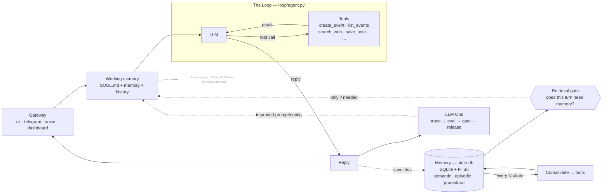

# launch-jarvis

**Your own Jarvis, on your own laptop, in code you can read in an afternoon.**

A minimal, transparent, local-first personal AI assistant that demonstrates the four
pillars of every serious agent system — **Harness, Loop, Memory, Eval/LLM-Ops** — with
zero frameworks hiding the interesting parts. Built for the
[Sean's AI Stories](https://www.youtube.com/@SeanAIStories) video series.

- **Local-first** — your memory is one SQLite file on your machine. Open it. Read it.
- **Memory is the hero** — procedural / semantic / episodic, with a gate that decides
  *whether* to retrieve and a consolidation pass that decides *what* to keep.
- **Transparent loop** — the agent loop is ~100 lines of plain Python you can step through.
- **Watch it think** — a local dashboard animates every message as it flows through the
  harness, and links straight to the real files it reads and writes.
- **Eval built in** — deterministic tests AND LLM-as-judge, side by side, with a release gate.


> The system-design whiteboard from the [Sean's AI Stories](https://www.youtube.com/@SeanAIStories)
> series. For the **code-accurate** version (every box → a file it maps to), see
> [The whiteboard maps to the code](#the-whiteboard-maps-to-the-code) below.

## Quickstart

```bash
git clone https://github.com/ShenSeanChen/launch-jarvis && cd launch-jarvis
uv venv && uv pip install -e .          # installs the `waku` command (or: pip install -e .)
cp .env.example .env                    # pick a provider, paste ONE key
waku                                    # talk to your Jarvis in the terminal
waku dashboard                          # …or the browser cockpit → localhost:7777
```

`waku` and `waku dashboard` are two doorways into the **same** local Jarvis (same
`state.db`, same loop). `waku dashboard` starts a tiny web server on **your** machine; when
you chat in the browser, *that process* runs the turn — nothing leaves your laptop (bound to
`127.0.0.1`). If `TELEGRAM_BOT_TOKEN` is set, `waku dashboard` also starts your Telegram bot in
the background, so one command runs every gateway. (`make run` / `make dashboard` still work too.)

Try: *"Remember that Alex prefers morning meetings."* Quit. Restart.
*"Book a catch-up with Alex on Friday."* — it remembers, and it books 9am.
Your calendar is `.jarvis/calendar.ics`; your memory is `.jarvis/state.db`.

**Works with the model you already pay for**: Anthropic (default), OpenAI, Google
Gemini, Kimi, or GLM — set `JARVIS_PROVIDER=` to one of them, paste that key, done.
The loop speaks one dialect; a [~60-line adapter](jarvis/loop/models.py) covers the rest.

## Watch the harness run — the dashboard

```bash
waku dashboard          # starts a local server → http://localhost:7777
```

This runs a small stdlib web server *you* own (`python -m jarvis.ops.dashboard`, bound to
`127.0.0.1`). The browser is just the UI — the same Python process runs every turn, so
chatting here is identical to `make run`, only with a live view. This is the fastest way to
*understand* the system. A chat dock sits on the right of
every tab — type or **speak** (local Whisper, no cloud) and watch it flow through the
harness on the Overview diagram: the retrieval gate lights up, the loop calls a tool,
the reply comes back, memory updates — the same pipeline every gateway drives. The whole
frontend is plain static files (`jarvis/ops/static/`), served with no build step.

Every tab is a window into one pillar, and each links straight to the real local files:

| Tab | What you see |
|---|---|
| **Overview** | cost, latency, the gate skip/retrieve split, the clickable architecture map |
| **Gateway** | one conversation across every channel, each message tagged by source (dashboard / telegram / voice / cli) |
| **Loop** | every turn with its gate decision, tool calls, tokens, and cost |
| **Memory** | sub-tabs per pillar — semantic facts, episodes, editable skills + SOUL, consolidation |
| **Tools** | the agent's available tools (grouped by origin), its results, and MCP connectors |
| **Data** | a live SQLite browser: per-table tabs, schema, and a read-only SQL console over `state.db` |
| **Ops** | eval verdict + history, the gate decisions, slowest turns, and inline JSONL traces |

The sidebar and chat dock are drag-resizable and hideable, and the chat has *New chat* +
history like any chat app.

## Things to try (each shows off a pillar)

Type these in the chat dock (or `make run`) and watch the dashboard light up:

| Try this | What it shows | Where to watch |
|---|---|---|
| *"Schedule a tennis game with Raj this Saturday at 8am"* | the Loop calls a tool (`create_event`) | the **LOOP** box pulses; **Loop** tab shows `iter 2` |
| *"What's on my calendar today?"* | reading the calendar (`list_events`) | it answers from `state.db`, no made-up events |
| *"When am I swimming with Sergey?"* then *"what's 12 × 8?"* | the **retrieval gate** — retrieve vs skip | Overview gate bar; **Ops** shows the per-turn decision |
| *"Remember that Raj prefers evening games"* | memory self-management (`save_note`) | **Memory ▸ Semantic** gains a fact; `MEMORY.md` updates |
| *"Search for the World Cup games still left to play and add each one to my calendar"* | **multi-tool loop engineering** | **Loop** tab shows `iter 8`: `search_web` × N → `create_event` × N |
| chat from `make run` **and** the browser | one brain, many gateways | the **Gateway** tab tags each message `cli` / `dashboard` |

**The money shot** is the World Cup one: in a single turn the agent searches the web several
times, reasons over the results, and books every remaining match — the loop runs **8 iterations**.
It needs a free `TAVILY_API_KEY` for reliable search (paste it on the **Settings** page). Watch the
**LOOP** box pulse once per cycle and the iteration count climb on the **Loop** tab — that's loop
engineering, on tape.

## How is this different from Claude Desktop / ChatGPT / Cowork?

Those are excellent products you *use*. This is a small codebase you *own*: every
layer — the loop, the memory schema, the retrieval gate, the eval harness — is yours
to read, modify, and extend. When you understand this repo, you understand what all
the products are doing under the hood. That's the point.

And versus the big open-source assistants (OpenClaw, Hermes)? Same architecture,
1/100th the code. They're products; this is the readable blueprint.

## The whiteboard maps to the code

This diagram renders straight from the README (it's [Mermaid](https://mermaid.js.org/) text, not an
image — edit it in a PR):



> _Architecture of **launch-jarvis** — built on [Sean's AI Stories](https://www.youtube.com/@SeanAIStories)
> ([@ShenSeanChen](https://github.com/ShenSeanChen)). Code is MIT; **this diagram is licensed CC BY-NC-SA 4.0** —
> reuse it with credit to the channel, not for commercial resale._

Every box is one module (full version with every file path: [docs/architecture.md](docs/architecture.md)):

| Diagram box | Module |
|---|---|
| Gateway Interface (CLI / voice / Telegram / web) | [`jarvis/gateway/`](jarvis/gateway) |
| Ephemeral Agent Run → Working Memory | [`jarvis/runtime/session.py`](jarvis/runtime/session.py) |
| The Loop (LLM ↔ tools, end-loop guardrails) | [`jarvis/loop/agent.py`](jarvis/loop/agent.py) |
| Agentic Tools (schedule / note / message) | [`jarvis/tools/`](jarvis/tools) |
| Procedural Memory (SKILL.md, "how to act") | [`jarvis/memory/procedural/`](jarvis/memory/procedural) + [`skills/`](skills) |
| Semantic Memory (durable facts, profile) | [`jarvis/memory/semantic/`](jarvis/memory/semantic) |
| Episodic Memory (dated events, past chats) | [`jarvis/memory/episodic/`](jarvis/memory/episodic) |
| "Should we even retrieve?" gate | [`jarvis/memory/retrieval_gate.py`](jarvis/memory/retrieval_gate.py) |
| Consolidate after N chats → summarizer | [`jarvis/memory/consolidation.py`](jarvis/memory/consolidation.py) |
| Trace (1 trace per run) | [`jarvis/ops/tracing.py`](jarvis/ops/tracing.py) |
| Eval: deterministic vs LLM-as-judge | [`evals/deterministic/`](evals/deterministic) vs [`evals/judge/`](evals/judge) |
| Gate → Release | [`jarvis/ops/release_gate.py`](jarvis/ops/release_gate.py) |

**A note on `MEMORY.md` vs `state.db`.** Some assistants (e.g. Hermes) keep long-term memory as a
single `MEMORY.md` markdown file. Jarvis keeps the *queryable* source in `state.db` (the `facts` and
`episodes` tables, keyword-searchable via FTS5) **and** regenerates a human-readable
`.jarvis/MEMORY.md` mirror after every turn — so you get both: a real file you can open, backed by a
sturdy database. The dashboard's **Memory** tab is the friendly view; the **Database** tab shows the
raw `state.db` tables.

## The Loop — reason → act → repeat

Yes, there's a real agent loop, and it's [~95 lines of plain Python](jarvis/loop/agent.py) —
no LangGraph, no hidden control flow:

```
while not done:
    response = llm(messages, tools)      # reason
    if response wants tools:
        results = run(tool_calls)        # act
        messages += results              # observe
    else:
        done                             # reply to the human
```

Two guardrails end every turn: the model stops asking for tools (natural end), or it hits
`max_iterations` (hard stop — it never spins forever). That's "loop engineering": the exit
conditions, the tool round-trip, and feeding results back as working memory.

**How to show it on camera:**
1. Type *"schedule a swim with Sergey Saturday at 5pm"* in the chat dock and watch the **LOOP**
   box on the Overview diagram light up: reason → `create_event` → reason → reply.
2. Open the **Loop** tab — every turn is listed with its gate decision, each tool call, the
   **iteration count**, tokens, and dollar cost. A tool-using turn shows `iter 2` (reason,
   act, then reason again to reply); a plain answer shows `iter 1`.
3. Open the **Ops** tab (or `.jarvis/traces/<today>.jsonl`) to read that same turn as raw
   events in order: `turn_start → gate → llm → tool → llm → turn_end`. That's the loop, on tape.

**The multi-tool loop (the money shot).** One tool is a loop; *chaining* tools is where loop
engineering earns its name. Try:

> *"Search for the World Cup games still left to play and add each one to my calendar."*

The agent loops across two tools: [`search_web`](jarvis/tools/search.py) reads the web, it
reasons over the results, then calls [`create_event`](jarvis/tools/calendar.py) once per match —
several iterations in a single turn. You'll see `iter 4`, `iter 5`… on the Loop tab and the
LOOP box pulse for each cycle. `search_web` works keyless via DuckDuckGo but that endpoint
rate-limits bots, so for a clean take set a free `TAVILY_API_KEY` (see [`.env.example`](.env.example)).

## The two hero moments

**1. The retrieval gate.** Most agents hit their memory store on every turn. That's
slow, and worse — irrelevant memories bias answers. Here a cheap model first answers
one question: *does this message need memory at all?* Watch it in the terminal:

```
you > what's 2+2?
  gate · skip — pure math
you > when am I meeting Alex?
  gate · retrieve — references user's plans
```

**2. Deterministic eval vs LLM-as-judge.** *"Did it create the right calendar event?"*
is a unit test — 0 or 1, no model judges it (`make eval`). *"Was the reply helpful?"*
is a judged score with a threshold (`make eval-judge`). Conflating the two is the most
common eval mistake; here they're separate suites you can diff. `make gate` runs both
as a release gate.

## Eval, tracing & catching bugs

Three commands, two kinds of eval — the LLM-Ops half of the system:

```bash
make eval          # deterministic: "did the right tool fire?" — 0 or 1, no model judges it
make eval-judge    # LLM-as-judge: "was the reply helpful?" — a scored %, needs a key
make gate          # the release gate: deterministic must pass 100%, judge must clear threshold
```

Deterministic tests are plain pytest in [`evals/deterministic/`](evals/deterministic); judged
ones use DeepEval in [`evals/judge/`](evals/judge). Keeping them apart is the whole point —
conflating "did it do the thing" (a unit test) with "was it any good" (a scored judgement) is
the most common eval mistake.

**Where the results show:** the terminal, and the dashboard's **Ops** tab — the release-gate
verdict, an **eval-history** table (one row per `make gate`, so you can see it grow), the actual
per-turn gate decisions, and the raw traces inline.

**The bug workflow (this is the discipline you show on camera):** when you catch a bug by using
the thing live, you fix it AND add a deterministic case so it can never come back. A real example
from this repo: the agent didn't know the current *time* and asked for it before scheduling
"in 30 minutes" → fixed in [`session.py`](jarvis/runtime/session.py), locked forever by
[`test_working_memory.py`](evals/deterministic/test_working_memory.py). Run `make gate` → green →
the eval history records the run.

**Spend is permanent:** every LLM call's tokens are appended to `.jarvis/usage.jsonl` — an
append-only ledger that a demo reset never wipes. The **Ops** tab shows the all-time cost, tokens,
and a per-day / per-provider breakdown (dollar cost is estimated from tokens, which are the ground
truth). So the number you show on camera is your real running total, not a per-session guess.

**Tracing is always on:** every turn appends readable lines to `.jarvis/traces/<date>.jsonl`
(zero setup) — a trace is just "what happened, in order." For span-waterfall views:

```bash
pip install -e '.[tracing]'
make trace                                            # Phoenix at localhost:6006
OTEL_EXPORTER_OTLP_ENDPOINT=http://localhost:4317 make run
```

Langfuse cloud speaks the same OTel toggle.

## Recording a clean demo

```bash
python scripts/demo_seed.py            # resets .jarvis to a tidy, curated state
```

It backs up your current `.jarvis` first, then seeds a few clean facts, one episode, and one
event — Sergey's standing **Saturday 5 PM swim**. The chat log and traces start **empty**, so
when you type live the Loop, traces, and Gateway inbox fill up in front of the viewer. The
memory/Data/Tools tabs already have tidy content to explain. Edit the seed lists at the top of
the script to taste.

## Talk to it

```bash
pip install -e '.[voice]'
make voice        # push-to-talk: Enter, speak, Enter
```

Same loop, same memory, same evals — speech is just another gateway. TTS uses
the macOS `say` British voice by default (zero setup); for the neural voice:
`pip install kokoro soundfile`, then `JARVIS_TTS=kokoro make voice`.

**Custom wake word** — make it always-listening with ANY phrase, no training:

```bash
JARVIS_WAKE_WORD="waku waku" make voice
```

A tiny Whisper model scans the mic; when it hears your phrase, the big model
takes over for the command. Fully transparent (the matcher is ~15 lines with
deterministic evals). A trained openWakeWord model is the efficient upgrade for v2.

## Phone to laptop

```bash
pip install -e '.[telegram]'
# message @BotFather, /newbot, put the token in .env, then:
make telegram
```

Text your bot from anywhere and your laptop runs the turn — long-polling, so no
public URL or webhook. Set `TELEGRAM_ALLOWED_USER` to lock it to just you.

## Brief me on my week (Apple Calendar + Mail)

```bash
JARVIS_APPLE_TOOLS=1 make brief      # macOS; grant the permission prompts once
```

Jarvis reads your **real** Calendar.app (including events invited by email) and
recent Apple Mail, cross-references your memory, and writes a focus-first briefing
with clickable `message://` links. Cron it for a morning greeting:

```
30 7 * * *  cd ~/launch-jarvis && make brief
```

It runs through the normal harness, so it animates on the dashboard like any turn.

## It manages its own memory

The agent has tools to keep itself useful — no black box:
- **manage_memory** — correct or forget a fact when you say it's wrong.
- **update_soul** — save a standing preference you give it (lives in `SOUL.md`).
- **create_skill** — when you teach it a repeatable workflow, it offers to save it
  as a skill (written to `.jarvis/skills/`, live the same session).

You can also edit any of this by hand on the dashboard's Memory tab (edit/delete
facts, rewrite `SOUL.md`) or in Settings (switch provider/model, paste keys — BYOK,
kept in your local `.env`, never sent to the browser).

## Connect MCP servers

```bash
pip install -e '.[mcp]'
```

Create `.jarvis/mcp.json` and any Model Context Protocol server's tools appear to
the agent, namespaced `<server>_<tool>` (and in the dashboard's Tools ▸ MCP tab):

```json
{"servers": [{"name": "fs", "command": "npx",
  "args": ["-y", "@modelcontextprotocol/server-filesystem", "/tmp"]}]}
```

**Node-free demo** — a tiny self-contained Python MCP server ships in the repo:

```bash
cp examples/mcp.demo.json .jarvis/mcp.json   # points at examples/mcp_demo_server.py
make dashboard                               # demo_word_count / demo_reverse_text appear in Tools
```

Same pattern scales to any server, yours or a vendor's — no changes to Jarvis's code.

## Add skills — yours or the community's

Skills are procedural memory: markdown instructions loaded only when relevant.

```bash
python -m jarvis skill install https://github.com/<someone>/<repo>/blob/main/skills/<skill>/SKILL.md
```

**Contribute one — it's just a markdown file.** Copy [`skills/TEMPLATE.md`](skills/TEMPLATE.md),
PR it into [`skills/community/`](skills/community). CI validates the frontmatter.
See [CONTRIBUTING.md](CONTRIBUTING.md).

## Every command

The `waku` command is installed with the package; the `make` targets are equivalent aliases.

| Command | Does |
|---|---|
| `waku` | chat in the terminal |
| `waku dashboard` | the live cockpit at localhost:7777 (+ Telegram if `TELEGRAM_BOT_TOKEN` is set) |
| `waku voice` | talk to it (push-to-talk or wake word) |
| `waku telegram` | message it from your phone (standalone) |
| `waku brief` | morning briefing from Calendar + Mail + memory |
| `make trace` | deep trace waterfalls (Phoenix) at localhost:6006 |
| `make eval` | deterministic evals (0/1, no judge) |
| `make eval-judge` | LLM-as-judge evals (scored %) |
| `make gate` | the release gate — both eval suites must pass |

## Roadmap — on the whiteboard, coming soon

A few boxes on the architecture chart are deliberately **skeletons** (see
[`jarvis/tools/experimental.py`](jarvis/tools/experimental.py)) — the intent is drawn so the
diagram maps to something, but they're not wired into the loop, so nothing is over-promised.
They're OFF by default; `JARVIS_EXPERIMENTAL=1` registers them (they just report "coming soon"),
and the dashboard's **Tools** tab lists them under **Coming soon**.

| Whiteboard box | Skeleton tool | Why it's a skeleton (not built yet) |
|---|---|---|
| Sub-Agents | `delegate_task` | multi-agent coordination — kept out to keep the core single-agent and readable |
| Terminal tool | `run_command` | needs a real sandbox + safety surface first |
| Browser tool | `browse_web` | `search_web` already covers read-only lookups; full browsing is more |
| Cron Job | `schedule_task` | `make brief` + a system cron line already does scheduled runs today |

The point of a teaching repo is a readable core; these are the natural next tools to add, shown
as the shape they'll take.

## Upgrade paths (when you outgrow the defaults)

| Default (zero setup) | Upgrade | How |
|---|---|---|
| SQLite FTS5 keyword memory | Supabase pgvector semantic search | `JARVIS_SEMANTIC_STORE=supabase` + [sql/init_supabase.sql](sql/init_supabase.sql) — the exact schema from [launch-rag](https://github.com/ShenSeanChen/launch-rag)/[launch-agentic-rag](https://github.com/ShenSeanChen/launch-agentic-rag) |
| Mock calendar (ICS + SQLite) | Apple / Google Calendar | `JARVIS_APPLE_CALENDAR=1` (macOS), or swap `jarvis/tools/calendar.py` — the tool schema stays |
| Hand-built memory pillars | mem0 / Letta / Zep | production frameworks that automate what this repo teaches |

## Related repos (the building blocks)

[launch-rag](https://github.com/ShenSeanChen/launch-rag) ·
[launch-agentic-rag](https://github.com/ShenSeanChen/launch-agentic-rag) ·
[launch-agent-skills](https://github.com/ShenSeanChen/launch-agent-skills) ·
[launch-mcp-demo](https://github.com/ShenSeanChen/launch-mcp-demo) ·
[launch-DeepResearch-Backend](https://github.com/ShenSeanChen/launch-DeepResearch-Backend)

## Community

Star the repo, join the [Discord](https://discord.gg/7Ntxzm3eJ), and grab a
[good first issue](docs/good-first-issues.md) — gateway adapters (WhatsApp, Discord),
memory backends, and community skills are all designed to be first PRs.

MIT — see [LICENSE](LICENSE). Built by [@ShenSeanChen](https://github.com/ShenSeanChen)
([YouTube](https://www.youtube.com/@SeanAIStories) · [X](https://x.com/ShenSeanChen)).
