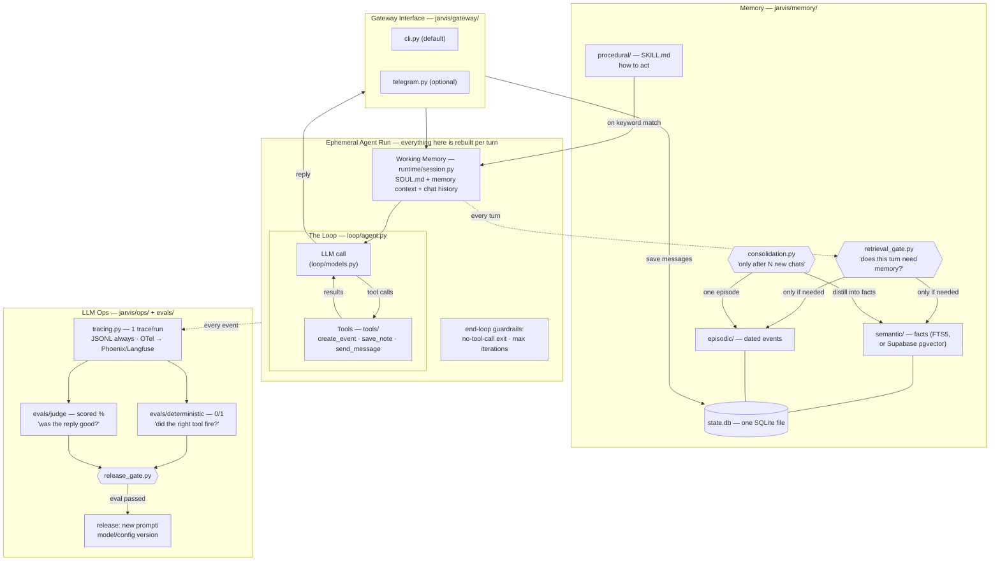

# Architecture — the whiteboard, refreshed

The same system as the two whiteboard diagrams from the previous videos
(the generic Harness/Loop/Memory/LLM-Ops one and the Hermes-specific one),
now with a file path on every box.

## Design decisions worth stealing

- **The gate before retrieval** (not retrieval on every turn): a cheap-model judge
  answers "does this message need the user's memory?" — saves latency and, more
  importantly, keeps irrelevant memories from biasing answers.
- **Consolidation is batched** ("after N chats"), asynchronous to the reply path,
  and loss-safe: if the summarizer fails, the chat log stays unconsolidated.
- **Deterministic evals and judge evals never mix.** One is a unit test, the other
  is a scored opinion. The release gate requires 100% of the first and a threshold
  on the second.
- **Every layer has a boring default and a documented upgrade** — FTS5 → pgvector,
  mock calendar → Google Calendar, JSONL → Phoenix/Langfuse. The default is always
  zero-signup.

## What this deliberately is not

Not a framework, not multi-agent, not production. It's the readable blueprint —
OpenClaw and Hermes are the products; this is the afternoon read that explains them.
