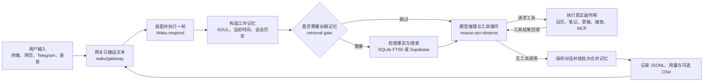

# waku-agent 项目学习指南

## 1. 项目速览

waku-agent 是一个面向 Agent 初学者和个人开发者的教学型、本地优先个人助理。它不借助 LangGraph 等编排框架，而是把 **Harness、Loop、Memory、Eval/LLM-Ops** 四个支柱直接写成可阅读的 Python：输入从 CLI、Dashboard、Telegram 或语音进入，同一套运行时负责组装上下文、调用模型、执行工具、持久化记忆并记录追踪。

项目的旗舰任务是个人日程：模型可以读取或创建本地日历事件，也可以保存事实、生成待发送消息、搜索网页和调用可选 MCP 工具。真正的产品目标不是覆盖最多能力，而是让读者能在一个下午内看清一个 Agent 从请求到副作用的完整闭环。项目边界由 [README](../README.md)、[架构说明](../docs/architecture.md) 和 [贡献约定](../CONTRIBUTING.md) 共同给出。

本指南基于 `main` 分支提交 `cc604f6`，分析日期为 2026-07-15。开始分析前已执行 `git fetch` 与 `git pull --ff-only`，本地和 `origin/main` 的 ahead/behind 均为 0；预先存在的未跟踪用户文件未被改动或纳入分析提交。

一句话定位：**这是用于学习和改造单 Agent 核心机制的透明蓝图，不是开箱即用的生产级个人助理平台。**

## 2. 背景、问题定义与边界

### 2.1 它要解决什么问题

很多 Agent 项目一上来就引入工作流框架、分布式服务、向量数据库和大型前端，新人能运行产品，却难以回答几个基础问题：模型为什么会调用工具、工具结果如何回到模型、长期记忆何时检索、一次对话如何结束、回归质量如何判断。

waku-agent 把这些问题压缩成几个显式模块：

- [应用装配层](../waku/app.py) 把配置、数据库、模型、工具、记忆、会话和追踪拼成一个 `Waku`。
- [工作记忆层](../waku/runtime/session.py) 每轮构造系统提示、当前时间、按需长期记忆和命中的技能。
- [Agent Loop](../waku/loop/agent.py) 直接展示 `reason -> act -> observe -> repeat`。
- [记忆门面](../waku/memory/__init__.py) 统一语义、情景和程序性记忆。
- [确定性评测](../evals/deterministic/) 与 [Judge 评测](../evals/judge/) 分离，避免把可精确断言的副作用交给模型打分。

### 2.2 “本地优先”不等于“完全离线”

事实是：SQLite 状态库、ICS 日历、消息草稿、技能、SOUL、JSONL trace 和 Dashboard 都默认保存在本机，Dashboard 也只绑定 `127.0.0.1`。但是 [模型适配层](../waku/loop/models.py) 会把系统提示、相关记忆和对话历史发送给所选远程模型 Provider；启用 Tavily、Telegram、Supabase 或 OTel 导出时，也会访问对应外部服务。

因此更准确的安全模型是：**状态与控制面本地优先，推理和可选集成可能远程。** 若 trace 中含私人对话或工具参数，启用 OTel 导出前还应把它们视为将要离开本机的数据。

### 2.3 明确不做什么

根据 [README 的 Roadmap](../README.md#roadmap--on-the-whiteboard-coming-soon) 与 [贡献约定](../CONTRIBUTING.md#scope-what-well-say-no-to-kindly)，当前项目不追求多 Agent 调度、任意终端执行、完整浏览器自动化、企业级权限或生产级高可用。相关能力在 [实验工具](../waku/tools/experimental.py) 中只是默认关闭的骨架。

## 3. 架构概览



架构有三条关键边界：

1. **网关与智能解耦。** [CLI](../waku/gateway/cli.py)、[Telegram](../waku/gateway/telegram.py)、[语音](../waku/gateway/voice.py) 和 [Dashboard](../waku/ops/dashboard.py) 最终都调用 `Waku.respond()`；通道只决定输入输出形式和 `source` 标签。
2. **Loop 只认一种协议。** [Agent Loop](../waku/loop/agent.py) 使用 Anthropic Messages 的内容块形状；[模型适配层](../waku/loop/models.py) 把 OpenAI/Gemini 的 Chat Completions 形状转换进来，核心循环不感知 Provider 差异。
3. **持久状态与每轮状态分开。** [Session](../waku/runtime/session.py) 中的工作记忆随进程和会话变化；[SQLite schema](../waku/db.py)、`SOUL.md`、用户技能、trace 和 outbox 才是可恢复状态。

## 4. 核心目录树（精简版）

```text
waku-agent/
├── pyproject.toml                    # Python 包、CLI 与可选 extras
├── Makefile                          # 运行、评测、门禁和 lint 快捷命令
├── waku/
│   ├── __main__.py                   # 【重点】所有 CLI 子命令分发入口
│   ├── app.py                        # 【重点】依赖装配与单轮总编排
│   ├── config.py                     # 环境变量配置和本地状态目录
│   ├── db.py                         # SQLite schema 与增量迁移
│   ├── gateway/                      # CLI、Telegram、语音输入输出适配
│   ├── runtime/session.py            # 【重点】工作记忆和会话历史组装
│   ├── loop/
│   │   ├── agent.py                  # 【重点】显式 reason-act-observe 循环
│   │   └── models.py                 # 两种 wire format、五个 Provider
│   ├── tools/
│   │   ├── registry.py               # 【重点】工具 schema、注册与安全执行
│   │   ├── calendar.py               # 旗舰任务：日历读写与幂等保护
│   │   └── mcp_client.py             # 同步 Loop 到异步 MCP 的桥
│   ├── memory/
│   │   ├── __init__.py               # 【重点】三类记忆的统一门面
│   │   ├── retrieval_gate.py         # 检索前置判定
│   │   ├── consolidation.py          # 批量对话蒸馏
│   │   ├── semantic/                  # 事实：FTS5 或 Supabase pgvector
│   │   ├── episodic/                  # 带日期的情景记忆
│   │   └── procedural/                # SKILL.md 加载、匹配、安装
│   └── ops/
│       ├── tracing.py                 # 【重点】JSONL、usage 与可选 OTel
│       ├── dashboard.py               # 本地 HTTP API 和 Dashboard gateway
│       └── release_gate.py            # 确定性/Judge 评测门禁
├── skills/                            # 内置程序性记忆
├── evals/
│   ├── deterministic/                 # 【重点】可精确断言的离线回归
│   └── judge/                         # 需要真实模型的质量评分
└── learning/                          # 中文学习指南与后续实验空间
```

## 5. 核心模块与阅读优先级

| 模块 | 职责 | 为什么重要 | 优先级 |
| --- | --- | --- | --- |
| [应用装配](../waku/app.py) | 构造所有依赖并编排一轮请求 | 一页代码就能看到全系统对象关系 | P0 |
| [Agent Loop](../waku/loop/agent.py) | 模型调用、工具执行、结果回填、退出保护 | 项目的教学核心，决定 Agent 是否真正“行动” | P0 |
| [工作记忆](../waku/runtime/session.py) | 组装 SOUL、时间、长期记忆、技能和会话历史 | 决定模型在每轮“知道什么” | P0 |
| [工具注册表](../waku/tools/registry.py) 与 [工具装配](../waku/tools/__init__.py) | 统一工具 schema 与执行边界 | 新增副作用或 MCP 能力都从这里接入 | P0 |
| [记忆门面](../waku/memory/__init__.py) | 聚合三类记忆、检索门和合并器 | 展示长期记忆不是单一向量库 | P1 |
| [SQLite schema](../waku/db.py) | 保存日历、事实、情景、聊天和 FTS 索引 | 本地状态的真实来源，调试时可直接查询 | P1 |
| [模型适配](../waku/loop/models.py) | 统一 Anthropic/OpenAI 两种协议 | 解释五个 Provider 如何共享同一 Loop | P1 |
| [追踪](../waku/ops/tracing.py) | 写 trace、token ledger 和 OTel span | 让每轮行为可观察、可复盘 | P1 |
| [Dashboard](../waku/ops/dashboard.py) | 本地 UI、状态 API、SSE 流式对话 | 展示同一 Harness 如何服务网页通道 | P2 |
| [评测](../evals/) | 将程序副作用回归与回答质量评分分开 | 规定了可安全发布的证据门槛 | P2 |

最有效的阅读顺序不是从 CLI 逐文件向下读，而是先读 [应用装配](../waku/app.py)，再读 [工作记忆](../waku/runtime/session.py) 与 [Agent Loop](../waku/loop/agent.py)，最后沿某个真实工具和记忆写回路径展开。

## 6. 一条真实的核心执行链路

以终端输入“下周二上午 9 点和 Alex 喝咖啡”为例，真实链路是：

`用户输入 -> CLI -> Waku.respond -> Session.build_system -> retrieval gate -> run_loop -> 模型请求 create_event -> ToolRegistry.execute -> SQLite + calendar.ics -> 工具结果回到模型 -> 最终回复 -> chat_log/合并记忆/trace`

逐步绑定源码如下：

1. [CLI](../waku/gateway/cli.py) 构造一个 `Waku`，把终端会话标成 `terminal`，然后调用 `respond(..., source="cli")`。
2. [Waku.respond](../waku/app.py) 组合界面 observer 与 tracer，并让 [Session](../waku/runtime/session.py) 读取或创建 `SOUL.md`、注入本机当前时间、调用记忆检索门、匹配最多两个相关技能。
3. [Retrieval gate](../waku/memory/retrieval_gate.py) 先用小模型判断请求是否依赖个人记忆。判定失败时采取 fail-open：仍然检索，优先避免遗漏记忆。
4. [Agent Loop](../waku/loop/agent.py) 把系统提示、历史、新消息和全部工具 schema 发给模型。若模型返回 `tool_use(create_event)`，循环不会结束。
5. [ToolRegistry](../waku/tools/registry.py) 调用 [日历工具](../waku/tools/calendar.py)。工具先以 `title + start` 做幂等检查，再写 `calendar_events` 表和 `calendar.ics`；只有打开 Apple Calendar 开关时才进一步写真实 Calendar.app。
6. 工具的纯文本结果以 `tool_result` 追加到当前轮消息中，Loop 再调用一次模型。模型不再请求工具时，文本成为最终回复；典型单工具任务因此需要两次主模型迭代。
7. [Session.add_exchange](../waku/runtime/session.py) 把回复和 `[tools used: ...]` 摘要写入内存历史及 `chat_log`，避免后续轮次忘记已经执行过副作用。
8. [合并器](../waku/memory/consolidation.py) 每累计默认 6 个 exchange 才尝试把未合并聊天蒸馏为事实和一个情景；失败时原始日志保持未合并，等待下次重试。
9. [记忆门面](../waku/memory/__init__.py) 重新生成本地 `MEMORY.md` 视图；[Tracer](../waku/ops/tracing.py) 已同步写入 gate、LLM、tool、consolidation、turn start/end 和 token usage。

### 核心状态映射

| 状态 | 写入点 | 读取/消费点 | 生命周期 |
| --- | --- | --- | --- |
| 当前会话历史 | [Session.add_exchange](../waku/runtime/session.py) | 下一轮 [Session](../waku/runtime/session.py) 与 [Agent Loop](../waku/loop/agent.py) | 当前进程；可从 `chat_log` 切换恢复 |
| 原始聊天 | [Memory.log_chat](../waku/memory/__init__.py) | Session 历史恢复、合并器、Dashboard | SQLite 持久化 |
| 语义事实 | [save_note](../waku/tools/notes.py) 或 [合并器](../waku/memory/consolidation.py) | [检索门后的事实搜索](../waku/memory/__init__.py) | SQLite FTS5 或 Supabase |
| 情景记忆 | [合并器](../waku/memory/consolidation.py) | 情景搜索与 Dashboard | SQLite 持久化 |
| 程序性记忆 | 内置或用户创建的 [SKILL.md 加载器](../waku/memory/procedural/loader.py) | 每轮关键词匹配后注入系统提示 | 仓库或本地技能目录 |
| 日历副作用 | [日历工具](../waku/tools/calendar.py) | `list_events`、Dashboard、外部导入 | SQLite + ICS；Apple Calendar 可选 |
| 可观测事件 | [Tracer](../waku/ops/tracing.py) | Dashboard Ops、JSONL 阅读器、OTel 后端 | 本地追加；可选远程导出 |

## 7. 主要技术栈及其维护影响

### 7.1 Python 3.11+ 与标准库优先

[包配置](../pyproject.toml) 要求 Python 3.11+。`dataclasses`、`sqlite3`、`http.server`、`urllib`、`threading`、`asyncio` 等标准库承担大量职责，换来少依赖和透明控制流。最直接连接的是 [配置](../waku/config.py)、[数据库](../waku/db.py)、[Dashboard](../waku/ops/dashboard.py) 与 [搜索工具](../waku/tools/search.py)。若改为 Web 框架或 ORM，最先受影响的是 Dashboard 路由、连接并发模型和测试装配缝隙。

### 7.2 Anthropic SDK + OpenAI SDK，两种 wire format

[模型适配层](../waku/loop/models.py) 选择 Anthropic Messages 作为 Loop 内部协议：Anthropic、Kimi、GLM 直接使用；OpenAI 和 Gemini 通过薄适配器转换文本块、工具调用、工具结果、stream delta 和 token usage。这样比在 Loop 内散布 Provider 分支更容易教学和测试。

维护时要重点回归两处：Provider 默认模型字符串会随服务方变化；`OpenAICompatClient._call()` 对所有异常都会尝试一次旧式 `max_tokens` 参数回退，认证、限流等非参数错误也可能被重复请求。升级 SDK 或新增 Provider 时，应优先增加适配器级离线测试，而不是只依赖真实模型冒烟。

### 7.3 SQLite + FTS5

[数据库 schema](../waku/db.py) 用一份 `state.db` 同时保存日历、事实、情景和聊天，并用触发器维护事实/情景 FTS 索引。对单用户数据量，它比部署向量数据库更容易理解、备份和调试；[Supabase adapter](../waku/memory/semantic/supabase_store.py) 则保留了语义检索升级路径。

当前 [FTS 查询预处理](../waku/memory/semantic/store.py) 只提取 ASCII 字母和数字，因此纯中文查询会得到空查询：事实搜索返回空，情景搜索退化为最近记录。这是中文使用场景下最值得优先补的检索缺口。

### 7.4 SKILL.md 程序性记忆

[技能加载器](../waku/memory/procedural/loader.py) 扫描仓库和用户状态目录中的 `SKILL.md`，只用名称与描述的关键词重叠做匹配，再把正文注入系统提示。它解决的是“按需加载做事方法”，不是事实检索。更新技能格式、匹配算法或热重载逻辑时，会直接影响 [内置技能](../skills/) 和 [记忆管理工具](../waku/tools/memory_admin.py)。

### 7.5 JSONL + OpenTelemetry 可观测性

[Tracer](../waku/ops/tracing.py) 无条件写本地 JSONL，并把每次 LLM 调用的 token 追加到长期 ledger；配置 OTLP endpoint 后，同样事件会映射成 span。这个设计保证零配置也能复盘，升级后端时无需侵入 Loop。但 trace 包含用户消息、回复、工具参数和输出，接入远程 OTel 后端前必须重新评估隐私和脱敏。

### 7.6 pytest 确定性评测 + DeepEval Judge

[离线评测](../evals/deterministic/) 用脚本化模型精确验证工具触发、数据库/ICS 副作用、幂等性、循环退出、时间注入和语音匹配；[Judge 评测](../evals/judge/) 才评价帮助性与记忆利用质量。[发布门禁](../waku/ops/release_gate.py) 要求确定性 suite 全绿；存在 Anthropic key 时再运行 Judge。二者分离是该项目 LLM-Ops 设计中最值得保留的原则。

## 8. 运行、调试与当前验证结果

### 8.1 建立开发环境

推荐按 [README Quickstart](../README.md#quickstart) 使用 `uv`：

```bash
uv venv --python 3.13
uv pip install -e '.[dev]'
cp .env.example .env
```

在 `.env` 中只需选择一个 Provider 并配置对应 key；所有开关的权威列表见 [环境变量模板](../.env.example)。真实 CLI 对话会在构造 `Waku` 时创建模型 client，因此没有 key 会直接退出。

一个实际踩坑：若仓库没有 `.venv`，[Makefile](../Makefile) 会回退到名为 `python` 的命令。在只安装 `python3` 的 macOS 上，`make eval` 会报 `python: No such file or directory`。先执行 `uv venv` 即可让 Make 自动使用 `.venv/bin/python`。

### 8.2 最小有意义工作流

不需要任何模型 key 就能验证核心控制流：

```bash
make eval
make lint
.venv/bin/python scripts/validate_skills.py
```

需要真实模型时：

```bash
uv run waku
uv run waku dashboard
```

其他入口由 [CLI 分发器](../waku/__main__.py) 定义：`waku voice`、`waku telegram`、`waku brief` 和 `waku skill install <url>`。可选依赖分别在 [包配置](../pyproject.toml) 的 extras 中声明。

### 8.3 Dashboard 运行模型

[Dashboard](../waku/ops/dashboard.py) 是一个 `ThreadingHTTPServer`：静态前端没有构建步骤；聊天 Agent 在第一次请求时懒加载；一个锁让单用户聊天串行执行；SQLite 连接用 `check_same_thread=False` 配合锁和 busy timeout。它默认从 7777 端口开始，冲突时最多向后尝试 9 个端口。

即使没有模型 key，Dashboard 首页和只读状态接口仍可启动并读取空状态；真正聊天时才会因 Agent 懒加载而要求 key。

### 8.4 本次已完成的验证

| 验证 | 实际结果 | 说明 |
| --- | --- | --- |
| 仓库同步 | 本地与 `origin/main` 一致 | `git pull --ff-only` 返回 up to date |
| Python 环境 | Python 3.13.1，隔离 `.venv` | 按项目要求创建 |
| 确定性评测 | 32 passed，5 skipped | 跳过项是没有 Anthropic key 的 live dataset |
| Ruff | All checks passed | 覆盖 `waku` 与 `evals` |
| 技能校验 | 2 skills valid | `schedule-meeting`、`weekly-brief` |
| Dashboard 冒烟 | `/` 和 `/api/data` 均 HTTP 200 | 使用隔离的 `/tmp` 状态目录和 18777 端口 |

未验证边界：真实 Provider 回复、Judge suite、Telegram long polling、麦克风/语音合成、Apple Calendar/Mail 权限、Tavily、Supabase、MCP 子进程和 OTel 后端。这些都需要密钥、账户、硬件或显式系统权限，不应由静态绿灯推断为已可用。

### 8.5 调试切入点

- Agent 不调用工具：先看 [系统提示与技能注入](../waku/runtime/session.py)，再看 [工具描述](../waku/tools/__init__.py) 和 trace 中的模型响应。
- 工具调用了但副作用错误：直接查 [工具实现](../waku/tools/) 与 `state.db`，不要先调 prompt。
- 重复执行副作用：对照 [日历幂等回归](../evals/deterministic/test_tool_trigger.py) 和历史中的 `[tools used: ...]`。
- 记忆没命中：分别检查 [检索门](../waku/memory/retrieval_gate.py)、[FTS 查询清洗](../waku/memory/semantic/store.py) 和 facts/episodes 表，不要把三个环节混为一谈。
- Dashboard 与 CLI 行为不同：确认各自的 `session_id`、`source` 与 Dashboard 共享 Agent 锁；业务主链仍应落到同一个 [Waku.respond](../waku/app.py)。

## 9. 同类项目与生态定位

以下比较只用于定位，不代表能力排名。

| 项目 | 官方定位 | 与 waku-agent 的关键差异 | 何时更适合选 waku-agent |
| --- | --- | --- | --- |
| [LangGraph](https://docs.langchain.com/oss/python/langgraph/overview) | 面向长时间、有状态 Agent 的低层编排框架和运行时 | LangGraph 提供图、持久执行与编排抽象；waku-agent 故意保留一个显式 for-loop，不提供 durable graph runtime | 想先真正看懂单 Agent 工具循环和退出条件时 |
| [Letta](https://docs.letta.com/guides/ade/overview) | 创建、测试和观察 stateful agents，强调 memory、state、prompt 与 tool execution 可见性 | Letta 是完整 stateful-agent 平台；waku-agent 用单个 SQLite、少量模块手工展示记忆门、合并和三类记忆 | 想学习记忆机制本身，且希望本地状态可直接打开时 |
| [OpenHands](https://docs.openhands.dev/sdk/index) | 面向软件开发 Agent 的 Python/REST SDK，提供代码执行、文件、浏览和可扩展工具 | OpenHands 的领域是软件工程，包含 Agent Server 和生产工具；waku-agent 的旗舰领域是个人日程，并明确排除终端和多 Agent 扩张 | 想用一个安全、窄范围任务理解 Harness，而不是部署编码 Agent 时 |

推断：waku-agent 最像“架构 kata + 可交互教材”。它适合教学、实验、小型个人定制和为大型框架建立心智模型；若目标是可靠的长任务恢复、权限隔离、多租户、团队协作或生产部署，应把它当原型参照，而不是直接扩成平台。

## 10. 渐进式学习路径

### 阶段 1：定位项目边界

- 目标：理解为什么项目宁愿少功能，也要保持透明。
- 阅读：[README](../README.md)、[架构说明](../docs/architecture.md)、[贡献约定](../CONTRIBUTING.md)。
- 需要回答：旗舰任务是什么？哪些白板能力只是骨架？“本地优先”在哪些边界成立？
- 最小练习：用自己的话画出 Gateway、Working Memory、Loop、Memory、Ops 五个方框。

### 阶段 2：跑通最小流程

- 目标：在不花模型费用的情况下验证仓库骨架。
- 阅读：[Makefile](../Makefile)、[评测 helper](../evals/helpers.py)、[工具触发测试](../evals/deterministic/test_tool_trigger.py)。
- 需要回答：脚本化 client 如何替代真实模型？测试断言的是模型措辞还是程序副作用？
- 最小练习：运行 `make eval`，再单独执行幂等测试并观察临时目录中的数据库和 ICS。

### 阶段 3：理解装配与工作记忆

- 目标：知道一轮请求开始前系统实际准备了什么。
- 阅读：[应用装配](../waku/app.py) -> [配置](../waku/config.py) -> [工作记忆](../waku/runtime/session.py)。
- 需要回答：哪些依赖可注入？当前时间在哪里加入？长期记忆与技能分别何时进入提示？
- 最小练习：构造一个 `Session(memory=None)`，打印 `build_system()`，验证时间与 SOUL 内容。

### 阶段 4：追踪核心执行路径

- 目标：掌握模型请求工具后为什么还要再次调用模型。
- 阅读：[Agent Loop](../waku/loop/agent.py) -> [工具注册表](../waku/tools/registry.py) -> [日历工具](../waku/tools/calendar.py) -> [回归测试](../evals/deterministic/test_tool_trigger.py)。
- 需要回答：两种退出条件是什么？一次响应能包含多少工具调用？错误为什么返回给模型而不是抛出到 Loop？
- 最小练习：在脚本化响应中串联 `search_web` 和 `create_event`，记录 iterations 与 tool_calls 顺序。

### 阶段 5：拆开三类记忆

- 目标：不要把 Memory 简化成“向量库”。
- 阅读：[记忆门面](../waku/memory/__init__.py) -> [检索门](../waku/memory/retrieval_gate.py) -> [事实存储](../waku/memory/semantic/store.py) -> [情景存储](../waku/memory/episodic/store.py) -> [合并器](../waku/memory/consolidation.py) -> [技能加载器](../waku/memory/procedural/loader.py)。
- 需要回答：检索门失败为什么 fail-open？合并失败如何避免丢日志？事实、情景、技能分别回答什么问题？
- 最小练习：添加英文事实并用同义/不同词查询，再用纯中文查询，对照当前 FTS 预处理边界。

### 阶段 6：扩展与贡献

- 目标：在不破坏可读性的前提下增加一个窄能力。
- 阅读：[工具装配](../waku/tools/__init__.py)、[模型适配](../waku/loop/models.py)、[追踪](../waku/ops/tracing.py)、[Good first issues](../docs/good-first-issues.md)。
- 需要回答：改动属于 gateway、tool、memory store、provider adapter 还是 ops？需要哪条确定性回归？是否引入新依赖和权限？
- 最小练习：实现一个无副作用的只读工具，给出 schema、执行函数、离线测试和 trace 证据。

## 11. 建议的第一批贡献

1. 修正 [贡献指南](../CONTRIBUTING.md) 中残留的 `jarvis` 命令与目录名，使其与当前 `waku` 包一致。这是纯文档、低风险且能立刻减少新人困惑的改动。
2. 为 [OpenAI 兼容适配器](../waku/loop/models.py) 增加纯离线转换测试，覆盖多工具调用、流式参数拼接、token usage 和参数回退。
3. 改进 [FTS 查询预处理](../waku/memory/semantic/store.py) 的 Unicode/中文 token 支持，并添加中文事实检索回归。
4. 给 [Supabase fact store](../waku/memory/semantic/supabase_store.py) 明确 CRUD 能力契约；当前记忆管理工具和 Dashboard 所依赖的 `list/update/delete/search_with_ids` 并未在该 adapter 中完整实现。
5. 从 [Good first issues](../docs/good-first-issues.md) 选择 trace pretty-printer 或 `/memory` CLI 命令：二者都能复用现有状态，不需要扩大 Agent 权限面。

每个贡献都应遵守仓库规则：若来自真实使用 bug，要同时新增 [确定性回归](../evals/deterministic/)；提交前运行 `make lint` 和 `make gate`。

## 12. 开放问题与已知限制

### 已由源码确认

- [贡献指南](../CONTRIBUTING.md) 仍引用旧的 `jarvis` 包名，而代码、CLI 和其余文档已经使用 `waku`。
- [默认 FTS 查询](../waku/memory/semantic/store.py) 不支持纯中文 token，中文个人记忆检索会显著退化。
- [Session](../waku/runtime/session.py) 会把当前会话全部历史继续带入后续请求，没有 token 预算、裁剪或摘要策略；长会话可能超过模型上下文或持续抬高成本。
- [合并器](../waku/memory/consolidation.py) 按整个数据库中所有未合并聊天批处理，不按 session 隔离；这是全局个人记忆的简化设计，但跨通道对话可能一起被概括。
- [Dashboard](../waku/ops/dashboard.py) 是单进程、单用户、进程内锁模型，不是多用户服务。它绑定 localhost 是安全前提之一。
- [发布门禁](../waku/ops/release_gate.py) 只有在 `ANTHROPIC_API_KEY` 存在时才运行 Judge；没有 key 时的 `GATE OPEN` 只代表确定性 suite 通过。

### 需要真实环境继续确认

- 当前 Provider 默认模型 ID 是否都对各自账户可用；源码也明确允许用 `WAKU_MODEL` 和 `WAKU_SMALL_MODEL` 覆盖。
- Telegram 后台线程、Voice 音频设备、Apple Automation 权限在目标机器上的稳定性。
- DuckDuckGo HTML 搜索的限流情况，以及 Tavily 作为可靠演示后端时的实际质量。
- MCP bridge 在多个长生命周期 server、超时和关闭阶段的资源回收表现。
- OTel 对 Phoenix 或 Langfuse 的认证、TLS 与字段映射是否满足目标部署。

## 13. 学习工作区说明

- [源码详解目录](src/)：后续单文件或模块级源码详解。
- [Chat 沉淀目录](chat/)：一次性较强的对比、排查或问答沉淀。
- [学习测试目录](test/)：帮助理解代码、但不属于正式发布门禁的学习测试。
- [Playground 索引](playground/README.md)：可运行实验入口，按标准库、外部框架和项目强相关 demo 分类。

主指南保持稳定、紧凑；长篇分支主题应进入 [Chat 沉淀目录](chat/)，可运行探索应进入 [Playground](playground/)，再从本页链接过去。
