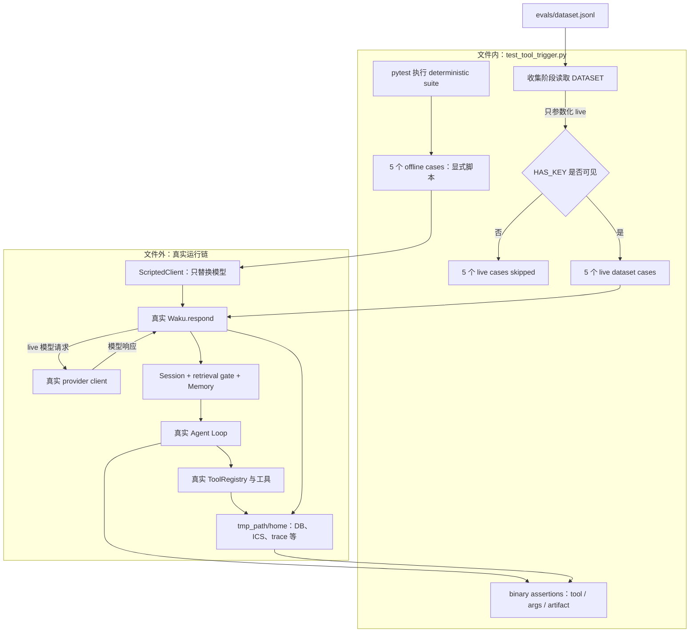

# `test_tool_trigger.py` 源码解析

## 源码文件

本文分析 [`evals/deterministic/test_tool_trigger.py`](../../../../evals/deterministic/test_tool_trigger.py#L1)。这个文件用同一套 binary assertions 覆盖两层能力：固定模型输出的 offline runtime 测试，以及真实模型参与的 live prompt / tool-selection 测试。

## 一句话总结

该文件验证的是“最终是否调用了正确 tool，并产生了正确状态”，其中 offline cases 只 fake 模型、仍执行真实 Waku runtime，live cases 则由 `dataset.jsonl` 驱动真实模型请求；因此 **deterministic 不等于 offline**，而 `tmp_path` 中的 SQLite、ICS、memory、trace 等都是实际副作用。

## 前提知识

1. **二元断言与模型可重复性不是一回事**：这里的 deterministic 指 pass/fail 判据是精确布尔契约，例如 tool 名、参数子串、行数或文件内容；live 模型输出本身仍可能波动。
2. **一次 Waku turn 有 gate 与主循环两段模型调用**：[`Session.build_system()`](../../../../waku/runtime/session.py#L82) 先调用 retrieval gate，之后 [`run_loop()`](../../../../waku/loop/agent.py#L40) 才计算 iteration。脚本第一项因此不计入 `LoopResult.iterations`。
3. **Anthropic 形状 fake**：[`evals/helpers.py`](../../../../evals/helpers.py#L15) 用轻量对象实现主循环读取的响应字段，`ScriptedClient` 再按队列顺序返回它们。
4. **真实 runtime 装配**：[`make_waku()`](../../../../evals/helpers.py#L84) 把 fake 注入 [`Waku`](../../../../waku/app.py#L18)，但没有替换 DB、Memory、Session、ToolRegistry、Loop 或 Tracer。
5. **pytest collection 语义**：模块顶层的 `DATASET` 会在收集阶段先读取；`skipif` 只决定 live test 是否执行，不会阻止 dataset 文件在 import 时被解析。

## 文件概览

| 代码位置 | 层级 | 证明的契约 | 主要观察点 |
| --- | --- | --- | --- |
| [`DATASET` 加载](../../../../evals/deterministic/test_tool_trigger.py#L23) | collection | JSONL 可以转成 live case 列表 | 只被 live 参数化使用 |
| [`test_create_event_writes_db_and_ics`](../../../../evals/deterministic/test_tool_trigger.py#L33) | offline | tool-use 能穿过完整 runtime | `LoopResult`、SQLite 行、ICS 内容 |
| [`test_create_event_is_idempotent`](../../../../evals/deterministic/test_tool_trigger.py#L59) | offline | 同 title + 分钟级 start 不重复写入 | DB 数量、第二次输出、ICS 次数 |
| [`test_history_records_tool_use`](../../../../evals/deterministic/test_tool_trigger.py#L84) | offline | 已执行动作进入后续 working history | `Session.history` assistant 记录 |
| [`test_no_tool_turn_ends_loop_in_one_iteration`](../../../../evals/deterministic/test_tool_trigger.py#L102) | offline | 纯文本响应自然退出 | reply、iterations、空 tool_calls |
| [`test_iteration_guardrail_stops_runaway_loop`](../../../../evals/deterministic/test_tool_trigger.py#L119) | offline | 连续 tool-use 会被硬上限终止 | 3 iterations、limit reply |
| [`test_dataset_case`](../../../../evals/deterministic/test_tool_trigger.py#L142) | live | 真实模型对固定输入选择正确 tool / args | tool 名与参数子串的 binary assertion |

## 文件拆解

### 1. 顶层 dataset: 被读取, 不代表每个测试都由它驱动

[`DATASET`](../../../../evals/deterministic/test_tool_trigger.py#L23) 在模块 import / pytest collection 阶段读取 [`evals/dataset.jsonl`](../../../../evals/dataset.jsonl#L1)，忽略空行后逐行 `json.loads()`。当前五条数据覆盖：

- 基础日程创建；
- 带已知偏好的日程创建；
- 保存偏好；
- 起草消息；
- 普通知识问答不调用 tool。

但这份 dataset **只出现在 live test 的参数化装饰器中**，见 [`parametrize("case", DATASET)`](../../../../evals/deterministic/test_tool_trigger.py#L141)。上面的五个 offline cases 全都在函数内部显式声明自己的 scripted responses，没有从 dataset 取输入或预期结果。

由此还有一个 collection 层后果：即使机器没有 API key、live case 最终会 skip，缺失或损坏的 `dataset.jsonl` 仍会让本模块在收集阶段失败。

### 2. Offline 公共结构: gate 响应 + loop 响应

每个 offline case 都创建 [`ScriptedClient`](../../../../evals/helpers.py#L58)，通常脚本结构为：

```text
第 1 项：retrieval gate JSON
第 2 项：Agent Loop 第 1 次迭代，返回 tool_use 或最终文本
第 3 项及以后：tool_result 后的下一次 reason，或持续 tool_use
```

第一项在 [`Session.build_system()`](../../../../waku/runtime/session.py#L101) 内被 Memory 消费；主循环尚未开始，所以它不计入 `result.iterations`。这也是 [`test_no_tool_turn_ends_loop_in_one_iteration`](../../../../evals/deterministic/test_tool_trigger.py#L110) 虽然准备两条 response，仍断言 iteration 为 1 的原因。

这些 case 的“offline”仅指不用真实模型。它们仍从公开 [`app.respond()`](../../../../evals/deterministic/test_tool_trigger.py#L49) 进入生产路径，而不是直接调用 tool function 或伪造数据库结果。

### 3. 创建事件: 同时断言协议观察值和物理 artifact

[`test_create_event_writes_db_and_ics`](../../../../evals/deterministic/test_tool_trigger.py#L33) 将一次 `create_event` tool-use 和一次最终文本排在 gate 后面。`respond()` 返回后，它做三层断言：

1. [`result.tool_calls`](../../../../evals/deterministic/test_tool_trigger.py#L52) 中实际执行过 `create_event`；
2. [`calendar_events` 查询](../../../../evals/deterministic/test_tool_trigger.py#L53) 得到正确 title / start；
3. [`calendar.ics` 文件](../../../../evals/deterministic/test_tool_trigger.py#L56) 含正确 `SUMMARY`。

后两项很关键：它们证明 fake 只决定模型输出，真实 [`ToolRegistry.execute()`](../../../../waku/tools/registry.py#L67) 与 [`calendar.create_event()`](../../../../waku/tools/calendar.py#L161) 确实运行了。`tmp_path/home` 是实际 runtime home，不是 mock-call 容器。

### 4. 幂等: 同一轮两个 tool blocks 也必须只写一次

[`test_create_event_is_idempotent`](../../../../evals/deterministic/test_tool_trigger.py#L59) 在同一个模型响应中放入两个 `create_event` blocks：title 相同，start 分别为分钟格式和带秒格式。真实主循环会在同一 iteration 中依次执行两个 blocks，见 [`for call in tool_uses`](../../../../waku/loop/agent.py#L113)。

日历工具先把秒截断到分钟，再以 `title + start` 查询既有行，见 [`幂等归一化与查询`](../../../../waku/tools/calendar.py#L183)。因此测试同时固定三个外部可见结果：

- SQLite 最终只有一行；
- 第二个 tool output 明确包含 `already exists`；
- ICS 中同一 `SUMMARY` 只出现一次。

这不是测试 fake 的去重能力；`ScriptedClient` 明确要求调用两次，去重发生在真实 calendar tool 内。

### 5. History: 动作事实必须跨 turn 可见

[`test_history_records_tool_use`](../../../../evals/deterministic/test_tool_trigger.py#L84) 执行一次真实 event 创建后，检查 Session 最后一条 assistant history 是否含 `[tools used: create_event ...]`。

该字符串由 [`Session.add_exchange()`](../../../../waku/runtime/session.py#L115) 根据 `LoopResult.tool_calls` 生成并追加到 reply，见 [`tool summary`](../../../../waku/runtime/session.py#L127)。这项测试保护的是“已经行动过”这一事实能否进入下一轮 working memory；否则模型可能因只看到 `Done.` 而重复执行副作用。

### 6. 两种 Loop 退出方式

[`test_no_tool_turn_ends_loop_in_one_iteration`](../../../../evals/deterministic/test_tool_trigger.py#L102) 固定自然退出：gate 后第一个 loop response 只有文本，真实 loop 在 [`if not tool_uses`](../../../../waku/loop/agent.py#L108) 立即返回。断言同时绑定 reply、一次 iteration 和空 tool list。

[`test_iteration_guardrail_stops_runaway_loop`](../../../../evals/deterministic/test_tool_trigger.py#L119) 固定强制退出：准备 99 个 `save_note` tool-use，但把 Settings 的 [`max_iterations` 覆盖为 3](../../../../evals/deterministic/test_tool_trigger.py#L132)。主循环真实执行 3 次 tool 后落到 [`iteration limit` 返回](../../../../waku/loop/agent.py#L127)。gate 调用不计入这 3 次，剩余 96 条 scripted responses 也不会被消费。

### 7. Live tier: 真实模型输出, 精确结果判定

[`test_dataset_case`](../../../../evals/deterministic/test_tool_trigger.py#L142) 同时受两个装饰器控制：

- `HAS_KEY` 为假时 skip；
- `DATASET` 中每条记录生成一个独立 case id。

函数没有传 client 给 [`make_waku(tmp_path / "home")`](../../../../evals/deterministic/test_tool_trigger.py#L152)，所以 Waku 创建真实 provider client。含 `setup_fact` 的 case 会先把事实写入该 case 的隔离 semantic memory，再让真实 gate / model / tool 链处理输入。

最后的 [`binary assertions`](../../../../evals/deterministic/test_tool_trigger.py#L160) 只检查：

- 预期无 tool 时，实际列表必须为空；
- 预期有 tool 时，该 tool 必须出现；
- `expect_in_args` 中每个 needle 必须以不区分大小写的子串形式出现在对应参数。

这里没有 LLM judge，但确实有真实网络和模型不确定性。因此 deterministic 是“判分规则确定”，不是“执行环境离线”或“结果永不波动”。

### 8. `tmp_path` 中的状态是被测结果

每个 case 都把 Waku home 设为 `tmp_path / "home"`。真实 [`Waku.__init__()`](../../../../waku/app.py#L19) 会创建本地运行时，真实 [`Waku.respond()`](../../../../waku/app.py#L57) 会驱动 trace、memory 和 history 收尾。按 case 走到的功能不同，目录中可能出现：

- `state.db`：事件、chat、facts 等 SQLite 状态；
- `calendar.ics`：日历工具导出的实际文件；
- `SOUL.md` 与 `MEMORY.md`：system persona 与 memory 可读镜像；
- `traces/*.jsonl` 与 `usage.jsonl`：真实 turn / LLM 观察记录；
- `outbox/` 或 note 状态：对应 tool 的真实本地副作用。

pytest 只负责提供和最终清理隔离目录，不会把这些路径自动变成虚拟文件系统。

## 主调用链

### 调用链一: Offline create-event

调用场景：模型行为已经固定，重点验证应用 wiring、loop、tool 与持久化。

1. 测试构造 [`gate + tool-use + final text`](../../../../evals/deterministic/test_tool_trigger.py#L41)。
2. [`make_waku()`](../../../../evals/helpers.py#L84) 注入 ScriptedClient，并把 home 指向 `tmp_path`。
3. [`Waku.__init__()`](../../../../waku/app.py#L19) 装配真实 connection、Memory、ToolRegistry、Session 与 Tracer。
4. [`Waku.respond()`](../../../../waku/app.py#L57) 调用 Session；retrieval gate 消费脚本第 1 项。
5. [`run_loop()`](../../../../waku/loop/agent.py#L40) 消费 tool-use，调用 [`ToolRegistry.execute()`](../../../../waku/tools/registry.py#L67)。
6. registry 路由到 [`calendar.create_event()`](../../../../waku/tools/calendar.py#L161)，实际 commit SQLite 并写 ICS，见 [`写入段`](../../../../waku/tools/calendar.py#L193)。
7. loop 消费最终文本，`respond()` 调用 [`Session.add_exchange()`](../../../../waku/runtime/session.py#L115) 并收尾 trace / memory。
8. 测试读取 `LoopResult`、DB 和文件做 binary assertions。

### 调用链二: Guardrail

调用场景：模型持续请求 tool，重点验证 runtime 不会无限 reason-act。

1. 测试生成 [`99 个 tool-use responses`](../../../../evals/deterministic/test_tool_trigger.py#L127)，但设置 `max_iterations=3`。
2. gate 先消费独立的第 1 项；随后 Agent Loop 连续消费 3 项。
3. 每项仍经真实 [`tools.execute()`](../../../../waku/loop/agent.py#L113) 产生 `save_note` 副作用。
4. `for` 循环耗尽上限后返回固定 limit reply，测试精确断言 iteration 与 reply。

### 调用链三: Live dataset

调用场景：验证模型 + prompt 的 tool-selection 行为，而不是只验证仓库 plumbing。

1. pytest 在 collection 时读取 [`dataset.jsonl`](../../../../evals/dataset.jsonl#L1)，并为每条记录参数化 live test。
2. [`HAS_KEY` skip 条件](../../../../evals/deterministic/test_tool_trigger.py#L140) 决定是否执行。
3. case 创建没有 fake client 的真实 Waku；可选 [`setup_fact`](../../../../evals/deterministic/test_tool_trigger.py#L153) 先写入隔离 memory。
4. [`app.respond(case["input"])`](../../../../evals/deterministic/test_tool_trigger.py#L157) 发起真实 gate 与主模型调用，并可能执行真实 tool。
5. 测试从 `result.tool_calls` 提取 tool 名和 args，以固定字符串契约判 pass / fail。

[`make eval`](../../../../Makefile#L31) 会运行整个 deterministic 目录，因此 key 可见时也会执行本文件 live cases；[`release_gate`](../../../../waku/ops/release_gate.py#L61) 则先跑 deterministic suite，再另行决定是否运行 judge suite。两者都不能把“deterministic suite”简单理解为“纯离线 suite”。

## 关键流程图



## 关键状态对象

| 状态对象 | 来源 | 变化方式 | 断言 / 风险 |
| --- | --- | --- | --- |
| `DATASET: list[dict]` | collection 时解析 JSONL | 模块进程内只读 | 只驱动 live 参数化；文件损坏会影响整个模块收集 |
| `HAS_KEY: bool` | `evals.helpers` import-time 环境快照 | 导入后不动态刷新 | 只控制 live skip，不控制 offline cases |
| `ScriptedClient._script` | 每个 offline case 显式构造 | gate 和 loop 依次 `pop(0)` | 队列顺序编码真实调用顺序；耗尽会显式失败 |
| `tmp_path / "home"` | pytest fixture | Waku 与 tools 实际创建 / 写入 | 隔离作用域不等于 fake；它承载被测 artifact |
| `LoopResult.tool_calls` | `run_loop()` 执行 tool 时追加 | 每次实际执行记录 tool、args、output | 是协议级断言和 history summary 的共同事实源 |
| `calendar_events` / `calendar.ics` | calendar tool | 首次事件写入；重复 key 提前返回 | 双重证明 tool 真执行以及幂等边界有效 |
| `Session.history` | `add_exchange()` | 每轮追加 user + assistant，assistant 可带 tool summary | 防止后续 turn 遗忘已发生的动作 |
| `LoopResult.iterations` | 主循环每次 reason 更新 | 不包含 retrieval gate 调用 | 无 tool case 为 1；runaway case 被固定为 3 |
| `max_iterations` | Settings override | 传入 `run_loop()` 的循环上限 | 是硬停止安全边界，不是 scripted queue 长度 |
| `case["setup_fact"]` | dataset 可选字段 | live respond 前写入 semantic facts | 为模型提供用户上下文, 但当前参数断言不能单独证明 retrieval 或偏好利用成功 |

## 阅读顺序

建议按“最短自然退出 → 一次真实副作用 → 边界回归 → live 数据集”阅读：

1. 先读模块说明和 [`DATASET` 加载](../../../../evals/deterministic/test_tool_trigger.py#L1)，先把 offline / live 与 binary assertion 三个概念分开。
2. 从最短的 [`test_no_tool_turn_ends_loop_in_one_iteration`](../../../../evals/deterministic/test_tool_trigger.py#L102) 入手，确认 gate response 不属于 loop iteration。
3. 再读 [`test_create_event_writes_db_and_ics`](../../../../evals/deterministic/test_tool_trigger.py#L33)，沿 [`Waku.respond()`](../../../../waku/app.py#L57) 到 [`run_loop()`](../../../../waku/loop/agent.py#L40) 和 calendar tool，观察真实副作用。
4. 接着读 [`test_create_event_is_idempotent`](../../../../evals/deterministic/test_tool_trigger.py#L59) 与 [`calendar.py` 的幂等分支](../../../../waku/tools/calendar.py#L183)，理解同一 iteration 多 tool blocks 的执行次序。
5. 再看 [`test_history_records_tool_use`](../../../../evals/deterministic/test_tool_trigger.py#L84)，把 `LoopResult.tool_calls` 与下一轮 working memory 联系起来。
6. 用 [`test_iteration_guardrail_stops_runaway_loop`](../../../../evals/deterministic/test_tool_trigger.py#L119) 区分“脚本长度”“模型调用次数”和“loop iteration 上限”。
7. 最后阅读 [`test_dataset_case`](../../../../evals/deterministic/test_tool_trigger.py#L142) 与 [`dataset.jsonl`](../../../../evals/dataset.jsonl#L1)，理解 live 模型为何仍属于 deterministic suite。

实际调试时，建议先查看失败 case 的 `tmp_path/home` artifact，再在 [`ScriptedClient._create()`](../../../../evals/helpers.py#L72)、[`Memory.gated_retrieve()`](../../../../waku/memory/__init__.py#L69)、[`run_loop()` 的模型调用](../../../../waku/loop/agent.py#L92) 和 [`ToolRegistry.execute()`](../../../../waku/tools/registry.py#L67) 设置断点。这样能快速判断问题发生在脚本顺序、gate、模型决策、tool 路由，还是持久化层。
