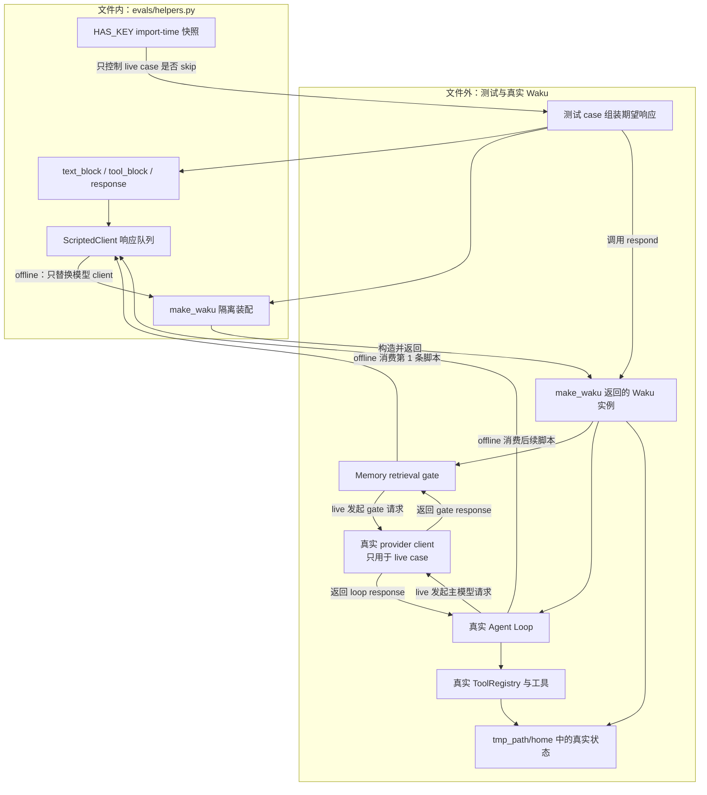

# `helpers.py` 源码解析

## 源码文件

本文分析 [`evals/helpers.py`](../../../evals/helpers.py#L1)。它不是被测业务实现，而是 deterministic / judge eval 共用的测试装配层：一边构造与 Anthropic Messages API 兼容的轻量响应，一边从真实 [`Waku`](../../../waku/app.py#L18) 入口创建隔离运行时。

## 一句话总结

`helpers.py` 用 `ScriptedClient` **只替换模型调用**，并没有伪造 Waku runtime；数据库、Memory、Session、ToolRegistry、Agent Loop、trace 和文件写入仍走生产代码，因此 `tmp_path` 里出现的是实际副作用，而不是 mock 记录。

## 前提知识

1. **Messages 协议形状**：主循环不要求响应对象一定来自 SDK，只要求它有 `stop_reason`、`usage`、`content`，且 content block 有 `type/text` 或 `type/id/name/input` 等字段。对应消费点在 [`run_loop()`](../../../waku/loop/agent.py#L92)。
2. **依赖注入边界**：[`Waku.__init__()`](../../../waku/app.py#L19) 接受可选 `client`；只有 `client` 为空时才调用 provider factory。测试正是从这里替换模型，而不是绕过应用入口。
3. **一次 `respond()` 不只调用一次模型**：[`Session.build_system()`](../../../waku/runtime/session.py#L82) 会先让 retrieval gate 做一次窄判定；随后 Agent Loop 才开始 reason-act-observe。因此离线脚本的第一项属于 gate，后续项才属于主循环。
4. **deterministic 与 offline 是两个维度**：deterministic 表示断言结果是可精确判定的 0/1 契约；同一个 suite 里仍有使用真实模型的 live cases，见 [`test_dataset_case()`](../../../evals/deterministic/test_tool_trigger.py#L142)。
5. **`tmp_path` 是隔离目录，不是内存假实现**：它把真实 `state.db`、`calendar.ics`、`SOUL.md`、`MEMORY.md`、trace、usage 和 outbox 等运行态文件限制在单个 case 下。

## 文件概览

| 代码位置 | 角色 | 输入 | 输出 / 状态变化 |
| --- | --- | --- | --- |
| [`HAS_KEY`](../../../evals/helpers.py#L10) | 在模块 import 时快照 `ANTHROPIC_API_KEY` 是否可见 | 当前进程环境 | 布尔值，供 live case 的 `skipif` 使用 |
| [`text_block()`](../../../evals/helpers.py#L15) | 构造 Anthropic 形状的文本 block | 文本 | `type="text"` 的轻量对象 |
| [`tool_block()`](../../../evals/helpers.py#L27) | 构造 Anthropic 形状的 tool-use block | tool 名称、参数、调用 id | `type="tool_use"` 的轻量对象 |
| [`response()`](../../../evals/helpers.py#L41) | 给 blocks 补齐响应外壳 | blocks、stop reason | 带 `content`、`usage`、`stop_reason` 的对象 |
| [`ScriptedClient`](../../../evals/helpers.py#L58) | 按真实调用顺序回放固定响应 | response 列表 | `messages.create()` 兼容入口和可消耗队列 |
| [`make_waku()`](../../../evals/helpers.py#L84) | 在隔离 home 装配真实 Waku，可选注入模型 fake | `home`、`client`、Settings 覆盖项 | 完整 Waku 实例及其实际运行态 |

## 文件拆解

### 1. 三个协议构造器: 最小形状, 而非 SDK mock

[`text_block()`](../../../evals/helpers.py#L15) 和 [`tool_block()`](../../../evals/helpers.py#L27) 都返回 `SimpleNamespace`。它们只实现主循环真正读取的字段：

- 文本 block 提供 `type` 与 `text`；
- tool block 提供 `type`、`id`、`name` 与 `input`；
- [`response()`](../../../evals/helpers.py#L41) 再补上 `stop_reason`、零 token usage 和 `content`。

这里没有模拟 Agent Loop 的决策。相反，fake 输出仍会被 [`run_loop()` 的真实分支判断](../../../waku/loop/agent.py#L103) 解析：无 `tool_use` 时结束，有 `tool_use` 时进入真实 ToolRegistry。

`stop_reason="tool_use"` 让脚本更接近 provider 协议，但当前主循环真正决定是否执行 tool 的依据是 content 中是否存在 `type="tool_use"` 的 block，见 [`tool_uses` 提取](../../../waku/loop/agent.py#L106)。因此测试的关键契约是 block 形状，不是字符串标签本身。

### 2. `ScriptedClient`: 一个会被消费的有序模型替身

构造函数在 [`self._script = list(script)`](../../../evals/helpers.py#L61) 复制传入列表，避免测试外部后续修改原列表影响回放；随后把 `messages.create` 指向内部 `_create`，满足 Waku 及 retrieval gate 期望的 client 接口。

[`_create()`](../../../evals/helpers.py#L72) 不分析 prompt、model 或 tools，而是直接 `pop(0)`：

- 顺序就是测试声明的因果顺序；
- retrieval gate 会先消费第 1 项；
- Agent Loop 的每次 iteration 再各消费 1 项；
- 响应不够时 `pop(0)` 会抛出 `IndexError`；主 loop 通常会暴露失败, retrieval gate 等 fail-open 边界则可能捕获它；
- 响应有剩余时不会自动失败，所以需要由结果断言确认期望的停止点。

这是一种协议级 fake。它替换的是远端模型的不确定输出，不替换 `Waku.respond()`、上下文组装、tool 路由或持久化。

### 3. `make_waku()`: 测试隔离与生产装配的交界

[`make_waku()`](../../../evals/helpers.py#L84) 的三步各自守住一个边界：

1. 默认把 [`apple_calendar` 设为 `False`](../../../evals/helpers.py#L98)，避免 eval 因本机 `.env` 配置而写入真实 Calendar.app；
2. 注入 fake client 且没有 provider key 时，设置占位凭证 [`"offline"`](../../../evals/helpers.py#L101)；当前注入路径会跳过 `get_client()`, 因而没有启动校验消费这个值, 它只留在 Settings 上标记 offline；
3. 把 `Settings` 和可选 client 交给 [`Waku(settings, client)`](../../../evals/helpers.py#L104)。

第三步最重要。真实 [`Waku.__init__()`](../../../waku/app.py#L19) 仍会：

- 创建 `home` 和 SQLite connection；
- 创建 Memory，并让它共享同一个 client；
- 装配真实 ToolRegistry；
- 创建真实 Session 与 Tracer。

因此 fake client 也会被 retrieval gate 使用，正好解释了为什么脚本必须把 gate 响应放在最前面。默认 local 配置下不会访问真实 LLM provider，但 `make_waku()` 并没有把所有可配置后端统统 mock 掉；它显式关闭的是 Apple Calendar，核心保证则是把所有 Waku home 副作用导向 `tmp_path`。

### 4. `HAS_KEY`: import-time 快照, 不是动态查询

[`HAS_KEY = bool(os.getenv(...))`](../../../evals/helpers.py#L10) 在导入模块时只计算一次。之后即使测试进程内再修改环境变量，这个布尔值也不会自动刷新。

这与启动方式有关：

- [`release_gate.py` 在进程开头加载 `.env`](../../../waku/ops/release_gate.py#L21)，再通过子进程运行 pytest，所以子进程导入 `helpers.py` 时能看到 key；
- 定向运行 `test_tool_trigger.py` 或 `make eval-judge` 时, `helpers.py` 通常先于 `waku.config` import, 仅写在 `.env` 中的 key 可能尚未进入 `os.environ`；
- 完整运行 `make eval` 时, 当前收集顺序可能先由其他 test import `waku.config` 并加载 `.env`, 所以 `HAS_KEY` 结果仍受 pytest 收集与 import 顺序影响；
- `HAS_KEY` 只决定 live case 是否收集后跳过，不决定 offline cases 是否能运行。

## 主调用链

### 调用链一: Offline tool case 使用 fake model 与真实 runtime

调用场景：验证确定的模型输出能否穿过完整生产链并生成实际日历 artifact。

1. 测试用 [`text_block()`、`tool_block()` 和 `response()` 组装脚本](../../../evals/deterministic/test_tool_trigger.py#L41)。
2. [`ScriptedClient([gate] + turn)`](../../../evals/deterministic/test_tool_trigger.py#L47) 固定模型输出顺序。
3. [`make_waku()`](../../../evals/helpers.py#L84) 把 fake client 注入真实 [`Waku.__init__()`](../../../waku/app.py#L19)。
4. [`Waku.respond()`](../../../waku/app.py#L57) 先调用 [`Session.build_system()`](../../../waku/runtime/session.py#L82)。
5. build-system 链中的 [`Memory.gated_retrieve()`](../../../waku/memory/__init__.py#L69) 最终调用 [`should_retrieve()`](../../../waku/memory/retrieval_gate.py#L36)，消费脚本中的 gate 响应。
6. [`run_loop()`](../../../waku/loop/agent.py#L40) 消费 tool-use 响应，经 [`ToolRegistry.execute()`](../../../waku/tools/registry.py#L67) 运行真实 tool，再消费最终文本响应。
7. `respond()` 将 tool facts 写回 [`Session.add_exchange()`](../../../waku/runtime/session.py#L115)，测试最后检查 `LoopResult` 和 `tmp_path/home` 中的实际 artifact。

这里的“离线”只表示不请求真实 LLM；被测 Waku runtime 并不离线成一组 mocks。

### 调用链二: Live dataset case 使用真实模型与 binary assertion

调用场景：验证当前模型与 prompt 对固定输入是否选择了正确 tool。

1. [`skipif` 和参数化装饰器](../../../evals/deterministic/test_tool_trigger.py#L140) 读取 `HAS_KEY` 与 `DATASET`。
2. case 直接调用 [`make_waku(tmp_path / "home")`](../../../evals/deterministic/test_tool_trigger.py#L152)，没有传 `ScriptedClient`。
3. [`Waku.__init__()`](../../../waku/app.py#L33) 因 `client is None` 创建真实 provider client。
4. `respond()` 走与 offline case 相同的 Session、gate、Loop、tool 和持久化链。
5. 测试用精确 tool 名与参数子串断言结果，而不是交给另一个 LLM 打分，见 [`binary contract`](../../../evals/deterministic/test_tool_trigger.py#L160)。

所以 deterministic suite 中同时存在 offline 与 live 两层；“deterministic”描述判定方式，不承诺没有网络。

## 关键流程图

## 关键状态对象

| 状态对象 | 生命周期 | 谁写 / 消费 | 必须注意的语义 |
| --- | --- | --- | --- |
| `HAS_KEY: bool` | `evals.helpers` 首次 import 到进程结束 | import 时读取环境；pytest 装饰器消费 | 是快照，不会随进程内环境修改动态变化 |
| text/tool `SimpleNamespace` | 单个脚本响应 | 构造器创建；gate 或 loop 读取 | 只实现实际消费字段，故测试协议兼容性而非 SDK 类本身 |
| response `SimpleNamespace` | 一次 fake 模型调用 | `response()` 创建；`messages.create()` 返回 | usage 固定为 0；只有 loop 消费的 response 会生成 llm event, gate response 不记录 usage |
| `ScriptedClient._script` | 单个 test case | `__init__` 复制；`_create()` 逐项弹出 | gate 与主循环共享队列，顺序和数量就是隐含调用契约 |
| `Settings.home` | 单个 Waku 实例 | `make_waku()` 设为 `tmp_path/home`；全 runtime 消费 | 隔离副作用的位置，不会把实现变成内存 fake |
| `client` | 单个 Waku 实例 | offline 由测试注入；live 由 Waku 创建 | fake 只替换模型边界；Memory 和 Loop 共用该 client |
| `settings.api_key = "offline"` | fake client 对应的 Waku 实例 | `make_waku()` 必要时写入；当前注入路径不读取它 | 不是可用凭证, 只留在 Settings 上标记 offline |
| SQLite / ICS / trace 等文件 | 单个 `tmp_path` case | Waku、tool、Memory、Tracer 实际写入 | 是断言对象和调试证据，测试结束后由 pytest 清理 |

## 阅读顺序

建议按“协议最小形状 → 模型替身 → 真实装配 → 两种调用场景”阅读：

1. 先看 [`text_block()`](../../../evals/helpers.py#L15)、[`tool_block()`](../../../evals/helpers.py#L27) 和 [`response()`](../../../evals/helpers.py#L41)，确认 loop 实际依赖哪些协议字段。
2. 再看 [`ScriptedClient`](../../../evals/helpers.py#L58)，把脚本列表理解为“gate 调用 + N 次 loop 调用”的时间线。
3. 接着看 [`make_waku()`](../../../evals/helpers.py#L84) 与 [`Waku.__init__()`](../../../waku/app.py#L19)，确认 fake 边界只到 model client 为止。
4. 用最短的 [`test_no_tool_turn_ends_loop_in_one_iteration`](../../../evals/deterministic/test_tool_trigger.py#L102) 验证“两个 client 调用、一个 loop iteration”的区别。
5. 再读 [`test_create_event_writes_db_and_ics`](../../../evals/deterministic/test_tool_trigger.py#L33)，观察 fake output 如何产生真实 SQLite / ICS 副作用。
6. 最后读 live [`test_dataset_case`](../../../evals/deterministic/test_tool_trigger.py#L142) 和 [`release_gate.py`](../../../waku/ops/release_gate.py#L61)，建立 deterministic、offline、live、judge 四个概念的边界。

调试时最有价值的断点依次是 [`ScriptedClient._create()`](../../../evals/helpers.py#L72)、[`Waku.respond()`](../../../waku/app.py#L57)、[`run_loop()` 的模型调用](../../../waku/loop/agent.py#L92) 和 [`ToolRegistry.execute()`](../../../waku/tools/registry.py#L67)。队列耗尽通常说明实际 client 调用次数比脚本多, 但还要检查异常是否被 gate 的 fail-open 分支捕获；artifact 缺失则应继续沿真实 tool 与 runtime home 排查。
