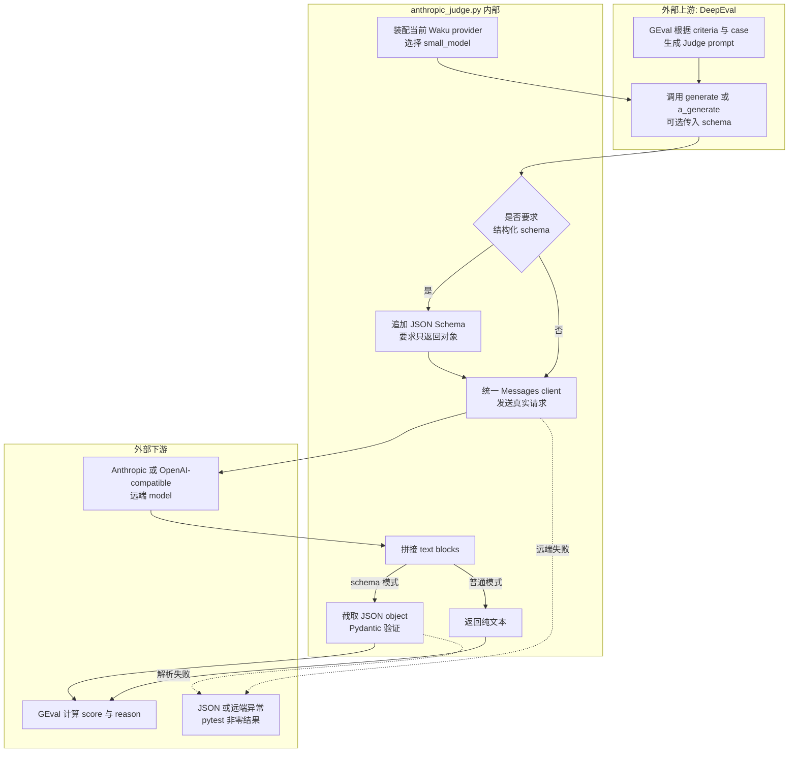

# `anthropic_judge.py` 源码解析

## 源码文件

- [`evals/judge/anthropic_judge.py`](../../../../evals/judge/anthropic_judge.py#L1)

## 一句话总结

这个文件是 DeepEval 与 Waku provider client 之间的协议适配器: 它让 `GEval` 可以复用 Waku 当前配置的 `small_model`, 并把可选结构化输出重新验证成 Pydantic schema。名字虽然叫 `AnthropicJudge`, 实际 provider 由 `WAKU_PROVIDER` 和 `get_client()` 决定。

## 前提知识

- `DeepEvalBaseLLM` 要求自定义模型实现同步/异步生成和模型名称接口。
- Waku 内部统一使用 Anthropic Messages 形状的 `client.messages.create()`；OpenAI/Gemini 等 provider 会先在 `waku.loop.models` 中适配成同一接口。
- `GEval` 可能要求普通文本, 也可能传入 Pydantic `schema` 要求结构化 verdict。
- 这个类不是 DeepEval 缺失时的 fallback。模块顶层就 import `deepeval`, 真正运行 Judge 必须安装 `.[eval]` extra。

## 文件概览

文件大致分为 client 装配、Judge 请求、接口兼容三部分。阅读时应先看 `generate()`, 再回看 `__init__()` 如何选择 provider 与 model。

| 主要部分 | 角色/职责 | 为什么值得先看 | 代码位置 |
| --- | --- | --- | --- |
| 模块依赖 | 引入 DeepEval、Settings 与统一 provider 工厂。 | 决定它不是独立 Judge SDK, 而是复用产品模型层。 | [`1-14`](../../../../evals/judge/anthropic_judge.py#L1) |
| `AnthropicJudge.__init__()` | 创建 provider client, 选择显式 model 或 `small_model`。 | 解释 Judge 的凭证、endpoint、wire format 和成本来源。 | [`17-30`](../../../../evals/judge/anthropic_judge.py#L17) |
| `load_model()` | 向 DeepEval 返回底层 client。 | 是 `DeepEvalBaseLLM` 的兼容接口, 本身不发请求。 | [`32-40`](../../../../evals/judge/anthropic_judge.py#L32) |
| `generate()` | 追加 schema 约束、调用模型、拼接文本并可选解析 JSON。 | 整个文件真正的远端与协议边界。 | [`42-68`](../../../../evals/judge/anthropic_judge.py#L42) |
| `a_generate()` | 用 async 签名包装同步 `generate()`。 | 容易误以为它提供了非阻塞 I/O, 实际仍同步执行。 | [`70-80`](../../../../evals/judge/anthropic_judge.py#L70) |
| `get_model_name()` | 暴露带实际 model id 的名称。 | 供 DeepEval 日志和结果标识使用。 | [`82-90`](../../../../evals/judge/anthropic_judge.py#L82) |

## 文件拆解

### 1. 装配阶段复用产品 provider

[`__init__()`](../../../../evals/judge/anthropic_judge.py#L17) 先调用 `load_settings()`, 再调用 [`get_client()`](../../../../waku/loop/models.py#L50)。因此:

- `WAKU_PROVIDER` 决定实际 provider, 不由类名决定。
- `WAKU_API_KEY`、provider 专用 key 和 `WAKU_BASE_URL` 的优先级沿用产品 runtime。
- `get_client()` 会回填 provider 默认的 `settings.small_model`; 构造参数 `model` 只覆盖最终 Judge model id。
- 创建 SDK client 是副作用, 但真正的网络请求推迟到 `generate()`。

这也意味着被测 Agent 和 Judge 默认来自同一 provider 家族。实现简单且成本较低, 但评测独立性有限, 文档或实验报告不应把它描述成外部独立裁判。

### 2. `generate()` 是唯一真实协议边界

[`generate()`](../../../../evals/judge/anthropic_judge.py#L42) 包含三个阶段:

1. 如果 DeepEval 传入 schema, 把 `schema.model_json_schema()` 追加进 prompt, 要求模型只返回 JSON。
2. 通过统一的 `messages.create()` 发起真实请求, 固定 `max_tokens=1024`, 只传一条 user message。
3. 拼接 response 中的 text blocks；schema 模式截取第一个 `{` 到最后一个 `}`, 再调用 `model_validate_json()`。

第三步没有容错 fallback。输出没有花括号、JSON 不完整或字段不符合 schema 时都会抛异常, 最终表现为 Judge pytest 失败或 error。release gate 用 pytest 退出码决定开闭, 同时会解析并持久化 passed/failed 数量, 但不会保存 raw score、reason 或 threshold。

### 3. async 接口不代表异步网络

[`a_generate()`](../../../../evals/judge/anthropic_judge.py#L70) 虽然声明为 `async def`, 内部直接同步调用 `generate()`。它满足 DeepEval 的接口要求, 但会在当前 event loop 线程里阻塞远端请求；不要据此推断 Judge case 会并发执行。

### 4. 运行开关不在这个文件

是否收集后 skip 由 [`test_response_quality.py` 的 module mark](../../../../evals/judge/test_response_quality.py#L17) 决定, release gate 也单独检查 `ANTHROPIC_API_KEY`。因此 provider client 能支持 OpenAI/Gemini/Kimi/GLM, 不代表只配置对应 provider key 就一定会运行 Judge suite。

## 主调用链

### 调用链一: module fixture 装配 Judge

1. [`geval_metrics()`](../../../../evals/judge/test_response_quality.py#L20) 在 Judge tests 真正执行时创建 module-scoped fixture。
2. fixture 调用 [`AnthropicJudge()`](../../../../evals/judge/anthropic_judge.py#L17), 读取 Settings 并创建统一 Messages client。
3. [`get_client()`](../../../../waku/loop/models.py#L50) 根据 provider 选择原生 Anthropic client 或 OpenAI compatibility adapter, 同时回填 `small_model`。
4. 同一个 Judge 实例被 Helpfulness 与 MemoryUse 两个 `GEval` metric 共享。

调用场景: Judge suite 没有被 skip 且 pytest 首次解析 `geval_metrics` fixture 时发生, 不是模块 import 时发生。

### 调用链二: DeepEval 请求一次评分生成

1. [`assert_test()` 调用点](../../../../evals/judge/test_response_quality.py#L83) 把 `LLMTestCase` 和 metric 交给 DeepEval。
2. GEval 生成评分 prompt, 调用 [`generate()`](../../../../evals/judge/anthropic_judge.py#L42) 或 [`a_generate()`](../../../../evals/judge/anthropic_judge.py#L70)。
3. `generate()` 通过 `client.messages.create()` 请求当前 provider 的 `small_model`。
4. 返回文本或经 Pydantic 验证的 schema 对象, 由 GEval 计算 score/reason。

调用场景: 每个 metric 评分过程中可能调用一次或多次, 具体调用次数由 DeepEval 实现决定, 不能简单等同于“一条 test 只有一个 Judge 请求”。

## 关键流程图

下图把当前文件内部逻辑和外部 DeepEval/provider 边界分开。重点是 schema 分支只改变 prompt 与返回解析, 不改变底层 provider 调用入口。

## 关键状态对象

| 状态对象 | 来源 | 影响 |
| --- | --- | --- |
| `self.settings` | `load_settings()` | 保存 provider、endpoint、显式 model 与 small model 配置。 |
| `self.client` | `get_client(settings)` | 对外统一为 `messages.create()`, 内部可能是两种 wire format。 |
| `self.model` | 显式构造参数或 `settings.small_model` | 决定 Judge 请求实际计费和能力边界。 |
| `prompt` | GEval 生成 | schema 模式会在本地追加结构说明, 原字符串变量被替换为更长文本。 |
| `schema` | DeepEval 可选传入 | 决定返回纯文本还是 Pydantic 实例, 也决定 JSON 解析失败面。 |
| `text` | response 的所有 text blocks 拼接 | tool blocks 会被忽略；schema 分支从该字符串截取 JSON。 |

## 阅读顺序

1. 先看 [`generate()`](../../../../evals/judge/anthropic_judge.py#L42), 抓住“prompt 约束 -> provider 请求 -> text/schema 返回”主线。
2. 再看 [`__init__()`](../../../../evals/judge/anthropic_judge.py#L17) 和 [`get_client()`](../../../../waku/loop/models.py#L50), 消除类名带来的 provider 误解。
3. 回到 [`geval_metrics()`](../../../../evals/judge/test_response_quality.py#L20), 看谁创建并共享这个 Judge。
4. 最后看 [`a_generate()`](../../../../evals/judge/anthropic_judge.py#L70), 记住它只是同步包装而非并发实现。

本文件不适合再生成 learning test: 它的核心价值就是与 DeepEval 和真实 provider 的集成, 用 fake 重写会重复实现协议而无法证明真实评分行为。更合适的调试点是 `generate()` 的 schema 分支、`messages.create()` 返回后以及 `model_validate_json()` 前, 分别观察 prompt、response blocks 和截取出的 JSON。
