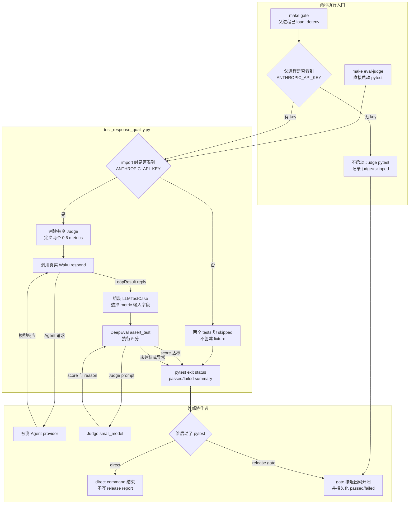

# `test_response_quality.py` 源码解析

## 源码文件

- [`evals/judge/test_response_quality.py`](../../../../evals/judge/test_response_quality.py#L1)

## 一句话总结

这个文件定义 Waku 的两条主观质量契约: Helpfulness 评价预约回复是否直接、完整且友好, MemoryUse 评价回答是否利用给定记忆；两个 GEval metric 各自以 `0.6` 为通过阈值。只有 `make gate` 编排该 suite 时, pytest 退出码才决定 gate 开闭, passed/failed 数量也会写入 report。

## 前提知识

- Judge test 不是让模型代替 deterministic assertion。它只适合帮助性、语气、上下文利用等难以写成精确断言的质量。
- 每条 test 先调用真实 `Waku.respond()` 得到被测回答, 随后 DeepEval 再调用 Judge model 评分, 至少跨越两类真实模型角色。
- `pytestmark` 使用 `evals.helpers.HAS_KEY`; 该值是 helpers import 时对进程环境的快照。
- `retrieval_context` 是交给 metric 的评分参照, 不是从 Waku trace 自动抽取的“实际检索成功”证据。

## 文件概览

文件由 module 级 skip、共享 metric fixture 和两条质量 case 组成。先看 fixture 的 criteria/threshold, 才能正确理解测试究竟在判断什么。

| 主要部分 | 角色/职责 | 为什么值得先看 | 代码位置 |
| --- | --- | --- | --- |
| module skip | 无 `ANTHROPIC_API_KEY` 时跳过整个文件。 | 决定命令显示成功究竟是通过还是全部 skipped。 | [`13-17`](../../../../evals/judge/test_response_quality.py#L13) |
| `geval_metrics()` | 创建共享 Judge、Helpfulness 与 MemoryUse metrics。 | 定义 criteria、evaluation params 和每项独立的 `0.6` 阈值。 | [`20-62`](../../../../evals/judge/test_response_quality.py#L20) |
| scheduling case | 让真实 Waku 预约, 只把 input/reply 交给 Helpfulness。 | 说明 Judge 不断言 tool call、DB row 或 calendar artifact。 | [`65-84`](../../../../evals/judge/test_response_quality.py#L65) |
| memory case | 预置 fact, 把 input/reply/显式 context 交给 MemoryUse。 | 说明“回答使用记忆”与“trace 证明实际检索”是不同证据。 | [`87-114`](../../../../evals/judge/test_response_quality.py#L87) |

## 文件拆解

### 1. skip 条件是 suite 的第一道门

[`pytestmark`](../../../../evals/judge/test_response_quality.py#L17) 在 module import 时根据 `HAS_KEY` 决定两个 test 是否执行。这里检查的是固定名称 `ANTHROPIC_API_KEY`, 而不是当前 `WAKU_PROVIDER` 对应的 key。

直接运行 `make eval-judge` 时, helpers 不主动加载 `.env`; 如果 key 只写在 `.env` 而未导出到 pytest 进程, suite 可能显示 `2 skipped` 并以 0 退出。`make gate` 不同: 外部 `release_gate.py` 先 `load_dotenv()`, 再创建 pytest 子进程。

### 2. 两个 metric 是两条独立阈值契约

[`geval_metrics()`](../../../../evals/judge/test_response_quality.py#L20) 创建一个 [`AnthropicJudge`](../../../../evals/judge/anthropic_judge.py#L17), 然后构造:

- [`Helpfulness`](../../../../evals/judge/test_response_quality.py#L37): 只观察 `INPUT` 与 `ACTUAL_OUTPUT`, criteria 要求直接回答、确认行动的 what/when/who、简洁且友好。
- [`MemoryUse`](../../../../evals/judge/test_response_quality.py#L48): 额外观察 `RETRIEVAL_CONTEXT`, criteria 要求正确吸收相关 remembered facts。

两者各自 `threshold=0.6`, 不是把两个 score 求平均后应用一个全局阈值。当前 release report 不保存原始 score、reason 或 threshold, 但会保存 judge verdict 以及 pytest 的 passed/failed 数量。

### 3. scheduling case 只评价最终文本

[`test_scheduling_reply_is_helpful()`](../../../../evals/judge/test_response_quality.py#L65) 通过 `make_waku(tmp_path/home)` 创建隔离 runtime, 调用真实 `respond()`, 再把用户输入和 `result.reply` 交给 Helpfulness。

它没有检查 `result.tool_calls`、SQLite row、ICS 文件或预约日期。也就是说, “tool 是否真的正确触发”必须由 deterministic suite 保证；这条 case 只回答“最终回复看起来是否有帮助”。

### 4. memory case 的评分参照是显式常量

[`test_reply_uses_remembered_preference()`](../../../../evals/judge/test_response_quality.py#L87) 确实先把 `Alex prefers morning meetings` 写进真实 semantic memory, 再让 Waku 回答。但传给 `LLMTestCase` 的 [`retrieval_context`](../../../../evals/judge/test_response_quality.py#L106) 是测试代码再次写入的同一条字符串, 不是从 retrieval gate 结果或 trace 中读取。

因此 test 通过能证明“最终回复与给定 context 一致到 Judge 认可”, 不能单独证明 retrieval gate 实际命中。要证明后者, 还需要 trace assertion 或 deterministic retrieval contract。

### 5. Judge suite 与 dataset 当前相互独立

本文件两个场景硬编码在 test body 中, 不读取 `evals/dataset.jsonl`。该 dataset 的唯一消费者是 [`test_tool_trigger.py` 的 live 参数化 case](../../../../evals/deterministic/test_tool_trigger.py#L140), 所以新增一条 dataset 记录不会自动增加 Judge coverage。

## 主调用链

### 调用链一: Helpfulness case

1. pytest 收集本文件, [`pytestmark`](../../../../evals/judge/test_response_quality.py#L17) 决定执行或 skip。
2. 首个 test 请求 [`geval_metrics()`](../../../../evals/judge/test_response_quality.py#L20), 创建共享 Judge 与两个 metrics。
3. [`make_waku()`](../../../../evals/helpers.py#L84) 构造隔离但使用真实 provider 的 Waku。
4. [`Waku.respond()`](../../../../waku/app.py#L57) 生成真实 `LoopResult.reply`。
5. [`assert_test()` 调用点](../../../../evals/judge/test_response_quality.py#L83) 把 input/output 交给 Helpfulness, score 未达 `0.6` 时转成 pytest failure；仅当 release gate 启动该 pytest 时, 退出码和 passed/failed 数量才继续进入 report。

调用场景: 评估预约回复是否清楚确认行动, 不承担预约副作用正确性的判定。

### 调用链二: MemoryUse case

1. [`facts.add()` 调用点](../../../../evals/judge/test_response_quality.py#L100) 在隔离 semantic store 预置偏好。
2. [`Waku.respond()` 调用点](../../../../evals/judge/test_response_quality.py#L104) 让产品链路自行决定是否检索和如何回答。
3. [`LLMTestCase`](../../../../evals/judge/test_response_quality.py#L107) 同时携带 input、actual output 与测试常量 context。
4. MemoryUse metric 调用 [`AnthropicJudge.generate()`](../../../../evals/judge/anthropic_judge.py#L42), 依据 criteria 输出 score/reason。

调用场景: 评价最终回答是否体现偏好, 不直接验证 retrieval gate 的内部事件。

## 关键流程图

下图分开两种 no-key 语义: 直接运行 Judge pytest 会收集 module 后把两个 tests 标成 skipped；`make gate` 则在父进程就不启动 Judge subprocess, 直接记录 `judge=skipped`。两者都不代表质量阈值已经通过。

## 关键状态对象

| 状态对象 | 来源 | 影响 |
| --- | --- | --- |
| `HAS_KEY` | `evals.helpers` import 时环境快照 | 决定整个 module 执行还是 skip, 不验证当前 provider 的完整可用性。 |
| `helpful` | `GEval` fixture | 只读取 input/output, `threshold=0.6`。 |
| `uses_memory` | `GEval` fixture | 额外读取 retrieval context, `threshold=0.6`。 |
| `app` | `make_waku(tmp_path/home)` | state 隔离在临时目录, 但 provider/模型请求是真实的。 |
| `result.reply` | 真实 `Waku.respond()` | 两个 case 的 actual output；tool calls 和 artifacts 不进入 metric。 |
| `retrieval_context` | test 中硬编码列表 | 是 Judge 的评分参照, 不是 runtime 检索 trace。 |

## 阅读顺序

1. 先看 [`geval_metrics()`](../../../../evals/judge/test_response_quality.py#L20), 记住两条 criteria 和两个独立阈值。
2. 再看 [`pytestmark`](../../../../evals/judge/test_response_quality.py#L17), 区分“通过”和“因无 key 跳过”。
3. 阅读 [`test_scheduling_reply_is_helpful()`](../../../../evals/judge/test_response_quality.py#L65), 明确 Judge 只看最终文本。
4. 阅读 [`test_reply_uses_remembered_preference()`](../../../../evals/judge/test_response_quality.py#L87), 分清预置 fact、实际 retrieval 和传给 Judge 的 context。
5. 最后跳到 [`AnthropicJudge.generate()`](../../../../evals/judge/anthropic_judge.py#L42) 与外部 release gate, 看 score 如何转成 pytest/release verdict。

本文件不再生成 learning test: 它本身就是需要真实模型与 DeepEval 的质量测试, fake Judge 只能验证测试框架接线, 无法解释真实评分稳定性。调试时可在 `app.respond()` 返回后、`LLMTestCase` 构造前和 `assert_test()` 内部 Judge 请求前观察 reply、retrieval context 与 metric score。
