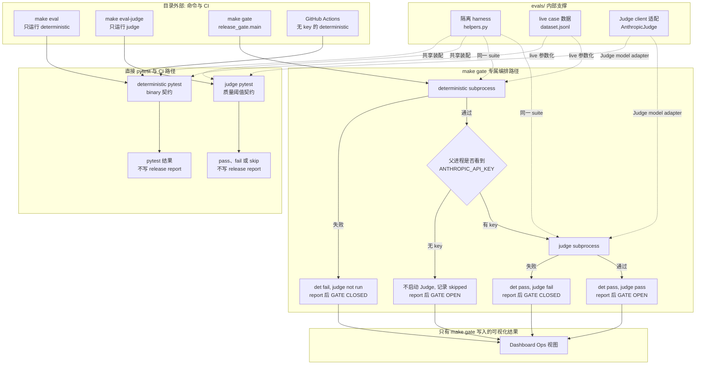
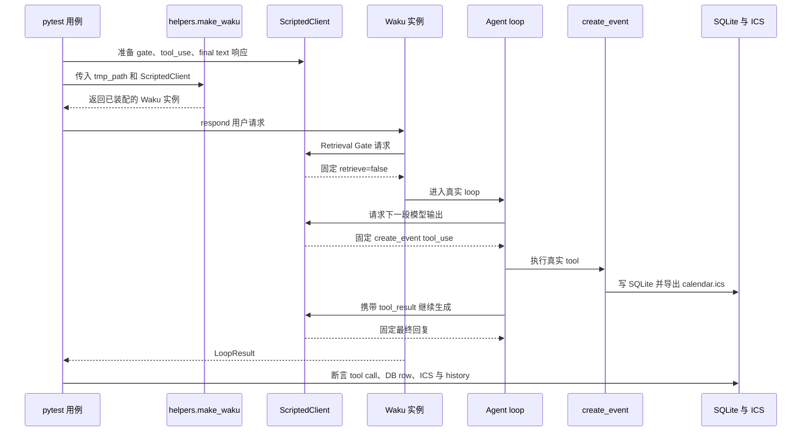
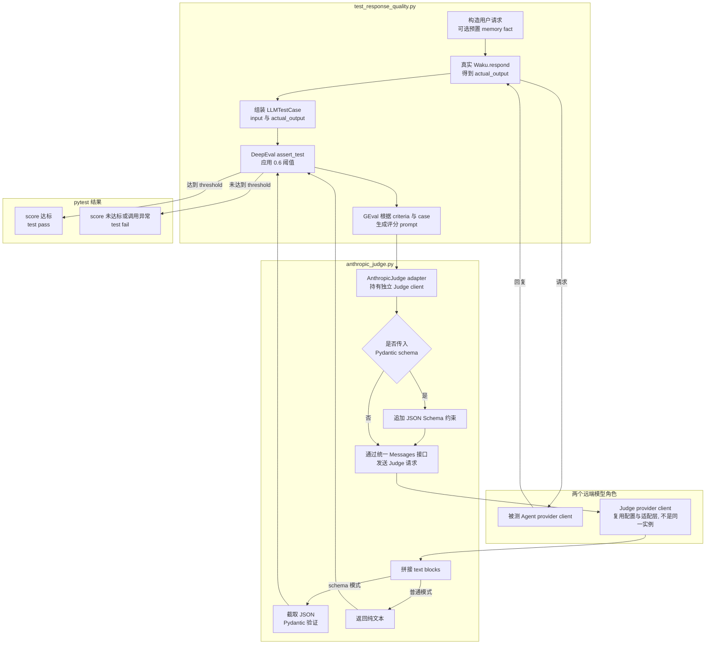

# `evals/` 学习指南

## 1. 目录职责

`evals/` 把 Waku 的质量判断拆成两种不能混为一谈的契约:

- `deterministic/` 用 pytest 断言可观察事实, 例如 tool 是否触发、SQLite/ICS 是否写入、循环是否按 guardrail 停止。结果是通过或失败。
- `judge/` 先让真实 Waku 生成回答, 再让 LLM Judge 按 `0.6` 阈值评分帮助性和记忆利用质量。结果依赖真实模型与远端网络。

目录本身不负责决定是否发布。外部的 `waku/ops/release_gate.py` 负责编排 suite、写入评测报告, Dashboard 再读取这些报告展示最近一次 verdict 与历史记录。

## 2. 核心目录树

```text
evals/
├── conftest.py                         # 让仓库根目录在 pytest 收集时可导入
├── helpers.py                          # 【重点】离线响应积木、ScriptedClient、隔离 Waku 工厂
├── dataset.jsonl                       # live binary eval 的输入与期望 tool 契约
├── deterministic/
│   ├── test_tool_trigger.py            # 【重点】offline harness 主链路与可选 live dataset eval
│   ├── test_apple_calendar.py          # AppleScript 日期、平台边界和空 tool call 回归
│   ├── test_speakable.py               # TTS 前文本净化契约
│   ├── test_wake_word.py               # wake word 模糊匹配与负例
│   └── test_working_memory.py          # 当前时间与 session 切换契约
└── judge/
    ├── anthropic_judge.py              # 【重点】DeepEval 到 Waku Messages client 的适配器
    └── test_response_quality.py         # 【重点】GEval 指标、阈值和两条质量用例
```

选择这 4 个重点文件的原因是: 它们分别定义测试依赖如何隔离、binary eval 如何穿过真实 Waku 主链路、DeepEval 如何调用项目已有 provider、主观质量如何变成 release gate 可消费的 pytest 结果。

## 3. 核心流程

### 3.1 从命令到发布 verdict

这张图先展示目录外的命令和 release gate 如何调用 `evals/` 内部两类 suite。`dataset.jsonl` 只驱动 `test_tool_trigger.py` 的 live 参数化用例, 不会自动驱动 Judge 用例。



这里有四个重要边界:

1. `deterministic` 描述的是判定方式为 binary assertion, 不等于所有 case 都不调用模型。`test_tool_trigger.py` 后半段在 key 可见时会运行真实模型, 只是最终仍用精确 tool/args 断言。
2. CI 没有 API key, 因而只覆盖 deterministic suite 中始终运行的离线部分。5 条 live dataset case 会 skip, Judge suite 根本不会被调用。
3. `make eval` 和 `make eval-judge` 只运行 pytest, 不写 Dashboard 读取的 release report；只有 `make gate` 调用 `report()`。
4. `make gate` 的持久结果只有 `pass/fail/skipped/not run` 和 pytest 的 passed/failed 数量, 不保存 GEval 原始 score、threshold、skipped 或 error 细分。

### 3.2 离线 tool-trigger eval 如何穿过真实产品链路

下图展开上一张图的 `deterministic suite`。Fake 只替换模型响应, Waku 的 Session、Loop、ToolRegistry、SQLite、ICS 与收尾逻辑仍然真实执行。



### 3.3 Judge 如何把主观质量转换成 pytest verdict

下图展开第一张图的 `judge suite`。同一个 case 至少包含“Waku 生成回答”和“Judge 评分”两类真实模型调用, 不能把它当成普通单元测试。



### 3.4 命令、依赖与副作用矩阵

| 入口 | 运行内容 | key 与依赖 | 是否写 release report |
| --- | --- | --- | --- |
| `make eval` | `evals/deterministic` | pytest；`HAS_KEY` import 时若环境已有 Anthropic key, 还会跑 5 条 live model case。`.env` 是否已被其他模块加载受收集顺序影响。 | 否 |
| `make eval-judge` | `evals/judge` | 需要 `.[eval]` 中的 DeepEval；无进程级 Anthropic key 时两个 test skip。 | 否 |
| `make gate` | deterministic 先行, 成功后按 Anthropic key 决定 Judge。 | 入口先加载 `.env`；有 key 时 deterministic live tier 与 Judge 都会产生网络调用。 | 是, 覆盖 latest 并追加 history |
| GitHub Actions | deterministic + skill validation | 只安装 `.[dev]`, 不含 DeepEval, 也不注入 key。 | 否 |

因此 CI 成功不能替代完整 release gate, 无 key 时的 `GATE OPEN` 也只证明 deterministic suite 通过。

## 4. 重点文件说明

| 源码 | 逐文件导读 | 核心角色 |
| --- | --- | --- |
| [`helpers.py`](../../../evals/helpers.py#L10) | [`helpers.md`](helpers.md) | 定义 key 快照、fake Anthropic content blocks、脚本化 client 与隔离 runtime 工厂, 是 offline/live 两种 eval 共用的装配边界。 |
| [`deterministic/test_tool_trigger.py`](../../../evals/deterministic/test_tool_trigger.py#L30) | [`deterministic/test_tool_trigger.md`](deterministic/test_tool_trigger.md) | 用真实 Waku 主链路验证 tool 副作用、幂等、history、终止条件, 并可选运行 dataset 驱动的 live binary eval。 |
| [`judge/anthropic_judge.py`](../../../evals/judge/anthropic_judge.py#L17) | [`judge/anthropic_judge.md`](judge/anthropic_judge.md) | 把 DeepEval 的同步、异步和 schema 请求适配到项目统一的 `messages.create()` client。 |
| [`judge/test_response_quality.py`](../../../evals/judge/test_response_quality.py#L20) | [`judge/test_response_quality.md`](judge/test_response_quality.md) | 定义 Helpfulness、MemoryUse 两个 GEval 指标与 `0.6` 阈值, 把真实回答质量映射成 pytest 通过或失败。 |

## 5. 非重点但相关文件

| 文件或目录 | 功能 | 与主流程的关系 |
| --- | --- | --- |
| `conftest.py` | 把仓库根目录加入 `sys.path`。 | 仅解决 pytest 收集时的 import 边界, 不定义质量契约。 |
| `dataset.jsonl` | 5 条输入、预置 fact、预期 tool 和参数片段。 | 只被 `test_tool_trigger.py::test_dataset_case` 读取, 当前 Judge suite 不消费它；参数采用 substring 而非完整相等。 |
| `test_apple_calendar.py` | 固定 AppleScript 日期顺序、平台分支和空参数回归。 | 验证 calendar tool 的局部边界；名为 escaping 的 case 实际没有覆盖转义逻辑。 |
| `test_speakable.py` | 参数化验证 emoji 与 Markdown 清理。 | 把真实语音问题压缩成纯函数契约。 |
| `test_wake_word.py` | 覆盖标点、连写、轻微转写错误、多语言别名和负例。 | 验证 voice gateway 的输入匹配边界。 |
| `test_working_memory.py` | 验证 system prompt 有时钟、Session 切换后的 id/空 history。 | 使用真实 Settings/home, 可能创建 `SOUL.md`; 当前 case 没有先放入旧 history, 因而未完整证明清空行为。 |
| `waku/ops/release_gate.py` | 先跑 deterministic, 再按 key 决定 Judge, 最后写报告。 | 是 `evals/` 的外部编排者, 不属于本目录。 |
| `.github/workflows/validate-skills.yml` | 在无 API key 的 Ubuntu runner 上运行 deterministic。 | 提供离线回归保护, 不覆盖 live dataset 与 Judge。 |

当前 coverage 还应按证据强度理解:

- `ScriptedClient` 不校验传给 provider 的 system、messages 或 tool schema, 它验证的是 runtime 如何消费响应。
- `make_waku()` 只默认关闭 `apple_calendar`; `semantic_store`、`apple_tools`、OTel 和 consolidation 等其余 Settings 仍可能受环境影响。
- dataset 只要求期望 tool 出现在列表, 参数只做大小写无关 substring 检查；额外 tool、精确日期和多数最终 artifact 不一定被约束。
- Judge scheduling case 不检查 tool/DB/ICS, MemoryUse case 的 `retrieval_context` 也是测试显式提供, 不是 runtime trace 证据。

## 6. 阅读顺序

1. 先读 [`helpers.py`](helpers.md), 明白 fake 只替换模型, 没有替换 Waku 业务链路。
2. 再读 [`test_tool_trigger.py`](deterministic/test_tool_trigger.md), 顺着一个 tool call 看完 gate、loop、tool、存储和 history。
3. 回看 `dataset.jsonl`, 区分 offline scripted case 与 live model case 共用的是哪一种 binary 判定。
4. 然后读 [`test_response_quality.py`](judge/test_response_quality.md), 理解“质量标准、输入字段、阈值”如何定义。
5. 最后读 [`anthropic_judge.py`](judge/anthropic_judge.md) 和目录外的 `release_gate.py`, 补齐远端调用适配与发布判定。

## 7. 后续深入路径

- 想理解“为什么 fake model 仍能覆盖真实 loop”, 继续对照 `waku/app.py`、`waku/loop/agent.py` 与 `waku/tools/calendar.py`。
- 想理解 release verdict 如何进入 UI, 继续追 `waku/ops/release_gate.py -> eval_report.json/eval_runs.jsonl -> waku/ops/dashboard.py`。
- 想扩大 live eval 覆盖, 先明确 dataset 是测试 binary tool 契约还是 Judge 质量契约；当前两套数据入口并不统一。
- 想稳定复现 Judge, 需要固定 provider、model、prompt、阈值和数据集版本, 并单独记录成本、延迟与失败原因。
- 本目录没有再生成额外 learning test: 重点文件本身已经是评测代码, 再用 fake 测试这些测试只会重复 harness；真实 Judge 又必须依赖网络和模型, 文档与克制的断点建议更有解释价值。

当前实现还值得特别留意两点: `HAS_KEY` 在 `evals.helpers` import 时只检查进程环境中的 `ANTHROPIC_API_KEY`, 而 `make eval-judge` 本身不会主动加载 `.env`; 另外名为 `AnthropicJudge` 的适配器实际通过 `get_client()` 复用当前 Waku provider, 但 suite 是否运行仍由 Anthropic 专用环境变量控制。
