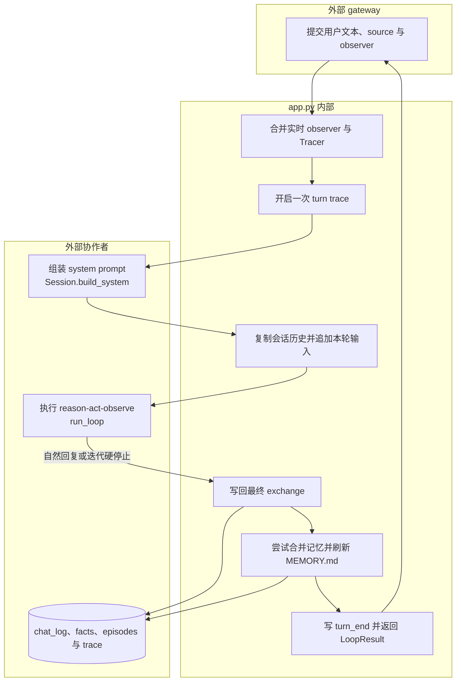

# `waku/app.py` 源码解析

## 源码文件

- [`waku/app.py`](../../../waku/app.py#L1)

## 一句话总结

`app.py` 是 Waku 的 composition root：它把配置、数据库、模型 client、Memory、ToolRegistry、Session 与 Tracer 装配成一个对象，再由 `respond()` 把一次用户输入完整地送过工作记忆、Agent Loop、持久化和观测链路。

这个文件不实现检索算法、tool 业务或 provider 协议；它的重要性在于规定这些部件的创建顺序、共享关系和单轮生命周期。

## 前提知识

- **composition root**：集中创建依赖并决定对象生命周期的入口。gateway 不应自行拼装 Memory 或 ToolRegistry，而是统一构造 `Waku`。
- **gateway**：CLI、Voice、Telegram、Dashboard 和 brief 只负责输入输出形式，智能主链都收敛到 `Waku.respond()`。
- **工作记忆与持久记忆**：`Session.history` 是进程内当前会话上下文；Memory 背后的 `chat_log`、facts、episodes 与 `MEMORY.md` 才跨轮或跨进程存在。
- **Observer**：Loop 发出的 gate、LLM、tool、text 等事件可同时送给 UI observer 和 Tracer，业务 Loop 不直接依赖任何 gateway。
- **LoopResult**：`run_loop()` 的统一返回对象，包含最终 `reply`、真实执行过的 `tool_calls` 和 `iterations`。

## 文件概览

文件大致分为四个职责块。阅读时应先看 `respond()` 的动态流程，再回头看构造函数为什么按当前顺序装配依赖。

| 主要部分 | 角色/职责 | 为什么值得先看 | 代码位置 |
| --- | --- | --- | --- |
| 模块依赖 | 汇集配置、DB、Loop、Tracing、Session 和 tool 装配入口 | 直接展示该 composition root 的外部协作者 | [`L1-L15`](../../../waku/app.py#L1) |
| `Waku.__init__()` | 建立状态目录、连接、模型 client、Memory、ToolRegistry、Session 和 Tracer | 决定所有共享对象的身份与生命周期 | [`L18-L44`](../../../waku/app.py#L18) |
| `Waku.close()` | 关闭可选 MCP bridge | 说明短生命周期 Waku 与长生命周期 subprocess 的边界 | [`L46-L55`](../../../waku/app.py#L46) |
| `Waku.respond()` | 执行单个 Agent turn 并返回 `LoopResult` | 是所有 gateway 共用的核心业务入口 | [`L57-L101`](../../../waku/app.py#L57) |

导出形态很简单：模块只公开 `Waku` 类，没有全局单例。Dashboard 可以复用一个实例，eval 也可以为每个案例创建带脚本化 client 的隔离实例。

## 文件拆解

### 1. 依赖注入缝隙

[`Waku.__init__()`](../../../waku/app.py#L19) 接受可选 `settings`、`client` 和 `conn`。这三个参数不是便利性装饰，而是项目能同时支持真实运行、Dashboard 跨线程 SQLite 和 deterministic eval 的关键缝隙：

- 未传 `settings` 时从环境变量加载真实配置。
- 未传 `conn` 时按 `settings.home` 创建普通 SQLite connection；Dashboard 则传入 `check_same_thread=False` 的连接。
- 未传 `client` 时创建真实 provider client；eval 传入 `ScriptedClient` 后不会读取真实密钥或访问网络。

依赖装配被分成三个阶段：基础配置与连接在 [`L29-L33`](../../../waku/app.py#L29)，Memory 与 tools 在 [`L35-L40`](../../../waku/app.py#L35)，Session 与 Tracer 在 [`L42-L44`](../../../waku/app.py#L42)。Memory 先于 ToolRegistry 是硬顺序，因为 memory-management tools 需要持有同一个 Memory facade。

### 2. MCP 资源边界

`build_registry()` 可能根据 `.waku/mcp.json` 启动 MCP server，并把 bridge 动态挂到 registry。构造函数在 [`L39-L40`](../../../waku/app.py#L39) 捕获这个可选引用，`close()` 再在 [`L53-L55`](../../../waku/app.py#L53) 统一释放。

因此 `close()` 不是“关闭整个 Waku 数据库”的通用析构器：当前它只负责显式持有的 MCP subprocess。SQLite connection 和 provider client 没有在这里统一关闭。

### 3. 单轮输入与 observer 合流

[`respond()`](../../../waku/app.py#L57) 首先用 `compose()` 合并 gateway observer 与 `self.tracer.event`。同一个 gate 或 tool event 因而可以一份送 UI、一份写 JSONL/OTel，而 `run_loop()` 仍只看到一个 `notify` callable。

`self.tracer.turn(user_message)` 在 [`L73`](../../../waku/app.py#L73) 创建 `turn_start` 与可选 OTel root span。该上下文内部包含 system prompt 构造、模型与 tool Loop、会话写回和记忆合并，覆盖的正是一次 Agent turn 的主要工作。

### 4. 工作上下文组装

[`Session.build_system()`](../../../waku/runtime/session.py#L82) 生成 persona、当前时间、检索记忆和 skill 指令。`respond()` 再在 [`L75-L76`](../../../waku/app.py#L75) 复制当前 `Session.history` 并追加本轮 user message。

这里使用 `list(self.session.history)` 很关键：`run_loop()` 会原地向传入 `messages` 增加 assistant/tool_result，但这些中间协议块不直接污染跨轮历史。跨轮历史只在最终结果明确后由 `Session.add_exchange()` 以更紧凑的 user/assistant 形状写回。

### 5. Loop 与最终写回

[`run_loop()` 调用](../../../waku/app.py#L79) 把 provider client、模型、system、messages、ToolRegistry、迭代限制、token 限制和 observer 一次性传入。Loop 内部负责模型调用、tool 执行和退出条件；`app.py` 不重复解释 provider 或 tool 协议。

Loop 返回后，[`Session.add_exchange()` 调用](../../../waku/app.py#L91) 才把最终回复和 tool 执行摘要写入工作历史与 `chat_log`。随后 Memory 在 [`L94-L97`](../../../waku/app.py#L94) 尝试 consolidation，并重新生成便于人阅读的 `MEMORY.md` 视图。原始 `chat_log` 是事实来源，导出的 Markdown 不是第二套独立存储。

最后 [`Tracer.end_turn()`](../../../waku/app.py#L99) 写 `turn_end` 并刷新可选 OTel provider，然后 `LoopResult` 原样交回 gateway。

## 主调用链

### 调用链一：CLI 的普通 turn

1. [`gateway/cli.py::main()`](../../../waku/gateway/cli.py#L28) 启动时创建一个 `Waku`，并把 Session 标成 `terminal`。调用场景：用户运行默认 CLI。
2. [`gateway/cli.py` 调用 `respond()`](../../../waku/gateway/cli.py#L46) 传入用户文本、终端 observer 与 `source="cli"`。调用场景：每次非空输入。
3. [`Waku.respond()`](../../../waku/app.py#L57) 组装系统上下文并调用 [`run_loop()`](../../../waku/app.py#L79)。调用场景：进入统一 Agent runtime。
4. [`Session.add_exchange()` 调用点](../../../waku/app.py#L91) 持久化最终结果，随后 [`Tracer.end_turn()`](../../../waku/app.py#L99) 收尾。调用场景：Loop 已结束且结果可交给用户。

### 调用链二：Dashboard 流式 turn

1. [`dashboard.py::chat_stream()`](../../../waku/ops/dashboard.py#L86) 在共享锁内取得或懒加载 Waku。调用场景：浏览器使用 SSE 发起聊天。
2. [`chat_stream()` 调用 `respond()`](../../../waku/ops/dashboard.py#L101) 设置 `stream=True` 并传入会把 text delta 发到浏览器的 observer。
3. [`Waku.respond()`](../../../waku/app.py#L57) 把该 observer 与 Tracer 合并，再将 `stream` 传给 Loop；同一批事件同时服务实时 UI 与 trace。

### 调用链三：Dashboard 热切换 provider

1. [`dashboard.py` 重建 Waku](../../../waku/ops/dashboard.py#L702) 先用新配置和新 connection 构造替代实例。调用场景：用户保存 provider/model 设置。
2. 构造成功后，[`dashboard.py` 调用旧实例 `close()`](../../../waku/ops/dashboard.py#L714)。调用场景：只有新实例可用时才释放旧 MCP 资源，失败则继续保留旧实例。
3. [`Waku.close()`](../../../waku/app.py#L46) 检查并关闭可选 MCP bridge，不触碰新实例状态。

## 关键流程图

下图展开 `Waku.respond()` 这一节点，重点展示 `app.py` 内部编排与外部协作者的边界。

图中 tool 的具体执行被封装在 `run_loop()` 内，`app.py` 只消费最终 `LoopResult`。这保证 gateway 不需要理解 tool_use/tool_result 协议。

## 关键状态对象

| 状态对象 | 产生位置 | 生命周期与下游影响 |
| --- | --- | --- |
| `self.settings` | [`Waku.__init__()`](../../../waku/app.py#L30) | Waku 实例级；决定 home、provider、模型、Loop 限制与可选能力 |
| `self.conn` | [`L32`](../../../waku/app.py#L32) | 被 Memory 和 tools 共享；保证同一实例读写同一 `state.db` |
| `self.client` | [`L33`](../../../waku/app.py#L33) | 同时供主 Loop、retrieval gate 与 consolidation 使用；eval 可替换 |
| `self.memory` / `self.tools` | [`L38-L40`](../../../waku/app.py#L38) | Memory 先创建；ToolRegistry 可能持有 memory tools 与 MCP bridge |
| `self.session` | [`L43`](../../../waku/app.py#L43) | 保存当前会话的进程内历史和 `session_id` |
| `self.tracer` | [`L44`](../../../waku/app.py#L44) | 跨 turn 复用；每轮写本地 trace，并可选导出 OTel |
| `messages` | [`Waku.respond()`](../../../waku/app.py#L75) | 单轮临时快照；Loop 会原地扩展，但不会直接成为下一轮历史 |
| `result` | [`L79`](../../../waku/app.py#L79) | Loop 的终态；驱动持久化、trace 收尾和 gateway 输出 |

## 阅读顺序

1. 先读 [`Waku.respond()`](../../../waku/app.py#L57)，抓住“observer 合流 → system/messages → Loop → 写回 → trace 收尾”的骨架。
2. 再读 [`Waku.__init__()`](../../../waku/app.py#L19)，确认 `conn`、`client`、Memory 和 ToolRegistry 为什么必须共享且按顺序创建。
3. 跳到 [`Session.build_system()`](../../../waku/runtime/session.py#L82) 与 [`run_loop()`](../../../waku/loop/agent.py#L40)，分别展开上下文组装和模型/tool 状态机。
4. 回看 [`Session.add_exchange()`](../../../waku/runtime/session.py#L115)，区分单轮 `messages` 与跨轮 `Session.history`/`chat_log`。
5. 最后读 [`Waku.close()`](../../../waku/app.py#L46) 和 Dashboard 的重建调用点，理解 MCP subprocess 的资源边界。

本文件的控制流已被 deterministic eval 和现有 Agent Turn demo 覆盖；再新增 learning test 只会重复装配行为，因此更适合沿上述调用点调试，而不是另造一套 mock。
