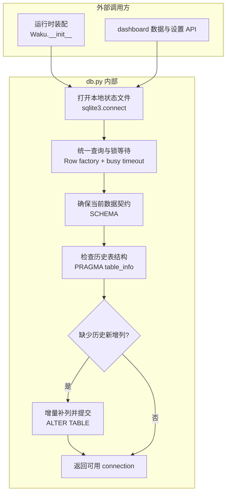

# db.py 源码解析

## 源码文件

- [`waku/db.py`](../../../waku/db.py#L12)

## 一句话总结

`db.py` 是 Waku 的本地持久化契约和统一连接工厂。它既定义新 `state.db` 应有哪些业务表、FTS5 索引和 trigger, 也负责把历史数据库幂等升级到当前 `chat_log` 结构。

## 前提知识

- `state.db` 是默认本地 source of truth, 保存日历事件、semantic facts、episodic episodes 和原始 chat log。
- FTS5 虚表不是第二份业务真相。`facts_fts`、`episodes_fts` 由 trigger 跟随业务表更新, 只承担全文检索。
- `CREATE ... IF NOT EXISTS` 可以重复执行, 但 SQLite 没有通用的 `ADD COLUMN IF NOT EXISTS`, 所以旧库列升级必须先读 `PRAGMA table_info`。
- CLI 默认使用 SQLite 的同线程检查。dashboard 使用 `ThreadingHTTPServer`, 因而显式传入 `check_same_thread=False`, 再由上层锁串行化共享 agent 的 turn。

## 文件概览

文件大致由数据契约、旧库迁移和连接初始化三部分组成。

| 主要部分 | 角色/职责 | 为什么值得先看 | 源码位置 |
| --- | --- | --- | --- |
| `SCHEMA` | 定义四张业务表、两组 FTS5 虚表及同步 trigger | 它决定整个 memory、calendar、session 的可持久状态 | [`SCHEMA`](../../../waku/db.py#L12) |
| `_migrate()` | 检查并补齐 `chat_log.session_id` 与 `source` | 展示旧库如何在不破坏数据的前提下升级 | [`_migrate()`](../../../waku/db.py#L81) |
| `connect()` | 打开连接、配置 Row/锁等待、执行 schema 和迁移 | 所有正常数据库访问都从这个统一入口开始 | [`connect()`](../../../waku/db.py#L103) |

## 文件拆解

### 1. 数据契约

[`calendar_events`](../../../waku/db.py#L17) 保存 flagship scheduling tool 的可验证产物；[`facts`](../../../waku/db.py#L28) 和 [`episodes`](../../../waku/db.py#L50) 分别保存 semantic 与 episodic memory；[`chat_log`](../../../waku/db.py#L70) 保存尚未或已经 consolidation 的原始对话。

索引同步不是由 Python 手动维护。以 facts 为例, insert、delete、update trigger 从 [`facts_fts`](../../../waku/db.py#L35) 的外部内容索引中增删对应 rowid。这样 `SqliteFactStore` 只需写业务表, 检索索引会在同一 SQLite 写入链路中更新。

### 2. 旧库幂等迁移

[`_migrate()`](../../../waku/db.py#L81) 先读取当前 `chat_log` 列集合, 再分别判断 `session_id` 和 `source`。两个字段独立判断很重要: 用户可能从任意历史版本升级, 不能假设缺一个字段时另一个也一定缺失。

每次 `ALTER TABLE` 后立即 commit。函数只做 additive migration, 不删列、不重写已有行；新增列的 default 让旧记录立即具备可查询值。

### 3. 统一连接初始化

[`connect()`](../../../waku/db.py#L103) 按固定顺序完成三件事:

1. 打开 `home/state.db`, 是否允许跨线程由调用方决定。
2. 把 row factory 设为 `sqlite3.Row`, 并设置三秒 `busy_timeout`。
3. 重放幂等 `SCHEMA`, 再执行旧库增量迁移。

返回连接时, 上层已经可以按列名取值, 也不需要再次判断表或迁移是否存在。

## 主调用链

### 运行时启动链

1. [`Waku.__init__()` 中的 `connect()` 调用](../../../waku/app.py#L32) 在创建 Memory 和 tools 前建立数据库连接。
2. [`connect()`](../../../waku/db.py#L103) 打开文件并配置连接。
3. [`SCHEMA`](../../../waku/db.py#L12) 创建缺失表、FTS5 索引和 trigger。
4. [`_migrate()`](../../../waku/db.py#L81) 补齐旧版 `chat_log` 列。
5. 初始化完成的 connection 被交给 Memory、ToolRegistry 和 Session 相关写入路径共享。

调用场景是每个 Waku 实例启动；dashboard 还会在数据查询、memory CRUD 和 settings 重建 agent 时重复使用同一连接工厂。

### 离线 eval 建库链

1. [`make_waku()`](../../../evals/helpers.py#L40) 为每个测试创建隔离的临时 `home`。
2. `Waku.__init__()` 间接调用 [`connect()`](../../../waku/db.py#L103)。
3. [`test_create_event_writes_db_and_ics()`](../../../evals/deterministic/test_tool_trigger.py#L32) 直接查询 `calendar_events`, 验证 schema 与 tool 写入链真实生效。

## 关键流程图

## 关键状态对象

| 状态对象 | 关键字段或配置 | 对行为的影响 |
| --- | --- | --- |
| `calendar_events` | `title + start` | calendar tool 用这组字段执行应用层幂等判断 |
| `facts` / `facts_fts` | `id/rowid` | 业务行与全文索引通过同一 rowid 对齐 |
| `episodes` / `episodes_fts` | `happened_at`, `summary` | 同时支持关键词相关性与发生时间排序 |
| `chat_log` | `consolidated`, `session_id`, `source` | 分别控制巩固候选、会话恢复和 gateway 来源 |
| `check_same_thread` | `True` 或 `False` | 决定 connection 是否允许跨 worker thread 使用 |
| `busy_timeout` | `3000ms` | dashboard 读写竞争时先短暂等待, 避免立即抛 locked error |

## 阅读顺序

1. 先读 [`connect()`](../../../waku/db.py#L103), 明确上层拿到 connection 前已经完成哪些保证。
2. 再读 [`SCHEMA`](../../../waku/db.py#L12), 按 `calendar_events → facts/FTS → episodes/FTS → chat_log` 建立数据地图。
3. 最后读 [`_migrate()`](../../../waku/db.py#L81), 理解新库幂等创建与旧库增量升级是两条相邻但不同的路径。

### 现有验证证据与断点判断

当前确定性 eval 已通过真实 `Waku` 装配间接覆盖新库创建, 并直接断言 `calendar_events` 行存在；但没有专门构造旧版 `chat_log` 验证两个迁移分支。本批次不新增测试。

如需调试旧库升级, 最有价值的两个断点是 [`_migrate()` 读取列集合后](../../../waku/db.py#L88) 和 [`connect()` 执行 SCHEMA 后](../../../waku/db.py#L122)。前者观察 `cols`, 后者确认问题来自基础 DDL 还是增量列迁移。正常新库路径静态阅读已经直接, 不建议增加更多断点。
