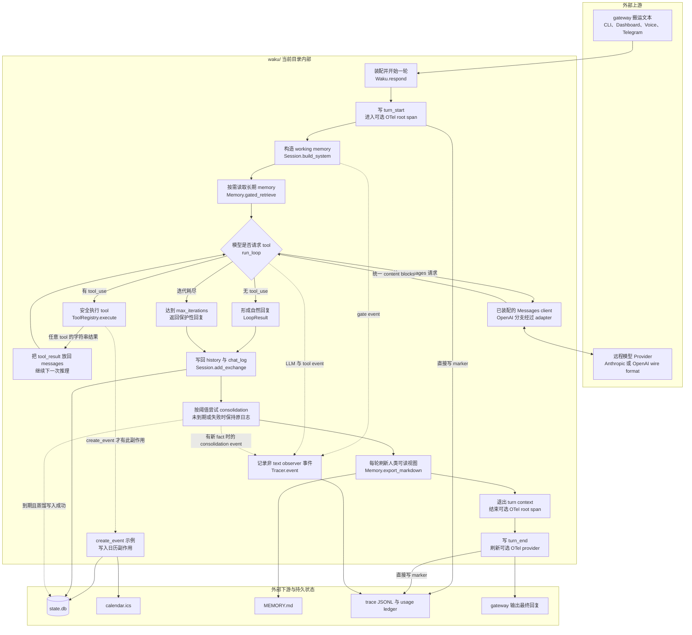
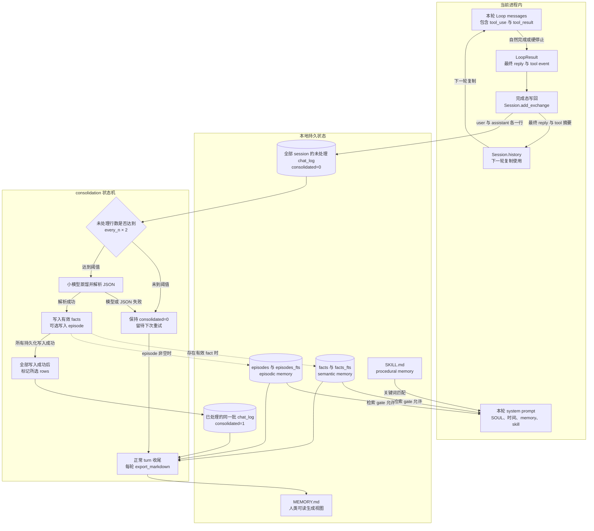

# `waku/` 源码目录学习指南

## 1. 目录职责

`waku/` 是项目的完整运行时包。它把外部 gateway 搬进来的文本装配成一次 Agent turn, 再依次完成工作记忆构造、模型推理、tool 执行、持久化写回和可观测记录。这个目录最重要的设计不是“文件很多”, 而是每个边界都保持显式: gateway 不做推理, Loop 不直接实现业务 tool, memory 不混进消息循环, tracing 通过 observer 旁路接入。

理解这个目录时, 可以先建立四个相互连接的平面:

- **Harness 平面**: `app.py`、`runtime/session.py`, 负责装配依赖并构造每轮上下文。
- **执行平面**: `loop/agent.py`、`loop/models.py`、`tools/`, 负责 reason → act → observe → repeat。
- **状态平面**: `memory/`、`db.py`, 区分当前进程里的 working memory 与可恢复的长期状态。
- **Ops 平面**: `ops/tracing.py` 记录 turn、LLM、tool、gate 和 consolidation 事件, `ops/dashboard.py` 等模块再消费这些状态。

目录边界外有三类协作者: CLI/Voice/Telegram/Dashboard 等 gateway、远程模型 Provider、Apple Calendar/OTel/MCP 等可选外部系统。默认路径仍以本地 SQLite、ICS、JSONL 和文件为主, 但“local-first”不等于所有数据都不离开本机: system prompt、相关 memory、history 和 tool schema 会进入所选远程模型请求。

## 2. 核心目录树

下面只保留理解主流程所需的结构。标有 `【重点】` 的文件会在同路径下提供逐文件深度导读, 并在源码关键位置补充中文解释性注释。

```text
waku/
├── __main__.py                       # CLI 子命令分发, 本身只做惰性路由
├── app.py                            # 【重点】全系统依赖装配与一轮请求总编排
├── config.py                         # 环境变量到 Settings 的映射
├── db.py                             # 【重点】SQLite schema、迁移与连接边界
├── gateway/
│   ├── cli.py                        # 默认文本 gateway
│   ├── telegram.py                   # 可选 Telegram polling gateway
│   └── voice.py                      # 可选录音、wake word、转写与播报状态机
├── runtime/
│   └── session.py                    # 【重点】system prompt、history 与 session 生命周期
├── loop/
│   ├── agent.py                      # 【重点】reason → act → observe 主循环与退出保护
│   └── models.py                     # 【重点】Provider 选择及 Anthropic/OpenAI 协议桥
├── tools/
│   ├── __init__.py                   # 【重点】默认、可选与 MCP tool 的装配入口
│   ├── registry.py                   # 【重点】tool schema 与安全执行边界
│   ├── calendar.py                   # 【重点】旗舰 scheduling tool、幂等与真实副作用
│   ├── memory_admin.py               # memory 修正、SOUL 更新与 skill 创建
│   └── mcp_client.py                 # 可选 MCP subprocess 生命周期桥
├── memory/
│   ├── __init__.py                   # 【重点】semantic、episodic、procedural memory 门面
│   ├── retrieval_gate.py             # 【重点】检索前的小模型决策与 fail-open
│   ├── consolidation.py              # 【重点】按阈值把 chat 蒸馏为长期 memory
│   ├── semantic/                     # SQLite FTS5 / Supabase fact store
│   ├── episodic/                     # dated episode store
│   └── procedural/                   # SKILL.md 扫描、匹配与安装
└── ops/
    ├── tracing.py                    # 【重点】JSONL、token ledger 与可选 OTel
    ├── dashboard.py                  # 本地 HTTP/SSE gateway 和状态查询
    └── release_gate.py               # deterministic 与 judge 的发布门禁
```

## 3. 核心流程

### 3.1 一次 Agent turn

这张图从外部 gateway 展开到 `Waku.respond()` 内部。`loop/models.py` 在启动时提供统一 client, 运行时 `run_loop()` 只依赖 Anthropic Messages 形状; OpenAI/Gemini 请求会在 adapter 内完成双向转换。



这里有三个容易混淆的返回语义:

1. **自然回复**: 当前模型响应没有 `tool_use`, 文本被收集为 `LoopResult.reply`。
2. **tool 中间结果**: `ToolRegistry.execute()` 返回的字符串不是直接给用户的最终回复, 而是包装成 `tool_result` 交回模型继续推理。
3. **保护性回复**: 模型持续请求 tool 时, `max_iterations` 结束循环并返回明确的未完成提示; 它防止无限循环, 不代表任务已经完成。

Loop 结束后的真实收尾顺序是 `add_exchange → maybe_consolidate → export_markdown → 退出 Tracer.turn root span → end_turn → 返回 gateway`。`turn_start` 与 `turn_end` 是 Tracer 直接写入的 marker, 不是 observer event; `gate/llm/tool/consolidation` 才经 `Tracer.event()` 旁路记录, 流式 `text` delta 会被明确跳过。

### 3.2 状态的写入与再消费

下面这张图展开上一张图中的“写回 history 与 chat_log”节点, 重点区分当前进程状态和重启后可恢复状态。



关键边界有三点。第一, facts、episodes 和 skill 只进入本轮 `system prompt`, 不会修改 `Session.history`。第二, `run_loop()` 的完整中间 messages 不会原样持久化; `add_exchange()` 只写最终 reply 和压缩后的 `[tools used: ...]` 摘要。第三, consolidation 未到阈值或模型/JSON 失败时 rows 保持 `consolidated=0`; 只有解析成功、可选 memory 写入全部完成后才统一标记为 `1`, 而 `MEMORY.md` 在正常 turn 收尾时无论本轮是否到期都会刷新。

## 4. 重点文件说明

| 源码 | 逐文件导读 | 核心流程中的角色 |
| --- | --- | --- |
| [`app.py`](../../../waku/app.py) | [`app.md`](app.md) | 依赖装配中心和一轮 Agent turn 的事务边界 |
| [`db.py`](../../../waku/db.py) | [`db.md`](db.md) | 本地状态 schema、兼容迁移和 SQLite connection 语义 |
| [`runtime/session.py`](../../../waku/runtime/session.py) | [`runtime/session.md`](runtime/session.md) | 在每轮推理前构造 system prompt, 在完成后维护 history/session |
| [`loop/agent.py`](../../../waku/loop/agent.py) | [`loop/agent.md`](loop/agent.md) | 把模型响应、tool 执行结果和两类退出条件串成可见状态机 |
| [`loop/models.py`](../../../waku/loop/models.py) | [`loop/models.md`](loop/models.md) | 把五个 Provider 收敛为 Loop 唯一理解的 Messages 接口 |
| [`tools/__init__.py`](../../../waku/tools/__init__.py) | [`tools/__init__.md`](tools/__init__.md) | 按配置组装默认、memory、实验、Apple 与 MCP tool |
| [`tools/registry.py`](../../../waku/tools/registry.py) | [`tools/registry.md`](tools/registry.md) | 在模型可见 schema 与 Python side effect 之间建立执行闸门 |
| [`tools/calendar.py`](../../../waku/tools/calendar.py) | [`tools/calendar.md`](tools/calendar.md) | 实现旗舰 scheduling 任务的校验、幂等、SQLite/ICS/Apple 写入 |
| [`memory/__init__.py`](../../../waku/memory/__init__.py) | [`memory/__init__.md`](memory/__init__.md) | 汇总三类 memory store, 并提供检索、写回、session 与导出门面 |
| [`memory/retrieval_gate.py`](../../../waku/memory/retrieval_gate.py) | [`memory/retrieval_gate.md`](memory/retrieval_gate.md) | 决定是否检索以及使用什么 query, 异常时 fail-open |
| [`memory/consolidation.py`](../../../waku/memory/consolidation.py) | [`memory/consolidation.md`](memory/consolidation.md) | 把未 consolidated chat 批量蒸馏成 facts 和 episode |
| [`ops/tracing.py`](../../../waku/ops/tracing.py) | [`ops/tracing.md`](ops/tracing.md) | 将同一 observer 事件同时写成 JSONL、usage ledger 和可选 OTel span |

## 5. 非重点但相关文件

这些文件需要知道其位置, 但理解核心 turn 不必逐个深挖。

| 文件或目录 | 功能 | 与主流程的关系 |
| --- | --- | --- |
| `__main__.py` | 解析第一个子命令并惰性导入对应入口 | 选择 gateway/ops 入口, 不承载 Agent 行为 |
| `config.py` | 从环境变量创建 `Settings` 并准备 home 目录 | 为装配阶段提供唯一配置对象 |
| `gateway/` | CLI、Telegram、Voice 三种输入输出适配 | 最终都把文本和 `source` 标签交给 `Waku.respond()` |
| `ops/dashboard.py` | 本地 HTTP API、SSE 流式输出、session 与设置管理 | 既是 web gateway, 也读取本地状态呈现 cockpit |
| `memory/semantic/` | fact 的 SQLite FTS5 或 Supabase 实现 | 被 `Memory` 门面选择和调用 |
| `memory/episodic/` | episode 的写入、检索和管理 | 被检索与 consolidation 路径复用 |
| `memory/procedural/` | SKILL.md 扫描、热刷新、匹配和安装 | `Session.build_system()` 每轮按需注入匹配 skill |
| `tools/memory_admin.py` | memory、SOUL 和 skill 的自管理 tool | 只有 `Memory` 已装配时才注册 |
| `tools/mcp_client.py` | 启停 MCP subprocess 并桥接远端 tool | `mcp.json` 存在且安装 extra 时进入可选装配分支 |
| `ops/release_gate.py` | 编排 deterministic 与 judge suite | 不参与请求路径, 但决定变更能否发布 |

## 6. 阅读顺序

1. 先读 [`app.py`](app.md), 确定对象如何装配、一次 turn 在哪里开始和结束。
2. 再读 [`runtime/session.py`](runtime/session.md), 分清 system、history、durable memory 三种上下文。
3. 接着读 [`loop/agent.py`](loop/agent.md), 手工走一遍“无 tool”与“有 tool”两条路径。
4. 把 [`tools/registry.py`](tools/registry.md)、[`tools/__init__.py`](tools/__init__.md) 和 [`tools/calendar.py`](tools/calendar.md) 连起来, 看 `tool_use` 如何变成可验证副作用。
5. 回到 [`memory/__init__.py`](memory/__init__.md), 再展开 [`retrieval_gate.py`](memory/retrieval_gate.md) 和 [`consolidation.py`](memory/consolidation.md), 理解读路径与写路径并不对称。
6. 最后读 [`loop/models.py`](loop/models.md)、[`db.py`](db.md) 与 [`ops/tracing.py`](ops/tracing.md), 把协议、持久化和观察边界补齐。

运行时学习优先使用现有离线 demo 与 deterministic eval。`learning/playground/project_demos/agent_turn/01_full_agent_turn_demo.py` 覆盖 gate → 两轮 Loop → calendar side effect → memory/trace 写回, `02_iteration_guardrail_demo.py` 单独展示硬退出; 它们比为每个薄函数再造 learning test 更能解释真实组合边界。

只有两个静态阅读成本高、又能完全脱离网络的边界额外提供了 learning test:

- [`test_models_protocol_flow.py`](../../test/test_models_protocol_flow.py) 展示 Anthropic/OpenAI tool 协议映射与 stream 状态组装。
- [`test_retrieval_gate_flow.py`](../../test/test_retrieval_gate_flow.py) 展示 skip、retrieve 与解析失败时 fail-open 三种决策。

这两份测试用于解释数据如何变化, 不替代 `evals/deterministic/` 的生产回归证据。

## 7. 后续深入路径

- **研究流式 UI**: 从 `ops/dashboard.py::chat_stream()` 进入, 对照 `run_loop(stream=True)` 和 `_OpenAIStream.text_stream`。
- **研究外部 tool 生命周期**: 从 `tools/__init__.py` 的 `mcp.json` 分支进入 `MCPBridge.start()/close()`。
- **研究 memory 检索质量**: 顺着 `Memory.gated_retrieve()` 进入 SQLite FTS query 预处理和 Supabase adapter, 注意两种 store 的搜索语义不同。
- **研究发布证据**: 对照 `evals/deterministic/`、`evals/judge/` 和 `ops/release_gate.py`, 保持 0/1 程序断言与 LLM 质量评分分离。
