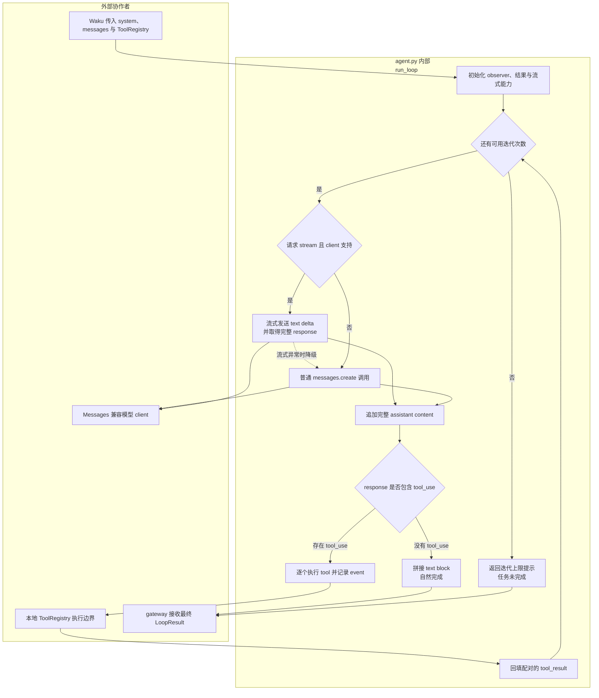

# `waku/loop/agent.py` 源码解析

## 源码文件

- [`waku/loop/agent.py`](../../../../waku/loop/agent.py#L1)

## 一句话总结

`agent.py` 是项目教学核心：一个不依赖编排框架的显式 reason-act-observe 循环。它把当前工作消息发送给模型，执行模型请求的 tool，把 `tool_result` 回填，再继续推理，直到模型给出普通文本或达到 `max_iterations`。

该文件同时定义两种退出语义：无 tool_use 的自然完成，以及持续请求 tool 时的迭代硬停止。

## 前提知识

- **Anthropic Messages 形状**：Loop 统一消费带 `content` block、`stop_reason` 和 `usage` 的 response。OpenAI/Gemini 等差异在 model adapter 中转换，不进入本文件。
- **content block**：response.content 可以同时包含 `text` 与 `tool_use`。Loop 必须保存完整 assistant content，不能只摘出文本。
- **tool_use/tool_result**：模型先返回结构化 tool 请求；本地执行后，结果以带同一 `tool_use_id` 的 `tool_result` block 回填。
- **Observer**：`notify(kind, event)` 旁路输出 text delta、LLM usage 和 tool event。Loop 不知道事件最终进入 CLI、Dashboard 还是 trace。
- **工作消息可变性**：`messages` 由调用方创建，但会在 Loop 内原地追加 assistant 与 tool_result。调用者若需要保留原始历史，必须先复制。
- **流式降级**：`stream=True` 只是优先路径。client 不支持 stream 或流式过程抛异常时，本轮会退回普通 `messages.create()`。

## 文件概览

整个文件围绕一个结果模型和一个主函数展开，没有隐藏状态机或后台 worker。

| 主要部分 | 角色/职责 | 为什么值得先看 | 代码位置 |
| --- | --- | --- | --- |
| 协议别名 `LoopEvent` / `Observer` | 定义旁路事件的最小形状 | 解释 gateway 与 tracing 如何在不侵入 Loop 的情况下观察执行 | [`L27-L30`](../../../../waku/loop/agent.py#L27) |
| `LoopResult` | 汇总最终 reply、tool events 与迭代数 | 是 Waku 和 gateway 唯一需要消费的 Loop 结果 | [`L33-L37`](../../../../waku/loop/agent.py#L33) |
| `run_loop()` 参数与初始化 | 注入 client、system、messages、tools 和保护阈值 | 显示 Loop 没有读取全局配置或创建依赖 | [`L40-L70`](../../../../waku/loop/agent.py#L40) |
| reason 与流式降级 | 调模型并归一成完整 response | 两条模型调用路径最终进入相同协议 | [`L72-L101`](../../../../waku/loop/agent.py#L72) |
| 自然退出与 act/observe | 判断 tool_use、执行 tool、回填结果 | 是 Agent 从“回答”转为“行动”的关键分叉 | [`L103-L125`](../../../../waku/loop/agent.py#L103) |
| 迭代硬停止 | 超过上限后返回明确提示 | 防止错误模型或 prompt 造成无限副作用循环 | [`L127-L129`](../../../../waku/loop/agent.py#L127) |

## 文件拆解

### 1. Observer 是旁路，不是业务依赖

[`LoopEvent` 与 `Observer`](../../../../waku/loop/agent.py#L27) 只约定一个 `kind + dict` callable。`run_loop()` 在 [`L67-L70`](../../../../waku/loop/agent.py#L67) 把缺失 observer 替换为空函数，因此观测能力不会改变控制流。

三类核心事件分别在不同阶段产生：

- 流式 text delta：[`L84-L85`](../../../../waku/loop/agent.py#L84)，只用于实时 UI。
- 完整 LLM 元数据：[`L100-L101`](../../../../waku/loop/agent.py#L100)，包含迭代、stop reason 和 token usage。
- tool event：[`L116-L119`](../../../../waku/loop/agent.py#L116)，与最终 `LoopResult.tool_calls` 使用同一字典。

### 2. `LoopResult` 只保存完成所需事实

[`LoopResult`](../../../../waku/loop/agent.py#L33) 不保存每个原始 response。`reply` 面向用户，`tool_calls` 面向持久历史/UI/trace，`iterations` 面向保护和运维指标。完整 assistant content blocks 与 `tool_result` 只保留在调用方传入的 `messages`；trace 记录的是 LLM 元数据和标准化 gate/tool 等事件, 不是这份完整中间协议。

### 3. Loop 的所有能力都由参数注入

[`run_loop()`](../../../../waku/loop/agent.py#L40) 不调用 `load_settings()`，也不创建 ToolRegistry。模型 id、system、消息、tool schema、迭代上限、token 上限和 observer 都由 Waku 传入。

这种设计使同一函数可被生产 Waku、deterministic eval 与教学 demo 复用。脚本化 client 只需提供相同的 `messages.create()` response 形状。

### 4. 流式调用仍以完整 response 为判定依据

[`can_stream`](../../../../waku/loop/agent.py#L70) 同时要求调用方开启 stream 且 client 暴露 `messages.stream`。流式分支在 [`L76-L86`](../../../../waku/loop/agent.py#L76) 一边推送文本 delta，一边通过 `get_final_message()` 获取完整 response。

任意流式异常都会在 [`L87-L89`](../../../../waku/loop/agent.py#L87) 把 `response` 重新置空。随后 [`L91-L99`](../../../../waku/loop/agent.py#L91) 走普通请求。这个捕获范围较宽，语义是“流式 UI 失败不能让 Agent turn 失败”；普通请求若也失败则继续向上抛出，不会在 Loop 内吞掉。

### 5. Assistant content 必须先入工作消息

无论 response 最终是普通回答还是 tool 请求，[`L103-L106`](../../../../waku/loop/agent.py#L103) 都先把完整 assistant content 追加到 `messages`，再筛选 `tool_use`。

这保持 provider 协议配对正确：后续 tool_result 必须跟在产生 tool_use 的 assistant turn 之后。若先丢弃 assistant content，只回填 tool_result，下一轮模型就看不到请求来源。

### 6. 自然退出与 tool 分支

当 `tool_uses` 为空时，[`L108-L111`](../../../../waku/loop/agent.py#L108) 将所有 text block 拼成最终 reply 并立即返回。这是“模型正在对人说话”的自然完成语义，即使 `stop_reason` 的具体字符串因 provider adapter 不同而变化，判断仍以 content block 为准。

存在 tool_use 时，[`L113-L122`](../../../../waku/loop/agent.py#L113) 对每个 call 执行三件事：

1. 通过 `ToolRegistry.execute()` 获得字符串输出；
2. 把相同 event 同时写入 `LoopResult.tool_calls` 并通知 observer；
3. 构造与 `call.id` 配对的 `tool_result` block。

所有 tool 结果在 [`L124-L125`](../../../../waku/loop/agent.py#L124) 一次性作为 user role 追加，下一次 for-loop 才进行新的 reason。这意味着一个 response 内的多个 tool_use 会先全部执行，再共同回填。

### 7. 迭代上限是硬退出，不是任务成功

`for iteration in range(1, max_iterations + 1)` 让 `result.iterations` 始终反映真实模型轮数。若每一轮都有 tool_use，循环结束后 [`L127-L129`](../../../../waku/loop/agent.py#L127) 返回固定提示。

这个分支只保证进程不会无限循环；它不回滚之前已经发生的 tool 副作用，也不代表用户任务完成。因此有副作用的 tool 自身仍需幂等保护。

## 主调用链

### 调用链一：生产 Agent turn

1. [`Waku.respond()`](../../../../waku/app.py#L57) 先组装 system 和消息快照，再在 [`app.py#L79`](../../../../waku/app.py#L79) 调用 `run_loop()`。调用场景：任一 gateway 收到用户输入。
2. [`run_loop()`](../../../../waku/loop/agent.py#L40) 在每轮 reason 时调用 [`ToolRegistry.schemas()`](../../../../waku/tools/registry.py#L57)，把当前可用 tool 描述发给模型。
3. response 含 tool_use 时，[`run_loop()` 的 act 阶段](../../../../waku/loop/agent.py#L113) 调用 [`ToolRegistry.execute()`](../../../../waku/tools/registry.py#L67)，再把输出包装为 tool_result。
4. response 不再含 tool_use 时返回 `LoopResult`，[`Waku.respond()` 的写回阶段](../../../../waku/app.py#L91) 将最终 reply 和 tool event 存入 Session。

### 调用链二：Dashboard 流式显示

1. [`dashboard.py::chat_stream()`](../../../../waku/ops/dashboard.py#L86) 构造能把事件发到 SSE 的 observer。
2. [`dashboard.py#L101`](../../../../waku/ops/dashboard.py#L101) 以 `stream=True` 调用 Waku，Waku 原样传入 Loop。
3. [`run_loop()` 流式分支](../../../../waku/loop/agent.py#L76) 逐个发送 text delta；Dashboard 实时展示，但 Tracer 会忽略这些高频 delta，只记录完整 LLM 事件。
4. 若 stream 不可用或中途异常，[`普通调用分支`](../../../../waku/loop/agent.py#L91) 仍产出完整 response，Dashboard 最后收到 done event。

### 调用链三：迭代保护教学 demo

1. [`02_iteration_guardrail_demo.py`](../../../playground/project_demos/agent_turn/02_iteration_guardrail_demo.py#L57) 构造一个永远请求 `demo_ping` 的脚本化 client 与无副作用 registry。
2. [`demo 调用 run_loop()`](../../../playground/project_demos/agent_turn/02_iteration_guardrail_demo.py#L74) 把 `max_iterations` 设为 3。调用场景：演示模型不主动停止时的真实 Loop 行为。
3. 三轮 tool_result 回填后进入 [`硬退出分支`](../../../../waku/loop/agent.py#L127)，结果的 `iterations` 为 3 且 reply 明确说明未完成。

## 关键流程图

下图展开 `run_loop()` 内部一次或多次迭代，明确流式降级、自然回复、tool 回填和迭代硬停止的不同返回语义。

## 关键状态对象

| 状态对象 | 含义 | 状态变化与消费点 |
| --- | --- | --- |
| `messages` | 单个 turn 的完整工作协议 | [`L103-L125`](../../../../waku/loop/agent.py#L103) 原地追加 assistant 与 tool_result；下一轮模型继续消费 |
| `LoopResult.reply` | 最终用户可见文本 | 自然分支在 [`L108-L111`](../../../../waku/loop/agent.py#L108) 设置；硬退出在 [`L127-L129`](../../../../waku/loop/agent.py#L127) 设置 |
| `LoopResult.tool_calls` | 已真实执行的 tool event | [`L116-L119`](../../../../waku/loop/agent.py#L116) 追加；Waku 写入会话摘要 |
| `LoopResult.iterations` | 已进行的 reason 次数 | 每轮在 [`L73-L74`](../../../../waku/loop/agent.py#L73) 更新，供 gate/运维和测试断言 |
| `can_stream` | 本 turn 是否可尝试流式调用 | [`L70`](../../../../waku/loop/agent.py#L70) 一次计算；异常后仍会在下一迭代再次尝试 stream |
| `response` | 当前 reason 的完整模型响应 | 流式与普通路径归一到同一变量，随后统一发送 llm event 与解析 content |
| `tool_uses` / `tool_results` | 当前迭代的请求和回填块 | 决定自然返回或进入下一轮；不跨迭代复用容器 |

## 阅读顺序

1. 先读 [`run_loop()` 的参数和结构化 docstring](../../../../waku/loop/agent.py#L40)，确认所有依赖都来自调用方。
2. 再沿 [`reason 阶段`](../../../../waku/loop/agent.py#L72) 比较 stream 与普通调用如何归一成 response。
3. 阅读 [`自然退出分支`](../../../../waku/loop/agent.py#L108)，明确“没有 tool_use”就是交付给人的完成态。
4. 阅读 [`act/observe 阶段`](../../../../waku/loop/agent.py#L113) 和 [`tool_result 回填`](../../../../waku/loop/agent.py#L124)，跟踪 call.id 与结果的配对。
5. 最后看 [`硬退出分支`](../../../../waku/loop/agent.py#L127)，并运行现有 iteration guardrail demo 验证三轮后的真实状态。

本文件已经有无 tool 自然退出、tool 调用、重复副作用保护和迭代上限的 deterministic 覆盖，并有专门教学 demo。新增 mock 型 learning test 会重复现有证据，因此本次不新增；若调试真实 provider，优先在完整 response 取得后、`tool_uses` 判定后和 tool_result 回填后观察变量。
