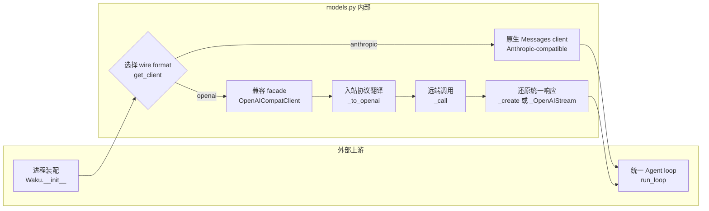
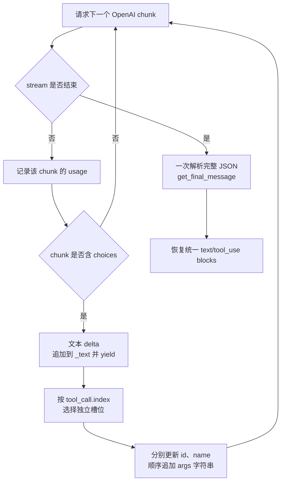

# models.py 源码解析

## 源码文件

- [`waku/loop/models.py`](../../../../waku/loop/models.py#L1)

## 一句话总结

`models.py` 把五个 provider 收敛成 Agent loop 只需理解的一种 Anthropic Messages 形状。原生 Anthropic-compatible provider 直接使用 SDK，OpenAI-compatible provider 则通过 `OpenAICompatClient` 完成请求、响应和 stream 的双向协议翻译。

## 前提知识

- **统一边界是 Python 对象形状，不是 HTTP 协议本身**：loop 只调用 `client.messages.create(...)`，并读取 `response.content` 中的 `text` / `tool_use` block。底层真正可以是 Anthropic Messages API，也可以是 OpenAI `chat.completions`。
- **主模型与小模型共用 client**：`settings.model` 给 Agent loop 使用，`settings.small_model` 给 retrieval gate 和 consolidation 使用；`get_client()` 会在未显式配置时回填二者。
- **tool call 是协议差异最大的部分**：Anthropic 把 `tool_use` 和 `tool_result` 表示为 content block；OpenAI 把请求放在 assistant 的 `tool_calls`，结果拆成独立的 `role=tool` 消息。
- **stream 不是一组完整响应**：OpenAI 可能把一个 tool 的 `id`、`name` 和 JSON `arguments` 拆散到多个 chunk，必须等 stream 结束后才能安全恢复一个 `tool_use` block。
- **`SimpleNamespace` 是兼容外壳**：adapter 用它构造具有 `.type`、`.text`、`.input`、`.usage` 等属性的对象，使 loop 不需要依赖 OpenAI SDK 的响应类型。

## 文件概览

这个文件大致分为 provider 配置、client 选择、非流式 adapter 和流式状态机四个部分。阅读时先抓住 `get_client()` 的分流，再进入 `_to_openai()` 和 `_OpenAIStream` 的两个协议转换方向。

| 主要部分 | 角色/职责 | 为什么值得先看 | 代码位置 |
|---|---|---|---|
| `Provider` 与 `PROVIDERS` | 把品牌名映射为 wire format、key 环境变量、endpoint 和默认模型 | 决定后面是原生直连还是进入 adapter | [`Provider` 与映射表](../../../../waku/loop/models.py#L24) |
| `get_client()` | 校验 provider/key，回填模型 id，构造统一 client | 是 Waku 装配模型边界的唯一入口 | [`get_client()`](../../../../waku/loop/models.py#L50) |
| `OpenAICompatClient._to_openai()` | 把 Anthropic 形状的 system/messages/tools 翻译为 OpenAI 请求 | tool call 与 tool result 的结构差异都集中在这里 | [`_to_openai()`](../../../../waku/loop/models.py#L111) |
| `_call()` 与 `_create()` | 发起非流式请求并把 OpenAI 响应还原为 Anthropic blocks | 展示请求字段兼容回退与响应字段归一化 | [`_call()`](../../../../waku/loop/models.py#L168)、[`_create()`](../../../../waku/loop/models.py#L187) |
| `_stream()` 与 `_OpenAIStream` | 模拟 Anthropic stream context manager，累计文本、tool 片段和 usage | 是本文件最容易误读的状态机，尤其是 tool JSON 参数重组 | [`_stream()`](../../../../waku/loop/models.py#L225)、[`text_stream`](../../../../waku/loop/models.py#L269)、[`get_final_message()`](../../../../waku/loop/models.py#L302) |

## 文件拆解

### 1. provider 选择只发生一次

[`get_client()`](../../../../waku/loop/models.py#L50) 先从 `PROVIDERS` 取得静态配置，再按“显式 `settings.api_key` 优先，provider 专属环境变量兜底”的顺序取凭证。它同时把默认 `model` 和 `small_model` 写回 `Settings`，所以下游 loop、gate、consolidation 和 tracer 都读取同一份最终配置。

`Provider.kind` 只有两个值：

- `anthropic`：Anthropic、Kimi、GLM 使用 Anthropic Messages wire format，返回原生 `anthropic.Anthropic`。
- `openai`：OpenAI、Gemini 使用 OpenAI-compatible wire format，返回 `OpenAICompatClient`。

这不是 provider 能力排序，而是协议路由。无论走哪一支，返回值都必须暴露 `messages.create()`；OpenAI adapter 还暴露 `messages.stream()`，供 Dashboard 流式输出使用。

### 2. 入站翻译：Anthropic working memory 转成 OpenAI messages

[`_to_openai()`](../../../../waku/loop/models.py#L111) 处理四类转换：

1. 顶层 `system` 变成 OpenAI 的第一条 `role=system` 消息。
2. 普通字符串消息保留原有 role 和 content。
3. assistant content blocks 被拆成 `content` 与 `tool_calls`；每个 `tool_use.input` 通过 `json.dumps()` 变成 function arguments 字符串。
4. Anthropic 放在一条 user 消息中的多个 `tool_result`，被拆成多条 OpenAI `role=tool` 消息，并用 `tool_call_id` 保持请求与结果配对。

tool schema 的内部 JSON Schema 不变，只把外壳从 Anthropic 的 `input_schema` 改成 OpenAI function 的 `parameters`。因此 `ToolRegistry` 不需要为不同 provider 维护两套 schema。

### 3. 非流式出站翻译：OpenAI response 还原成 content blocks

[`_create()`](../../../../waku/loop/models.py#L187) 先调用 `_to_openai()` 和 [`_call()`](../../../../waku/loop/models.py#L168)，再把响应还原为 loop 可扫描的对象：

- `choice.content` 变成 `type="text"` block。
- `choice.tool_calls` 逐个变成 `type="tool_use"` block，function arguments 在这里 `json.loads()` 为 Python dict。
- 有 tool call 时统一得到 `stop_reason="tool_use"`，否则是 `end_turn`。
- `prompt_tokens` / `completion_tokens` 被改名为 tracer 读取的 `input_tokens` / `output_tokens`。

`_call()` 先发送 `max_completion_tokens`。若 endpoint 抛出异常，它复制请求参数并改用旧 `max_tokens` 再试一次。复制很重要：adapter 不会改坏第一次请求的 `kwargs`，调试时也能看到原始输入。

### 4. 流式出站翻译：先累计，再收束

[`_stream()`](../../../../waku/loop/models.py#L225) 只转换并冻结请求参数，真正的网络请求延迟到遍历 [`text_stream`](../../../../waku/loop/models.py#L269) 时发生。这样它才能模拟 Anthropic SDK 的 `with client.messages.stream(...) as stream` 使用方式。

`_OpenAIStream` 维护三类跨 chunk 状态：

- `_text`：每个文本 delta 先追加，再立即 `yield` 给 Dashboard。
- `_tools`：以 OpenAI `tool_call.index` 为 key，分别累计同一个 tool 的 `id`、`name` 和 `args` 字符串。
- `_usage`：记录 stream 尾部携带的 token usage。

tool arguments 不能在 chunk 到达时立刻解析。一个 JSON 对象可能先到 `{"tit`，后到 `le":"Coffee"}`；并行 tool call 还会交错。代码先按 `index` 选槽位，再按到达顺序拼接 `args`，最后才在 [`get_final_message()`](../../../../waku/loop/models.py#L302) 中执行一次 `json.loads()` 并生成 `tool_use` block。

如果 stream 阶段抛出异常，外层 `run_loop()` 会放弃这次流式结果并回退到 `messages.create()`。因此 stream 是 gateway 体验优化，最终协议仍由同一套非流式响应形状兜底。

### 5. 调试与学习测试判断

现有 [`01_full_agent_turn_demo.py`](../../../../learning/playground/project_demos/agent_turn/01_full_agent_turn_demo.py) 和 [`test_tool_trigger.py`](../../../../evals/deterministic/test_tool_trigger.py) 已证明 Anthropic 形状的 fake client 能驱动真实 loop、tool 和持久化。OpenAI adapter 的纯协议行为另有独立学习测试：[`learning/test/test_models_protocol_flow.py`](../../../test/test_models_protocol_flow.py)。

从仓库根目录运行：

```bash
.venv/bin/python -m pytest -o addopts= learning/test/test_models_protocol_flow.py -q
```

该测试无需 API key、server、数据库或网络，覆盖两类学习行为：`_to_openai()` 如何保留 text、tool call、tool result 的 role 与 call id 映射；`_OpenAIStream.get_final_message()` 如何把已收集的文本、tool arguments 和 usage 组装成 loop 可消费的统一响应。它是用于解释协议边界的 learning test，不代表 adapter 的完整生产回归，也没有覆盖真实 SDK、网络错误、chunk 到达时序或 `_call()` 的兼容重试。

源码运行时仍可用三个克制断点理解：

- [`_to_openai()` 完成消息翻译处](../../../../waku/loop/models.py#L156)：观察 `messages` 与 `oai_messages` 的一一对应。
- [`text_stream` 选择 tool 槽位处](../../../../waku/loop/models.py#L291)：观察 `tc.index`、`tc.function.arguments` 和 `_tools` 如何逐 chunk 变化。
- [`get_final_message()` 解析完整参数处](../../../../waku/loop/models.py#L315)：确认 `args` 已是完整 JSON，并观察最终 `content` block 顺序。

## 主调用链

### 调用链一：Waku 启动时选择 client

1. [`Waku.__init__()` 中的 `get_client()` 调用](../../../../waku/app.py#L33) 在进程装配时选择模型 client。
2. [`get_client(settings)`](../../../../waku/loop/models.py#L50) 校验配置并回填主/小模型 id。
3. 原生分支返回 Anthropic SDK；OpenAI 分支进入 [`OpenAICompatClient.__init__()`](../../../../waku/loop/models.py#L95)。
4. [`run_loop()`](../../../../waku/loop/agent.py#L40) 只持有统一的 `messages.create/stream` 接口，不再判断 provider。

### 调用链二：非流式一次模型调用

1. `run_loop()` 或 memory 辅助流程调用 `client.messages.create(...)`。
2. [`_create()`](../../../../waku/loop/models.py#L187) 接收 Anthropic 形状参数。
3. [`_to_openai()`](../../../../waku/loop/models.py#L111) 翻译 system、messages 和 tools，随后 [`_call()`](../../../../waku/loop/models.py#L168) 请求 endpoint。
4. `_create()` 把文本、tool call 和 usage 还原成 Anthropic 形状，交还 loop 继续判断自然结束或工具执行。

### 调用链三：Dashboard 流式调用

1. Dashboard 以 `stream=True` 调用 `Waku.respond()`，`run_loop()` 进入 `messages.stream(...)`。
2. [`_stream()`](../../../../waku/loop/models.py#L225) 创建独立 `_OpenAIStream`。
3. [`text_stream`](../../../../waku/loop/models.py#L269) 一边把文本 delta 发给 observer，一边累计 tool fragments。
4. [`get_final_message()`](../../../../waku/loop/models.py#L302) 收束完整响应，loop 再按普通 Anthropic blocks 执行后续逻辑。

## 关键流程图

下面第一张图展示 provider 选择与双协议汇合的总体边界。



下面第二张图展开上一图的 `_OpenAIStream` 节点，重点是 tool arguments 的跨 chunk 重组。



## 关键状态对象

| 状态对象 | 关键字段 | 在主链路中的作用 |
|---|---|---|
| `Provider` | `kind`、`key_env`、`base_url`、`model`、`small_model` | 把 provider 名称转换成可执行的协议与默认值 |
| `Settings` | `provider`、`api_key`、`model`、`small_model`、`base_url` | 输入启动配置；`get_client()` 会把缺省模型 id 回填到同一对象 |
| Anthropic 形状 `messages` | `role`、字符串或 content blocks | 是 loop 与 adapter 之间的稳定内部协议 |
| OpenAI `oai_messages` | `role=system/assistant/tool`、`tool_calls` | 是发给 `chat.completions` 的外部协议 |
| `_OpenAIStream._text` | 文本 delta 列表 | 同时支持即时展示与最终 response 重建 |
| `_OpenAIStream._tools` | `index -> {id, name, args}` | 隔离并行 tool call，延迟解析分片 JSON |
| `_OpenAIStream._usage` | `prompt_tokens`、`completion_tokens` | stream 结束后被统一成 tracer 认识的 usage 字段 |

## 阅读顺序

1. 先看 [`Provider` 与 `PROVIDERS`](../../../../waku/loop/models.py#L24)，只记住五个名字最终归为两种 wire format。
2. 再看 [`get_client()`](../../../../waku/loop/models.py#L50)，确认配置、默认模型和 client 实例何时定型。
3. 接着逐分支读 [`_to_openai()`](../../../../waku/loop/models.py#L111)，建立 tool request/result 的协议映射。
4. 然后读 [`_create()`](../../../../waku/loop/models.py#L187)，看响应如何恢复为 loop 的统一 blocks。
5. 最后联读 [`text_stream`](../../../../waku/loop/models.py#L269) 与 [`get_final_message()`](../../../../waku/loop/models.py#L302)，重点跟踪 `_tools[index]["args"]` 从碎片字符串到 Python dict 的变化。
