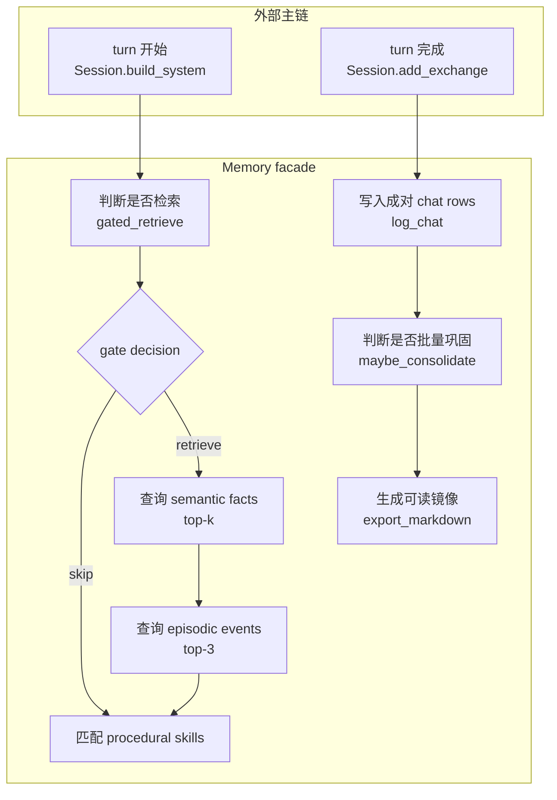

# memory/__init__.py 源码解析

## 源码文件

- [`waku/memory/__init__.py`](../../../../waku/memory/__init__.py#L28)

## 一句话总结

这个文件定义 `Memory` facade, 把 semantic facts、episodic events、procedural skills、chat/session 持久化和批量 consolidation 收敛成 Waku 上层只需理解的一组接口。它不是单一 store, 而是一次 turn 中所有长期记忆读写路径的协调者。

## 前提知识

- working memory 位于 `Session.history` 与本轮 prompt 中；这里管理的是跨 turn 保留的 durable memory。
- semantic memory 表示长期事实, 默认由 SQLite FTS5 检索, 也可通过 `semantic_store=supabase` 替换成向量 store。
- episodic memory 表示带日期的已发生事件, 当前始终保存在 SQLite。
- procedural memory 是 repo 与 `WAKU_HOME/skills` 下的 `SKILL.md`, 只在关键词匹配时注入 prompt。
- `chat_log` 同时服务 session 恢复和 consolidation。一次 exchange 固定写成相邻的 user/assistant 两行。
- `notify` 遵循 loop Observer 协议, Memory 只发布 gate 和 consolidation 事件, 不依赖具体 gateway。

## 文件概览

文件大致分为依赖装配、三类读取、chat/session 写读、Markdown 导出和 consolidation 协调五个职责块。

| 主要部分 | 角色/职责 | 为什么值得先看 | 源码位置 |
| --- | --- | --- | --- |
| `Memory.__init__()` | 装配 fact、episode、skill 三个子系统 | 决定哪些状态可以替换, 哪些始终 local-first | [`__init__()`](../../../../waku/memory/__init__.py#L31) |
| `_make_fact_store()` | 在 SQLite 与 Supabase fact store 间分流 | 这是 semantic memory 唯一的实现替换边界 | [`_make_fact_store()`](../../../../waku/memory/__init__.py#L52) |
| `gated_retrieve()` | 先 gate, 再按需查 facts/episodes | 是 working prompt 进入长期记忆的主读取路径 | [`gated_retrieve()`](../../../../waku/memory/__init__.py#L69) |
| `matching_skills()` | 选择并格式化 procedural memory | 展示 SKILL.md 的 progressive disclosure | [`matching_skills()`](../../../../waku/memory/__init__.py#L97) |
| `log_chat()` | 原子地写入一对 chat rows | session 恢复与 consolidation 都依赖其成对约定 | [`log_chat()`](../../../../waku/memory/__init__.py#L109) |
| session 查询 | 把 row 恢复为 exchange, 或生成会话摘要 | 解释 session 只是 `chat_log.session_id` 标签 | [`session_history()`](../../../../waku/memory/__init__.py#L134), [`list_sessions()`](../../../../waku/memory/__init__.py#L158) |
| `export_markdown()` | 将 SQLite 记忆镜像为 `MEMORY.md` | 让本地记忆可直接检查, 但文件不是反向写入源 | [`export_markdown()`](../../../../waku/memory/__init__.py#L187) |
| `maybe_consolidate()` | 委托批量巩固并按结果发事件 | 是 chat log 向 durable memory 转换的外层入口 | [`maybe_consolidate()`](../../../../waku/memory/__init__.py#L219) |

## 文件拆解

### 1. facade 装配与可替换边界

[`Memory.__init__()`](../../../../waku/memory/__init__.py#L31) 保存共享 connection、settings、model client, 随后按固定顺序创建三个子系统。只有 [`_make_fact_store()`](../../../../waku/memory/__init__.py#L52) 根据配置切换 semantic facts 的实现；episodes、chat/session 和 skills 仍分别绑定 SQLite 与文件系统。

这意味着 Supabase 是 semantic retrieval 的升级路径, 不是把整个 Waku 状态迁到远端。`export_markdown()` 也明确从本地 SQLite 的 `facts`、`episodes` 表生成视图, 读者不能把它误解为任意 fact backend 的统一导出。

### 2. gated retrieval 与 procedural matching

[`gated_retrieve()`](../../../../waku/memory/__init__.py#L69) 先调用 [`should_retrieve()`](../../../../waku/memory/retrieval_gate.py#L36), 再立刻通过 `notify` 发布 decision。`skip` 是正常分支, 会在访问任何 store 前返回空串；`retrieve` 才会以 gate 生成的 query 搜索 facts top-k 和 episodes top-3, 最后把两个列表拼成 prompt 文本。

[`matching_skills()`](../../../../waku/memory/__init__.py#L97) 与长期记忆检索相互独立。SkillLoader 在扫描或 refresh 时已经读取并解析完整 SKILL.md, `match()` 只用消息与 skill name/description 的关键词重合打分；命中后才由 Memory 把已加载的 body 注入 system prompt。SKILL.md mtime 改变时会在匹配前自动重新扫描。

### 3. chat 与 session 的共享 row 模型

[`log_chat()`](../../../../waku/memory/__init__.py#L109) 连续插入 user 和 assistant 两行, 使用相同的 `session_id`、`source`, 最后一次 commit。这个顺序是一个隐含协议: consolidation 用“两行等于一个 exchange”计算阈值, [`session_history()`](../../../../waku/memory/__init__.py#L134) 也用 pending user 加下一条 assistant 重组 pair。

恢复逻辑会忽略没有前置 user 的 assistant row；末尾没有 assistant 的 pending user 也不会形成返回 pair。正常写路径通过成对插入避免这两种不完整状态。

### 4. 人类可读镜像

[`export_markdown()`](../../../../waku/memory/__init__.py#L187) 先从 SQLite 读取稳定排序的 facts/episodes, 再整体覆盖 `MEMORY.md`。整体覆盖可以避免重复条目, 并强调 Markdown 是 generated view, 不是 source of truth。

### 5. consolidation 协调

[`maybe_consolidate()`](../../../../waku/memory/__init__.py#L219) 把 connection、small model、阈值和两个 store 一并交给 [`consolidate_if_due()`](../../../../waku/memory/consolidation.py#L37)。返回值为 0 时不发布事件；只有 `new_facts` 非零时才发 `consolidation` event。因此 episode-only 的有效巩固仍可能改变持久状态, 但不会产生该 UI event。

## 主调用链

### turn 前的记忆读取链

1. [`Waku.respond()` 调用 `Session.build_system()`](../../../../waku/app.py#L75) 组装 system prompt。
2. [`Session.build_system()` 调用 `gated_retrieve()`](../../../../waku/runtime/session.py#L103) 进入 memory 读取门面。
3. [`gated_retrieve()`](../../../../waku/memory/__init__.py#L69) 先取得 gate decision, retrieve 分支再访问 fact/episode stores。
4. 同一个 `build_system()` 随后调用 [`matching_skills()`](../../../../waku/memory/__init__.py#L97), 把命中的 procedural instructions 追加到 prompt。

调用场景是每个用户 turn 在进入 Agent loop 之前；这条链决定模型本轮能看到哪些长期上下文。

### turn 后的持久化与巩固链

1. Agent loop 返回最终 reply 后, `Session.add_exchange()` 调用 [`log_chat()`](../../../../waku/memory/__init__.py#L109)。
2. chat rows commit 后, `Waku.respond()` 调用 [`maybe_consolidate()`](../../../../waku/memory/__init__.py#L219)。
3. consolidation 到期时写入 facts/episode 并推进 `chat_log.consolidated`。
4. 最后 [`export_markdown()`](../../../../waku/memory/__init__.py#L187) 覆盖人类可读镜像。

### session 恢复链

1. dashboard 请求切换 session, 或 `Session.switch()` 收到目标 id。
2. [`session_history()`](../../../../waku/memory/__init__.py#L134) 按 row id 读取目标 `chat_log`。
3. user/assistant pairs 被重新写回 `Session.history`, 成为后续 turn 的 working history。

## 关键流程图

## 关键状态对象

| 状态对象 | 含义 | 影响的分支或下游 |
| --- | --- | --- |
| `self.facts` | SQLite FTS5 或 Supabase semantic store | 决定 facts 的 add/search 实现 |
| `self.episodes` | SQLite episodic store | retrieve 时补充事件记忆, consolidation 时写 episode |
| `self.skills` | repo/home 两个 skill 目录的 loader | mtime 变化会刷新, 匹配结果进入 system prompt |
| `chat_log.consolidated` | row 是否已被批量提炼 | consolidation 只读取 0, 成功收尾后置 1 |
| `session_id` | chat row 的会话标签 | 控制历史查询和 working history 恢复范围 |
| `source` | cli、voice、telegram、dashboard 等 gateway 来源 | 只用于追踪和 inbox 展示, 不改变回复逻辑 |
| `notify` | 可选 Observer | 让 memory 状态对 gateway 和 tracing 可见, 不耦合 UI |

## 阅读顺序

1. 先读 [`Memory.__init__()`](../../../../waku/memory/__init__.py#L31), 区分可替换 semantic store 与始终本地的状态。
2. 再沿 [`gated_retrieve()`](../../../../waku/memory/__init__.py#L69) 和 [`matching_skills()`](../../../../waku/memory/__init__.py#L97) 阅读 turn 前输入。
3. 接着读 [`log_chat()`](../../../../waku/memory/__init__.py#L109) 与 [`session_history()`](../../../../waku/memory/__init__.py#L134), 建立 row/pair/session 模型。
4. 最后读 [`maybe_consolidate()`](../../../../waku/memory/__init__.py#L219) 和 [`export_markdown()`](../../../../waku/memory/__init__.py#L187), 理解 turn 后的长期状态变化。

### 现有验证证据与断点判断

[`test_tool_trigger.py`](../../../../evals/deterministic/test_tool_trigger.py#L32) 通过隔离 Waku 实例真实经过 gate、chat 写入和 memory 收尾, 并对 tool/history 行为做确定性断言；judge eval 还会预置 fact 验证回答能使用 memory。但当前没有一个测试同时展示 retrieve/skip、session pair 重组、consolidation event 三组内部状态, 本批次按要求不新增 learning test。

调试时建议只下三个断点: [`gated_retrieve()` 取得 decision 后](../../../../waku/memory/__init__.py#L78) 观察 `retrieve/query/reason`, [`log_chat()` commit 前](../../../../waku/memory/__init__.py#L120) 核对 pair 标签, [`maybe_consolidate()` 返回后](../../../../waku/memory/__init__.py#L226) 观察 `new_facts`。它们分别覆盖 turn 前读取、turn 后原始记录和 durable 状态转换。
