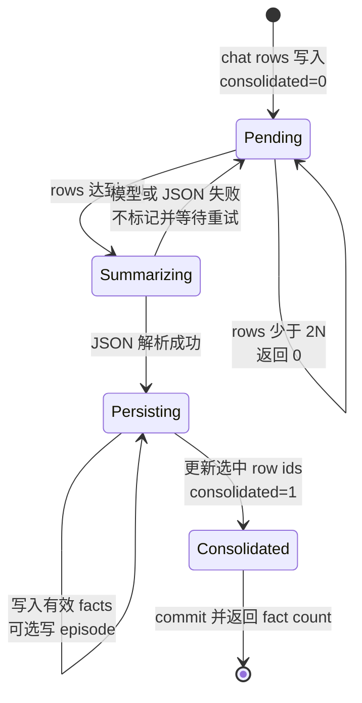

# consolidation.py 源码解析

## 源码文件

- [`waku/memory/consolidation.py`](../../../../waku/memory/consolidation.py#L22)

## 一句话总结

`consolidation.py` 把累计到阈值的原始 chat rows 批量提炼为 durable facts 和一个 episode, 然后才把这些 rows 从 `consolidated=0` 推进到 `1`。模型调用或 JSON 解析失败会返回 0 且不标记原始 chat, 让下一次 turn 可以完整重试。

## 前提知识

- `Memory.log_chat()` 每个 exchange 写两行: 一行 user、一行 assistant。
- `consolidate_every` 的单位是 exchange, 而查询结果的单位是 row, 所以阈值判断使用 `every_n * 2`。
- `facts` 是 semantic memory store, `episodes` 是 episodic memory store。函数依赖它们的 `add()` 接口, 不直接写对应业务表。
- `chat_log.consolidated` 是处理游标。0 表示仍应被后续批次读取, 1 表示已经进入过成功完成的巩固流程。
- summarizer 使用 Anthropic shape client, 返回 soft-constrained JSON 文本。

## 文件概览

文件由 summarizer prompt 与一个四阶段函数组成: 读取/阈值、模型解析、记忆写入、状态收尾。

| 主要部分 | 角色/职责 | 为什么值得先看 | 源码位置 |
| --- | --- | --- | --- |
| `SUMMARIZER_PROMPT` | 规定 facts 数组和单个 episode 的 JSON 协议 | 决定模型输出如何映射到两类 memory | [`SUMMARIZER_PROMPT`](../../../../waku/memory/consolidation.py#L22) |
| 阈值判断 | 读取全部未巩固 rows, 判断是否到期 | 解释为什么 N 个 exchange 对应 2N 行 | [`Step 1`](../../../../waku/memory/consolidation.py#L57) |
| 模型与解析 | 批量生成并解析 distilled JSON | 是可重试失败边界 | [`Step 2`](../../../../waku/memory/consolidation.py#L64) |
| 记忆写入 | 过滤不完整 fact, 可选写 episode | 真正产生 durable memory 副作用 | [`Step 3`](../../../../waku/memory/consolidation.py#L79) |
| 状态收尾 | 将本批 row ids 标为 consolidated 并 commit | 保证只有完成前面阶段才推进处理状态 | [`Step 4`](../../../../waku/memory/consolidation.py#L86) |

## 文件拆解

### 1. 读取的是全部 backlog

[`consolidate_if_due()`](../../../../waku/memory/consolidation.py#L37) 查询所有 `consolidated=0` 的 rows, 不只截取恰好 `every_n * 2` 行。阈值只是“是否开始”的门槛；一旦到期, 当前全部 backlog 会进入同一次 summarizer prompt。

如果 rows 少于阈值, 函数在 [`Step 1`](../../../../waku/memory/consolidation.py#L57) 直接返回 0, 不调用模型、不写 store、不更新 row 状态。

### 2. 模型输出是一个显式协议边界

[`Step 2`](../../../../waku/memory/consolidation.py#L64) 把 `role: content` 行串进 prompt, 请求一个 `facts` 数组和一个 `episode` 字符串。和 retrieval gate 一样, 代码截取首个 `{` 到最后一个 `}` 再执行 `json.loads()`。

模型超时、content 形状不符、没有花括号或 JSON 无效都会进入 [`except`](../../../../waku/memory/consolidation.py#L74)。这里直接返回 0, 没有任何 `UPDATE chat_log`, 所以原始 rows 仍是 `consolidated=0`。

### 3. 先写 memory, 后推进 chat 状态

[`Step 3`](../../../../waku/memory/consolidation.py#L79) 只把同时具有 `subject` 和 `content` 的 fact 交给 semantic store；episode 非空时写入当天日期。随后 [`Step 4`](../../../../waku/memory/consolidation.py#L86) 才按最初查询得到的全部 id 更新 `chat_log`。

这个顺序体现状态机语义:

```text
pending rows → distilled memory 已写入 → rows marked consolidated
```

不能提前标记 rows。否则 summarizer 解析失败时, 原始 chat 会从候选集合消失, 后续无法重试。

### 4. 失败边界要精确区分

“失败不标记”直接由 `try/except` 保证的是模型调用与 JSON 解析阶段。fact/episode store 的写入异常没有被本函数捕获, 会向上抛出；由于 chat UPDATE 位于最后, 此时 rows 同样不会被标记。不过各 store 的 `add()` 可能自行 commit, 所以存储阶段的中途错误可能留下部分 durable memory, 下次重试时应特别观察是否产生重复内容。

返回值使用 `len(distilled["facts"])`, 是模型返回的 fact 项数量, 不是经过字段完整性过滤后精确写入的数量。正常协议下两者一致, malformed fact 则可能不同。

## 主调用链

### 每个 turn 结束后的巩固链

1. `Waku.respond()` 先通过 `Session.add_exchange()` 把本轮 user/assistant 写入 chat log。
2. [`Memory.maybe_consolidate()`](../../../../waku/memory/__init__.py#L219) 调用 [`consolidate_if_due()`](../../../../waku/memory/consolidation.py#L37)。
3. [`Step 1`](../../../../waku/memory/consolidation.py#L57) 读取未处理 backlog 并判断阈值。
4. 到期时 [`Step 2`](../../../../waku/memory/consolidation.py#L64) 调用 small model。
5. 解析成功后 [`Step 3`](../../../../waku/memory/consolidation.py#L79) 写 facts/episode, [`Step 4`](../../../../waku/memory/consolidation.py#L86) 推进 rows 状态。
6. 返回非零 fact count 时, facade 发布 `consolidation` Observer event。

调用场景是每次 exchange 已成功落库之后；未到阈值时这条链在首次查询后快速结束。

### 可重试失败链

1. backlog 已到阈值。
2. model request 或 JSON parsing 抛出异常。
3. [`except`](../../../../waku/memory/consolidation.py#L74) 返回 0。
4. 没有执行 facts/episode 写入与 chat UPDATE。
5. 下一次 turn 写入新 exchange 后, 同一批原始 rows 会再次被查询。

## 关键流程图



## 关键状态对象

| 状态对象 | 含义 | 状态转换 |
| --- | --- | --- |
| `rows` | 本次查询到的全部未巩固 chat rows | 未到阈值直接保留；成功后按 id 全部置 1 |
| `every_n` | exchange 阈值 | 实际 row 阈值为 `every_n * 2` |
| `log` | `role: content` 拼接的模型输入 | 只在到期后构造 |
| `distilled` | JSON object, 期望含 `facts` 和 `episode` | 解析失败不存在；成功后驱动两类 store 写入 |
| `consolidated` | chat row 处理标志 | `0 → 1` 只发生在解析和 store 写入步骤之后 |
| 返回值 | distilled fact 项数 | 0 同时表示未到期、解析失败或 facts 为空 |

## 阅读顺序

1. 先看 [`consolidate_if_due()` 的结构化入口说明](../../../../waku/memory/consolidation.py#L37), 明确六个依赖与副作用。
2. 沿 [`Step 1`](../../../../waku/memory/consolidation.py#L57) 到 [`Step 2`](../../../../waku/memory/consolidation.py#L64), 理解阈值和可重试失败。
3. 再比较 [`Step 3`](../../../../waku/memory/consolidation.py#L79) 与 [`Step 4`](../../../../waku/memory/consolidation.py#L86) 的先后顺序, 这是文件最关键的状态保证。
4. 最后回看 `SUMMARIZER_PROMPT`, 将 JSON 字段与 store 调用逐一对应。

### 现有验证证据与断点判断

现有 deterministic eval 会经过 `Memory.maybe_consolidate()`, 但默认阈值下单个测试 turn 通常只覆盖“未到期返回 0”；当前没有专门验证 malformed JSON 后 rows 仍为 0, 或成功后 rows 全部变为 1 的回归。本批次按要求不新增测试。

若调试一次真实巩固, 建议在 [`阈值判断前`](../../../../waku/memory/consolidation.py#L57) 观察 `len(rows)` 与 `every_n`, 在 [`JSON 解析后`](../../../../waku/memory/consolidation.py#L72) 观察 `distilled`, 在 [`UPDATE 前`](../../../../waku/memory/consolidation.py#L86) 检查 store 已写结果和 row ids。若专门排查失败不标记, 再在 [`except`](../../../../waku/memory/consolidation.py#L74) 观察异常即可。
