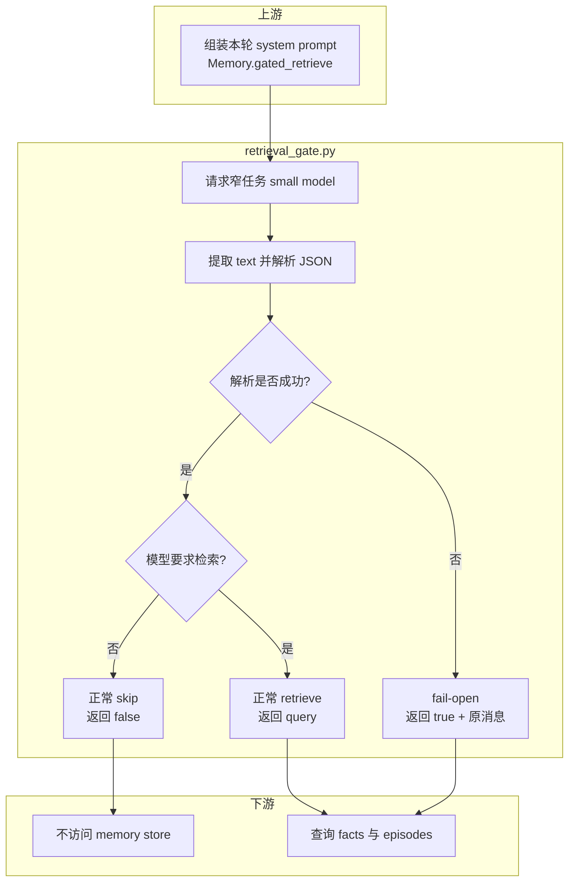

# retrieval_gate.py 源码解析

## 源码文件

- [`waku/memory/retrieval_gate.py`](../../../../waku/memory/retrieval_gate.py#L22)

## 一句话总结

`retrieval_gate.py` 用一次窄任务 small-model 调用判断“本轮是否需要长期记忆”, 把默认每轮检索改成显式 `skip/retrieve` 分支。它最关键的可靠性语义是 fail-open: gate 自身失败时返回 retrieve, 不让判定层成为记忆丢失的单点故障。

## 前提知识

- gate 不负责真正检索。它只返回 `(retrieve, query, reason)`, store 查询由 `Memory.gated_retrieve()` 执行。
- 调用方期待 client 暴露 Anthropic shape 的 `messages.create()`, 原生 Anthropic 与 OpenAI adapter 都满足这个内部协议。
- 模型输出是软约束文本。代码要求其中至少存在一个可解析的 JSON object, 因而需要截取首尾花括号。
- fail-open 与 fail-closed 的差异: 前者在判定失败时继续检索, 后者会跳过检索。这里选择前者, 因为多一次搜索的代价小于静默遗漏用户记忆。

## 文件概览

文件只有 prompt 契约和一个公开判定函数, 但内部包含正常决策与异常兜底两条行为不同的路径。

| 主要部分 | 角色/职责 | 为什么值得先看 | 源码位置 |
| --- | --- | --- | --- |
| `GATE_PROMPT` | 规定 retrieve/query/reason JSON 协议 | 模型是否能稳定给出窄判定主要由这个契约决定 | [`GATE_PROMPT`](../../../../waku/memory/retrieval_gate.py#L22) |
| `should_retrieve()` | 调模型、解析 JSON、归一化 tuple | 是 gate 唯一入口和全部状态转换所在 | [`should_retrieve()`](../../../../waku/memory/retrieval_gate.py#L36) |
| 正常解析路径 | 截取 JSON 并返回模型决策 | 区分正常 skip 与正常 retrieve | [`JSON 解析`](../../../../waku/memory/retrieval_gate.py#L56) |
| fail-open 路径 | 捕获模型、文本和 JSON 的任意异常 | 保证 gate 故障不会直接关闭 memory retrieval | [`fail-open`](../../../../waku/memory/retrieval_gate.py#L62) |

## 文件拆解

### 1. prompt 是协议而不是普通问答

[`GATE_PROMPT`](../../../../waku/memory/retrieval_gate.py#L22) 把任务限制为三字段 JSON:

- `retrieve`: 是否需要用户长期记忆。
- `query`: retrieve 分支使用的搜索关键词。
- `reason`: 给 trace/dashboard 展示的短原因。

它还给出 negative/positive 类别, 避免 general knowledge、math 或 self-contained request 无意义地访问 memory store。

### 2. small-model 判定

[`should_retrieve()`](../../../../waku/memory/retrieval_gate.py#L36) 将 `max_tokens` 限为 100, 说明这是分类与 query rewrite, 不是生成回答。调用完成后只拼接 `type == "text"` 的 content block, 再截取第一个 `{` 到最后一个 `}` 之间的内容。

这种截取能容忍少量前后说明, 但不能容忍缺少花括号、无效 JSON 或 client 异常；这些情况统一进入 fail-open。

### 3. 正常返回值归一化

[`正常返回`](../../../../waku/memory/retrieval_gate.py#L60) 用 `bool()` 归一化 retrieve 字段。query key 缺失时回退到原始 message, reason 缺失时为空串。返回 tuple 会被 facade 拆成三个变量, 并把 decision 通过 Observer 发布。

### 4. fail-open 的真实语义

[`except` 分支](../../../../waku/memory/retrieval_gate.py#L62) 捕获模型调用、content 访问、花括号查找和 JSON 解析的全部异常, 返回:

```text
(True, 原始用户消息, "gate failed open (<异常类型>)")
```

这里不是“假装判定成功”。reason 明确保留异常类型, 上层仍会记录 `decision=retrieve`, 随后用原消息查询 facts/episodes。这样 gate 的不稳定最多造成一次额外检索, 不会造成可能相关的记忆被静默跳过。

## 主调用链

### 正常 turn 的 gate 链

1. `Session.build_system()` 进入 [`Memory.gated_retrieve()`](../../../../waku/memory/__init__.py#L69)。
2. facade 调用 [`should_retrieve()`](../../../../waku/memory/retrieval_gate.py#L36), 传入共享 client、small model id 和用户消息。
3. [`messages.create()`](../../../../waku/memory/retrieval_gate.py#L50) 返回 text content。
4. [`JSON 解析`](../../../../waku/memory/retrieval_gate.py#L56) 得到 decision。
5. `skip` 让 facade 立即返回空串；`retrieve` 让 facade 继续搜索 facts 与 episodes。

调用场景是每个 turn 构建 system prompt 时, 在任何长期 store 查询之前执行。

### gate 故障链

1. 模型超时、client 抛错、没有 JSON object 或 JSON 无效。
2. 控制流进入 [`fail-open`](../../../../waku/memory/retrieval_gate.py#L62)。
3. 函数返回 `retrieve=True` 与原始 message。
4. `Memory.gated_retrieve()` 按 retrieve 分支继续访问 stores, 同时 trace 中保留 `gate failed open` reason。

## 关键流程图



## 关键状态对象

| 状态对象 | 可能值 | 对下游的影响 |
| --- | --- | --- |
| `retrieve` | `True` / `False` | 决定 facade 是否访问长期 memory store |
| `query` | 模型关键词、原 message 或空串 | 作为 facts/episodes 的搜索输入 |
| `reason` | 模型短原因或 fail-open 异常类型 | 进入 gate Observer event, 用于 trace/dashboard 解释 |
| `response.content` | Anthropic shape content blocks | 只消费 `type="text"` 的内容 |
| exception | 网络、协议、解析错误 | 不向上抛出, 统一转换为 retrieve=True |

## 阅读顺序

1. 先读 [`GATE_PROMPT`](../../../../waku/memory/retrieval_gate.py#L22), 明确模型必须交付的协议。
2. 再读 [`should_retrieve()` 的正常路径](../../../../waku/memory/retrieval_gate.py#L48), 跟踪 request → text → JSON → tuple。
3. 最后单独读 [`fail-open`](../../../../waku/memory/retrieval_gate.py#L62), 不要把它和正常 retrieve 混为同一种原因。

### 现有验证证据与断点判断

已有学习测试 [`test_retrieval_gate_flow.py`](../../../test/test_retrieval_gate_flow.py) 用轻量 fake client 分别展示 skip、retrieve 与 fail-open 三条行为路径。它已完成文件级 3 case 和函数级独立运行验证；推荐从仓库根目录执行:

```bash
.venv/bin/python -m pytest -o addopts= learning/test/test_retrieval_gate_flow.py -q
```

这是一组解释 gate 状态流的学习行为测试, 不是完整生产回归覆盖。现有 [`test_tool_trigger.py`](../../../../evals/deterministic/test_tool_trigger.py#L32) 还会从真实 Waku 主链间接覆盖 scripted `retrieve=false` 协议。

若要运行时确认, 建议在 [`messages.create()` 前](../../../../waku/memory/retrieval_gate.py#L49) 观察 `small_model/message`, 在 [`decision` 解析后](../../../../waku/memory/retrieval_gate.py#L56) 观察三个字段, 在 [`except` 分支](../../../../waku/memory/retrieval_gate.py#L62) 观察异常类型。这三个断点足以区分模型决策、协议解析和 fail-open, 无需为简单 tuple 返回增加更多断点。
