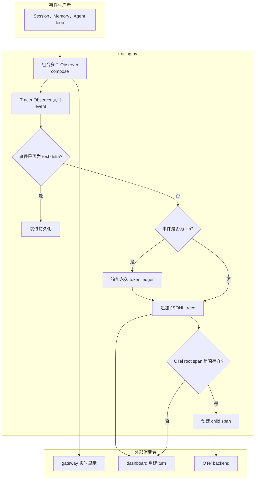

# tracing.py 源码解析

## 源码文件

- [`waku/ops/tracing.py`](../../../../waku/ops/tracing.py#L29)

## 一句话总结

`tracing.py` 把 loop 的统一 Observer event 同时映射到始终开启的 JSONL trace、独立的永久 token ledger 和可选 OTel spans。它有意跳过流式 `text` delta 的持久化, 让 dashboard 实时显示 token 的同时避免 trace 膨胀和最终 reply 重复。

## 前提知识

- loop Observer 是 `observer(kind, event)` callable。loop、memory 不知道具体 UI 或 tracing backend, 只发布统一事件。
- `compose()` 负责 fanout, 所以同一 event 可以先被 gateway 展示, 再被 Tracer 持久化。
- JSONL 是零依赖 source of truth: 每行一个独立 event, dashboard 按 `turn_start` 到 `turn_end` 重建 turn。
- `usage.jsonl` 与 traces 分离。trace 可以为了 demo 重置, token ledger 则作为永久成本依据保留。
- OTel 是可选镜像。没有 endpoint 或 optional dependency 时, JSONL 仍完整工作。
- streaming `text` event 只包含 delta, 最终完整 reply 由 `end_turn()` 的 `turn_end` record 保存。

## 文件概览

文件大致分为时间与输出初始化、事件持久化、turn 生命周期和 Observer 合成四块。

| 主要部分 | 角色/职责 | 为什么值得先看 | 源码位置 |
| --- | --- | --- | --- |
| `_now()` | 生成统一 UTC 毫秒时间戳 | JSONL 与 usage 的排序基础 | [`_now()`](../../../../waku/ops/tracing.py#L29) |
| `Tracer.__init__()` | 选择当天 trace 文件并初始化 OTel | 建立实例级 backend 状态 | [`__init__()`](../../../../waku/ops/tracing.py#L42) |
| `_init_otel()` | 配置 exporter、provider、tracer 或降级 | 是 optional tracing 的外部协议边界 | [`_init_otel()`](../../../../waku/ops/tracing.py#L58) |
| `_write()` / `_record_usage()` | 分别追加 trace 与永久 token ledger | 解释两个 JSONL 文件为何不能混为一类 | [`_write()`](../../../../waku/ops/tracing.py#L91), [`_record_usage()`](../../../../waku/ops/tracing.py#L105) |
| `event()` | Observer 主入口与 kind 分流 | `text` 跳过、`llm` 记账、非 text 落 trace 都在这里 | [`event()`](../../../../waku/ops/tracing.py#L120) |
| `turn()` / `end_turn()` | 写 turn 边界并维护 OTel root span | 决定 dashboard 能否识别完成与未完成 turn | [`turn()`](../../../../waku/ops/tracing.py#L151), [`end_turn()`](../../../../waku/ops/tracing.py#L177) |
| `compose()` | 合并 gateway Observer 与 Tracer | 保持 loop 与 UI/ops 解耦 | [`compose()`](../../../../waku/ops/tracing.py#L191) |

## 文件拆解

### 1. Tracer 初始化与双层输出

[`Tracer.__init__()`](../../../../waku/ops/tracing.py#L42) 保存 settings, 以本地日期选择 `traces/YYYY-MM-DD.jsonl`, 但每条 record 通过 [`_now()`](../../../../waku/ops/tracing.py#L29) 使用 UTC 时间。文件分片服务本地运维习惯, record 时间则保持跨时区一致。

[`_init_otel()`](../../../../waku/ops/tracing.py#L58) 显式处理三种常见结果:

- endpoint 为空: 不导入 OTel, 直接返回 `None`。
- endpoint 存在且依赖齐全: 注册 provider、BatchSpanProcessor 和 gRPC exporter。
- endpoint 存在但 import 缺失: 捕获 `ImportError`, 打印一次降级说明并返回 `None`。

endpoint 为空或只缺少 optional package 时, JSONL 都可独立工作。但这里不会吞掉 exporter/provider 初始化阶段的其他异常；endpoint 配错、SDK 初始化失败等错误会向上中断 `Waku` 构造。换言之, OTel 在默认配置下不是硬依赖, 显式启用后则需要其初始化真正可用。

### 2. JSONL trace 与 usage ledger 分离

[`_write()`](../../../../waku/ops/tracing.py#L91) 会原地为 record 添加 `ts`, 再以 `ensure_ascii=False` 追加一行 JSON。每行独立意味着进程即使在 turn 中途退出, 之前写完的事件仍可读取。

[`_record_usage()`](../../../../waku/ops/tracing.py#L105) 只保存 provider、model、input/output tokens 和 timestamp。美元价格不写入 ledger, dashboard 读取时再按当前价格表估算, 因而 token 是更稳定的历史事实。

### 3. Observer event 分流

[`event()`](../../../../waku/ops/tracing.py#L120) 是最值得先读的函数:

1. `kind == "text"` 时立即返回。delta 已经通过另一个 Observer 到达实时 UI, 逐 token 写文件既高频又会和最终 reply 重复。
2. `kind == "llm"` 时先追加永久 usage ledger。
3. 所有非 text event 都写 JSONL trace。
4. 只有 OTel tracer 和当前 root span 同时存在时, 才创建瞬时 child span。

因此“text 不落 trace”不等于回复不可观察。正常 turn 的最终 reply 会由 [`end_turn()`](../../../../waku/ops/tracing.py#L177) 写进 `turn_end`。

### 4. turn 生命周期

[`turn()`](../../../../waku/ops/tracing.py#L151) 在进入 agent 主逻辑前无条件写 `turn_start`。OTel 模式下, 它在 `yield` 前设置 `_span_ctx`, 在 `finally` 中无条件清空；JSONL-only 模式仍提供相同 context-manager 契约。

`Waku.respond()` 离开 `with tracer.turn(...)` 后才调用 [`end_turn()`](../../../../waku/ops/tracing.py#L177)。所以 root span 包围 system/loop/memory 主体, `turn_end` 是其后的 JSONL 完成标记；随后 provider 被 force flush。若主体抛错, `end_turn()` 不会执行, 但此前 `turn_start` 仍在, dashboard 会把未配对状态标为 unfinished turn。

### 5. Observer fanout

[`compose()`](../../../../waku/ops/tracing.py#L191) 先过滤 `None`, 再返回一个闭包, 按注册顺序把同一 `(kind, event)` 交给所有 active observers。它不复制 event, 也不捕获 Observer 异常；主链使用它把 gateway display 和 `tracer.event` 组合起来。

## 主调用链

### 正常 turn 的 tracing 链

1. `Waku.__init__()` 创建 [`Tracer`](../../../../waku/ops/tracing.py#L42)。
2. `Waku.respond()` 调用 [`compose()`](../../../../waku/ops/tracing.py#L191), 合并 gateway observer 与 `tracer.event`。
3. `with tracer.turn(user_message)` 通过 [`turn()`](../../../../waku/ops/tracing.py#L151) 写 `turn_start` 并可选建立 root span。
4. Session、Memory 和 loop 通过 fanout 调用 [`event()`](../../../../waku/ops/tracing.py#L120), 产生 gate、llm、tool、consolidation 等 records。
5. 主体成功结束后 [`end_turn()`](../../../../waku/ops/tracing.py#L177) 写完整 reply 与 iterations, 再 flush OTel。
6. [`dashboard.collect()`](../../../../waku/ops/dashboard.py#L184) 后续读取 JSONL, 按起止标记重建 turn。

调用场景是所有 gateway 的每个 turn, 因为它们最终都收敛到同一个 `Waku.respond()`。

### dashboard 流式文本链

1. dashboard 以 `stream=True` 启动 loop。
2. loop 对每个 token 发布 `notify("text", {"delta": ...})`。
3. [`compose()`](../../../../waku/ops/tracing.py#L191) 把 delta 交给 SSE observer 和 Tracer。
4. SSE observer 立即发给浏览器；[`Tracer.event()`](../../../../waku/ops/tracing.py#L120) 对 text 直接返回。
5. stream 完成后, 最终 reply 仍通过 `turn_end` 只保存一次。

## 关键流程图

## 关键状态对象

| 状态对象 | 含义 | 生命周期或影响 |
| --- | --- | --- |
| `self.path` | 当天 JSONL trace 文件 | Tracer 创建时按本地日期固定 |
| `self._otel_tracer` | 可选 OTel tracer | endpoint 关闭或缺依赖时为 `None` |
| `self._span_ctx` | 当前 turn root span | `turn()` yield 前设置, finally 中清空 |
| `_otel_provider` | 成功初始化的 provider | `end_turn()` 用它 force flush |
| `kind` | Observer event 类型 | 决定 text skip、llm usage 和 span kind |
| `record["ts"]` | UTC 毫秒时间 | `_write()` 在落盘前原地补齐 |
| `turn_start/turn_end` | JSONL 生命周期标记 | dashboard 用是否配对判断完成或挂起 |

## 阅读顺序

1. 先读 [`compose()`](../../../../waku/ops/tracing.py#L191), 明确 loop event 为什么能同时到 UI 与 trace。
2. 再读 [`event()`](../../../../waku/ops/tracing.py#L120), 特别确认 text delta 跳过与 llm usage 分支。
3. 接着读 [`turn()`](../../../../waku/ops/tracing.py#L151) 和 [`end_turn()`](../../../../waku/ops/tracing.py#L177), 建立 turn 边界与 unfinished 语义。
4. 最后读 [`_write()`](../../../../waku/ops/tracing.py#L91)、[`_record_usage()`](../../../../waku/ops/tracing.py#L105) 和 [`_init_otel()`](../../../../waku/ops/tracing.py#L58), 区分三个输出 backend。

### 现有验证证据与断点判断

现有 deterministic eval 通过真实 `Waku.respond()` 间接产生 turn、gate、llm 和 tool trace, 但断言重点在 loop/tool 结果, 没有专门验证 text delta 不写文件、usage ledger 或 unfinished turn。本批次按要求不新增测试；这些行为涉及文件输出和可选 OTel, 为学习目的引入复杂 mock 的收益低于源码注释与断点观察。

如需调试, 建议在 [`event()` text 判断处](../../../../waku/ops/tracing.py#L128) 观察 `kind/event`, 在 [`_write()` 落盘前](../../../../waku/ops/tracing.py#L98) 观察最终 record, 在 [`turn()` yield 前后](../../../../waku/ops/tracing.py#L159) 观察 `_span_ctx`。三处足以确认 delta skip、JSONL 内容和 root span 生命周期。
