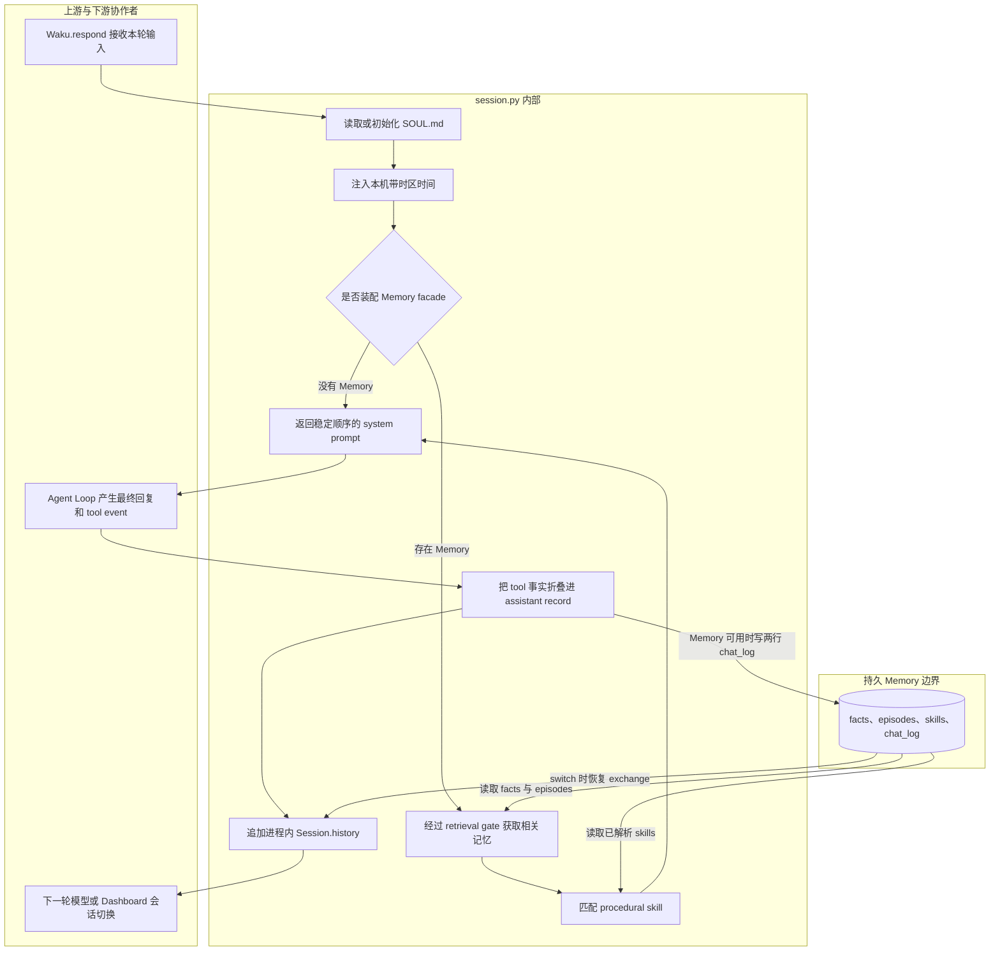

# `waku/runtime/session.py` 源码解析

## 源码文件

- [`waku/runtime/session.py`](../../../../waku/runtime/session.py#L1)

## 一句话总结

`session.py` 管理 Waku 的工作记忆边界：每轮开始时把 SOUL、当前时间、按需检索的长期记忆与匹配 skill 组装成 system prompt；每轮结束时只把最终 user/assistant exchange 写回进程内历史和可选 `chat_log`。

它不保存 Loop 的完整中间协议，也不实现长期记忆检索；它负责在“临时模型上下文”和“可恢复聊天记录”之间做受控转换。

## 前提知识

- **SOUL.md**：位于 `settings.home` 的可编辑 persona 文件。首次运行由 `DEFAULT_SOUL` 初始化，之后用户编辑优先。
- **system prompt**：每次模型调用都携带的运行指令。本文件按固定顺序拼接 persona、当前时间、检索结果与 skill 指令。
- **working memory**：`Session.history` 中的当前会话 user/assistant 消息。它存在于进程内，可通过 `switch()` 从 `chat_log` 重建。
- **durable memory**：Memory facade 管理的 facts、episodes、skills 与 `chat_log`。Session 只通过公开方法访问，不直接执行 SQL。
- **retrieval gate**：在真正搜索 facts/episodes 之前判断本轮是否需要个人记忆；`Session` 只发起调用并消费拼好的文本。
- **tool 摘要**：最终 assistant 历史中的 `[tools used: ...]` 行。它记录已经发生的副作用，避免下一轮模型重复执行同一 tool。

## 文件概览

文件可按“默认 persona → 文件边界 → Session 状态 → 每轮组装 → 每轮写回 → 会话切换”来阅读。

| 主要部分 | 角色/职责 | 为什么值得先看 | 代码位置 |
| --- | --- | --- | --- |
| `DEFAULT_SOUL` | 首次运行使用的 persona 与 tool 使用规则 | 决定无用户自定义时模型最初看到的行为契约 | [`L17-L42`](../../../../waku/runtime/session.py#L17) |
| `load_soul()` | 创建或读取 SOUL.md | 是 system prompt 与本地文件系统之间的边界 | [`L45-L60`](../../../../waku/runtime/session.py#L45) |
| `Session.__init__()` | 保存配置、Memory 引用、session id 和历史 | 建立工作记忆最小状态 | [`L63-L80`](../../../../waku/runtime/session.py#L63) |
| `build_system()` | 拼接 persona、时间、长期记忆与 skill | 决定模型在本轮开始前“知道什么” | [`L82-L113`](../../../../waku/runtime/session.py#L82) |
| `add_exchange()` | 折叠 tool 事实并写回历史/chat_log | 决定下一轮模型和持久会话“记得什么” | [`L115-L139`](../../../../waku/runtime/session.py#L115) |
| `start_new()` / `switch()` | 清空或恢复会话工作历史 | 将 Dashboard 会话选择映射成进程内状态变化 | [`L141-L176`](../../../../waku/runtime/session.py#L141) |

## 文件拆解

### 1. 默认 persona 只负责首次初始化

[`DEFAULT_SOUL`](../../../../waku/runtime/session.py#L17) 不会在每轮强制覆盖 SOUL.md。它包含日程、记忆、消息和副作用真实性等默认规则，但 [`load_soul()`](../../../../waku/runtime/session.py#L45) 只在文件不存在时写入默认值。

这一区分非常重要：源码常量是 bootstrap，`settings.home / "SOUL.md"` 才是运行时 persona。用户修改文件后，后续 turn 都读取修改后的内容。

### 2. `load_soul()` 是可见的文件副作用边界

函数先在 [`L54-L55`](../../../../waku/runtime/session.py#L54) 由 `settings.home` 计算路径，再在 [`L57-L60`](../../../../waku/runtime/session.py#L57) 执行“缺失则创建、始终读取”。

它没有创建 `settings.home`；目录准备由 Waku 装配阶段完成。直接在测试中构造 Session 时，也需要先调用 `settings.ensure_home()`，否则首次写入可能失败。

### 3. Session 状态刻意很小

[`Session.__init__()`](../../../../waku/runtime/session.py#L67) 只有四个状态：`settings`、可选 `memory`、`session_id` 和 `history`。Memory 可以为 `None`，因此当前时间注入等基础能力可在不连接长期记忆的 deterministic test 中独立验证。

`history` 的元素采用 `{"role": ..., "content": ...}` 形状，能直接复制到 `run_loop()` 的 `messages`。它不保存主模型每一轮的 tool_use/tool_result 块；这些细节属于单次 Loop 工作区和 trace。

### 4. `build_system()` 的稳定拼接顺序

[`build_system()`](../../../../waku/runtime/session.py#L82) 有五个阶段：

1. [`L94-L95`](../../../../waku/runtime/session.py#L94) 获取本机带时区时间，解决“30 分钟后”等相对时间。
2. [`L97-L99`](../../../../waku/runtime/session.py#L97) 把 SOUL 和当前时间放入固定的前两段。
3. Memory 存在时，[`L101-L105`](../../../../waku/runtime/session.py#L101) 调用 gated retrieval；只有非空结果才添加 `Relevant memory`。
4. [`L107-L110`](../../../../waku/runtime/session.py#L107) 独立匹配 procedural skill；事实记忆与做事方法不会混在一个查询接口里。
5. [`L112-L113`](../../../../waku/runtime/session.py#L112) 用换行保持各上下文块的稳定边界。

Memory 不存在时，函数不是失败，而是自然退化为 SOUL + 当前时间。retrieval gate 判定 skip 时同样只是少一个记忆段，skill 匹配仍会继续。

### 5. `add_exchange()` 只保存完成态

[`add_exchange()`](../../../../waku/runtime/session.py#L115) 在 Loop 完成后接收最终 reply 与实际执行的 tool event。若存在 tool_calls，[`L127-L131`](../../../../waku/runtime/session.py#L127) 会把名称、参数和输出压成一行 `[tools used: ...]`。

之后同一个 `record` 同时进入：

- [`Session.history`](../../../../waku/runtime/session.py#L133)，供下一轮直接复制；
- [`Memory.log_chat()`](../../../../waku/runtime/session.py#L137)，供跨进程恢复和 consolidation 使用。

这保证进程内和持久层看到相同的“tool 已执行”事实。没有 Memory 时只更新进程内历史，不会报错。

### 6. 新会话与切换不是删除操作

[`start_new()`](../../../../waku/runtime/session.py#L145) 只替换 `session_id` 并清空 `history`。它不会插入空会话记录，也不会删除旧 chat_log；新 id 要等下一次 `add_exchange()` 才真正出现在持久层。

[`switch()`](../../../../waku/runtime/session.py#L157) 同样先清空当前历史，再在 Memory 可用时调用 `session_history(session_id)`，把 `(user, assistant)` exchange 对恢复为交替消息。这样旧会话的 tool 摘要也会随 assistant record 恢复。

文件注释在 [`L141-L144`](../../../../waku/runtime/session.py#L141) 还强调一个边界：Session 切换按 `session_id` 隔离工作历史，但 consolidation 当前读取所有未合并 chat_log，并不按 session 分批。

## 主调用链

### 调用链一：每轮 system prompt 组装

1. [`Waku.respond()`](../../../../waku/app.py#L57) 开启 turn trace 后调用 [`Session.build_system()`](../../../../waku/app.py#L75)。调用场景：任何 gateway 的新用户输入。
2. [`build_system()`](../../../../waku/runtime/session.py#L82) 先调用 [`load_soul()`](../../../../waku/runtime/session.py#L45)，再注入本机当前时间。
3. Memory 可用时，[`Memory.gated_retrieve()`](../../../../waku/memory/__init__.py#L69) 决定是否搜索 facts/episodes；随后 [`Memory.matching_skills()`](../../../../waku/memory/__init__.py#L97) 独立匹配 procedural memory。
4. 返回的 system 字符串在 [`Waku.respond()`](../../../../waku/app.py#L79) 被交给 `run_loop()`。

### 调用链二：完成态写回

1. [`run_loop()` 返回后](../../../../waku/app.py#L91)，Waku 调用 [`Session.add_exchange()`](../../../../waku/runtime/session.py#L115)。调用场景：模型自然回复或迭代保护产生最终结果。
2. `add_exchange()` 把 tool event 压入 assistant record，并在 [`L133-L139`](../../../../waku/runtime/session.py#L133) 同步更新内存历史与 `Memory.log_chat()`。
3. [`Memory.log_chat()`](../../../../waku/memory/__init__.py#L109) 将 user 和 assistant 各写一行并提交；随后 Waku 才可能触发 consolidation。

### 调用链三：Dashboard 会话生命周期

1. [`dashboard.py` 的 session action](../../../../waku/ops/dashboard.py#L527) 在共享 agent 锁内处理 `new` 或 `switch`。
2. `new` 分支在 [`dashboard.py#L545`](../../../../waku/ops/dashboard.py#L545) 生成 id 并调用 [`start_new()`](../../../../waku/runtime/session.py#L145)。调用场景：用户新建空会话。
3. `switch` 分支在 [`dashboard.py#L549`](../../../../waku/ops/dashboard.py#L549) 调用 [`switch()`](../../../../waku/runtime/session.py#L157)。调用场景：用户重新打开旧会话。
4. `switch()` 再通过 [`Memory.session_history()`](../../../../waku/memory/__init__.py#L134) 读取持久 exchange 并重建 `history`。

## 关键流程图

下图把 `build_system()` 与 `add_exchange()` 放在一次完整 turn 的前后两端，突出 Session 与 Memory/Loop 的边界。

## 关键状态对象

| 状态对象 | 含义 | 写入/消费位置 |
| --- | --- | --- |
| `DEFAULT_SOUL` | 首次启动 persona 模板，不是持续覆盖源 | [`load_soul()`](../../../../waku/runtime/session.py#L45) 只在文件缺失时写入 |
| `settings.home / "SOUL.md"` | 当前生效 persona 的本地文件 | [`L54-L60`](../../../../waku/runtime/session.py#L54) 读取；内容进入 system 第一段 |
| `Session.session_id` | chat_log 的会话标签 | [`start_new()`](../../../../waku/runtime/session.py#L145)、[`switch()`](../../../../waku/runtime/session.py#L157) 更新；`add_exchange()` 持久化时消费 |
| `Session.history` | 当前会话的进程内完成态消息 | [`add_exchange()`](../../../../waku/runtime/session.py#L133) 追加；`Waku.respond()` 下一轮复制 |
| `parts` | 单次 `build_system()` 的上下文分段 | [`L98-L113`](../../../../waku/runtime/session.py#L98) 按 persona、时间、记忆、skill 顺序拼接 |
| `record` | 最终 reply 加可选 tool 摘要 | [`L127-L139`](../../../../waku/runtime/session.py#L127) 同时进入 history 与 chat_log |
| `memory` | 可选持久层 facade | 为 `None` 时所有核心方法都有明确退化路径，不影响纯工作记忆运行 |

## 阅读顺序

1. 先看 [`build_system()`](../../../../waku/runtime/session.py#L82)，理解模型每轮获得的四类上下文及其固定顺序。
2. 再看 [`add_exchange()`](../../../../waku/runtime/session.py#L115)，区分完整 Loop messages 与跨轮完成态历史。
3. 回到 [`load_soul()`](../../../../waku/runtime/session.py#L45) 和 `DEFAULT_SOUL`，确认 persona 的 bootstrap 与用户编辑边界。
4. 阅读 [`start_new()`](../../../../waku/runtime/session.py#L145) 与 [`switch()`](../../../../waku/runtime/session.py#L157)，观察 session id 如何影响工作历史而不删除 chat_log。
5. 最后沿 [`Waku.respond()` 调用点](../../../../waku/app.py#L75) 和 [`Memory` 检索边界](../../../../waku/memory/__init__.py#L69) 向两侧扩展。

当前时间注入和新会话行为已有 deterministic eval，完整写回也由 Agent Turn demo 覆盖。额外 learning test 的收益低于现有真实链路，因此本次不新增测试；调试时优先在 `build_system()` 返回前和 `add_exchange()` 的 `record` 生成后观察数据。
