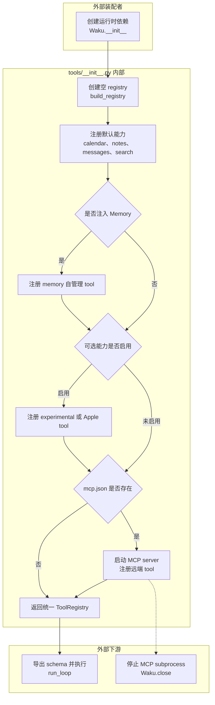

# tools/__init__.py 源码解析

## 源码文件

- [`waku/tools/__init__.py`](../../../../waku/tools/__init__.py#L1)

## 一句话总结

`tools/__init__.py` 是 Waku 的 tool composition root。它把始终可用的核心 tool、依赖 Memory 的自管理 tool，以及由配置显式开启的 experimental、Apple 和 MCP tool 装进同一个 `ToolRegistry`，让 Agent loop 只面对统一 schema 与执行接口。

## 前提知识

- **`Tool` 是能力描述与 Python 函数的组合**：名称、描述、输入 JSON Schema 会给模型看，`fn` 只在模型真正请求该 tool 时执行。
- **`ToolRegistry` 是运行时目录**：`schemas()` 给模型提供可调用能力，`execute(name, args)` 找到并安全执行对应函数。
- **tool factory 常返回闭包**：例如 calendar factory 会把共享 SQLite 连接和 `WAKU_HOME` 固定在 `create_event` 内，模型只需提供业务参数。
- **装配与执行不是一回事**：大多数 factory 只创建 `Tool`；MCP 是例外，发现 `mcp.json` 后会在装配阶段启动外部 server subprocess。
- **三个启用来源彼此独立**：experimental 直接读环境变量，Apple tool 读 `Settings.apple_tools`，MCP 读 `settings.home/mcp.json` 是否存在。

## 文件概览

这个短文件只有一个公开函数，但函数内部有五个清晰阶段。阅读重点不是逐条记住 tool 名，而是理解“默认能力、依赖注入、权限开关、外部进程”如何逐级扩大 registry 边界。

| 主要部分 | 角色/职责 | 为什么值得先看 | 代码位置 |
|---|---|---|---|
| 固定依赖与 `ToolRegistry` | 引入 Settings、核心 tool module 和 registry 类型 | 说明本文件是装配层而不是 tool 实现层 | [`模块依赖`](../../../../waku/tools/__init__.py#L3) |
| `build_registry()` 入口 | 接收共享 DB、配置和可选 Memory，返回完整 registry | 是 Waku 初始化 tool 系统的唯一主入口 | [`build_registry()`](../../../../waku/tools/__init__.py#L13) |
| 核心与 Memory tool | 始终注册 scheduling/search/note/message；有 Memory 才加自管理能力 | 划定默认可用能力和依赖完整性边界 | [`核心注册`](../../../../waku/tools/__init__.py#L24)、[`Memory 分支`](../../../../waku/tools/__init__.py#L33) |
| experimental 与 Apple 分支 | 用两个独立 opt-in 开关扩展 registry | 一个是 roadmap skeleton，一个可能触发真实系统权限，不能混为同类默认能力 | [`experimental`](../../../../waku/tools/__init__.py#L40)、[`Apple`](../../../../waku/tools/__init__.py#L47) |
| MCP 分支 | 从配置启动 server，注册远端 tool，并把 bridge 交给 Waku 管理生命周期 | 是本文件唯一在装配期跨出进程边界的路径 | [`MCP 装配`](../../../../waku/tools/__init__.py#L54) |

## 文件拆解

### 1. 核心 tool 始终存在

[`build_registry()`](../../../../waku/tools/__init__.py#L13) 创建空 `ToolRegistry` 后，依次注册：

- `create_event` 与 `list_events`：scheduling 任务的写侧和读侧。
- `save_note`：写入本地 note/memory 相关状态。
- `send_message`：把消息草稿写入本地 outbox。
- `search_web`：提供搜索结果，可与 `create_event` 形成多轮 tool loop。

这里仅决定“模型能看见哪些能力”，不会决定调用顺序。真正的 reason → act → observe 循环仍在 `run_loop()`，tool 运行时安全边界在 `ToolRegistry.execute()`。

### 2. Memory 决定自管理 tool 是否有效

[`memory is not None` 分支](../../../../waku/tools/__init__.py#L33) 注册 `manage_memory`、`update_soul` 和 `create_skill`。这些 factory 会闭包捕获真实 Memory 或 Settings，因此没有注入 Memory 时选择“不注册”，而不是暴露一个调用后必然失败的 schema。

正常 `Waku.__init__()` 会先构造 Memory，再调用 `build_registry()`；把参数保留为可选，主要是让独立工具目录或教学场景能只装配核心 tool。

### 3. experimental 与 Apple 是两种不同的 opt-in

[`WAKU_EXPERIMENTAL` 分支](../../../../waku/tools/__init__.py#L40) 直接读取环境变量。它注册的是 roadmap skeleton，目的是展示未来 tool 形状，默认关闭以免模型误以为能力已经完整实现。

[`settings.apple_tools` 分支](../../../../waku/tools/__init__.py#L47) 注册 Calendar、Mail、Reminders、Notes 等真实 macOS adapter。它默认关闭的原因是权限和真实系统副作用；第一次执行可能触发 Automation permission prompt。

两者虽然都扩展 registry，但风险语义不同，所以代码用两个独立开关和两个独立阶段处理。

### 4. MCP 在装配阶段启动外部进程

[`MCP 分支`](../../../../waku/tools/__init__.py#L54) 只在 `settings.home/mcp.json` 存在时进入：

1. 延迟导入 `MCPBridge`，没有安装 optional dependency 时只打印提示。
2. `MCPBridge.start()` 启动配置中的 server，并把发现的远端 tool 转为本地 `Tool` 注册。
3. `bridge` 动态挂到 `registry.mcp_bridge`。
4. `Waku.__init__()` 取出该属性，之后由 `Waku.close()` 停止 subprocess。

这个动态属性不是给 loop 使用的；它专门把外部进程的 ownership 从临时局部变量交还给 Waku 生命周期。除 `ImportError` 外的启动异常不会在这里吞掉，因而装配失败仍会暴露给上层。

### 5. 学习测试判断

本批不新增 learning test。这个文件的逻辑是短而直观的条件装配，单独测试每一条 `register()` 调用容易退化为复述实现。现有 [`test_tool_trigger.py`](../../../../evals/deterministic/test_tool_trigger.py) 通过 `Waku(settings, client=ScriptedClient)` 间接证明核心 `create_event` schema 能被 loop 发现并执行；完整 Agent Turn demo 也走过同一装配入口。

若调试 MCP 生命周期，最有价值的断点只有两个：[`bridge.start()`](../../../../waku/tools/__init__.py#L62) 观察远端 tool 列表，以及 [`registry.mcp_bridge = bridge`](../../../../waku/tools/__init__.py#L65) 确认 ownership 已交给 `Waku.close()`。默认核心路径无需额外断点。

## 主调用链

### 调用链一：Waku 初始化 tool 系统

1. [`Waku.__init__()`](../../../../waku/app.py#L19) 先建立 Settings、SQLite、client 和 Memory。
2. [`build_registry(conn, settings, memory)`](../../../../waku/tools/__init__.py#L13) 注册核心与启用项。
3. 返回的 `ToolRegistry` 被保存为 `Waku.tools`。
4. [`run_loop()`](../../../../waku/loop/agent.py#L40) 每次模型调用前取 `tools.schemas()`，收到 tool request 后调用 `tools.execute()`。

### 调用链二：本地 tool factory 进入统一执行面

1. [`核心注册阶段`](../../../../waku/tools/__init__.py#L24) 调用各 module 的 `make_tool()`。
2. factory 把 `conn`、`settings.home` 或 Memory 捕获在闭包里，并返回 `Tool`。
3. `registry.register()` 以 tool name 建立索引。
4. 模型只看 schema；真正调用时 `ToolRegistry.execute()` 再把 args 展开给闭包函数。

### 调用链三：MCP server 生命周期

1. 用户在 `WAKU_HOME` 放置 `mcp.json`，Waku 启动时进入 [`MCP 装配阶段`](../../../../waku/tools/__init__.py#L54)。
2. `MCPBridge.start()` 启动 server 并返回远端 tool。
3. 这些 tool 与本地 tool 注册到同一 registry，loop 不区分来源。
4. bridge 被上交给 Waku；设置变更重建 agent 或显式关闭时，`Waku.close()` 负责停止 subprocess。

## 关键流程图

## 关键状态对象

| 状态对象 | 来源 | 影响 |
|---|---|---|
| `registry` | `ToolRegistry()` | 汇总所有本地与远端 tool；最终同时服务 schema 导出和运行时执行 |
| `conn` | `Waku.__init__()` 创建的 SQLite connection | 被 calendar、notes 和 memory tool 的闭包共享，保证同一 agent 看到一致本地状态 |
| `settings` | `.env` 经 `Settings` 读取 | 提供 `home`、`apple_tools` 等装配决策 |
| `memory` | Waku 在 tool 之前构造的 Memory facade | 决定自管理 tool 是否注册，并成为这些闭包的真实操作对象 |
| `WAKU_EXPERIMENTAL` | 进程环境变量 | 控制 roadmap skeleton 是否暴露给模型 |
| `mcp_config` | `settings.home / "mcp.json"` | 文件是否存在决定是否跨入 MCP subprocess 边界 |
| `registry.mcp_bridge` | MCP 启动成功后动态附加 | 不参与 tool 调用；只用于把 subprocess 清理责任交给 Waku |

## 阅读顺序

1. 先看 [`build_registry()` 的结构化注释](../../../../waku/tools/__init__.py#L13)，明确三个输入和唯一返回值。
2. 再看 [`核心注册阶段`](../../../../waku/tools/__init__.py#L24)，把默认 tool 清单与 scheduling 主任务对应起来。
3. 接着比较 [`Memory`](../../../../waku/tools/__init__.py#L33)、[`experimental`](../../../../waku/tools/__init__.py#L40) 和 [`Apple`](../../../../waku/tools/__init__.py#L47) 三个分支各自的启用语义。
4. 最后读 [`MCP 装配`](../../../../waku/tools/__init__.py#L54)，重点追踪 `bridge` 为什么动态挂到 registry，而不是只看远端 tool 注册循环。
