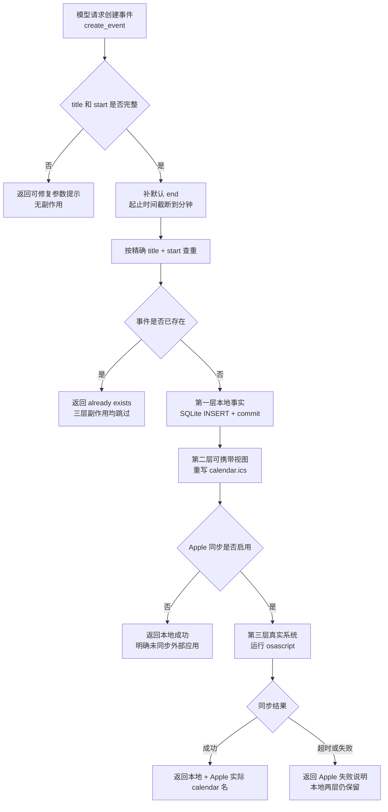

# calendar.py 源码解析

## 源码文件

- [`waku/tools/calendar.py`](../../../../waku/tools/calendar.py#L1)

## 一句话总结

`calendar.py` 同时提供 scheduling 的写侧 `create_event` 和读侧 `list_events`。写侧先用精确 `title + start` 做幂等判断，再依次产生 SQLite、ICS、可选 Apple Calendar 三层副作用；每个分支都用返回文本如实告诉模型事件实际落在哪里。

## 前提知识

- **Tool factory 与闭包**：`make_tool()` / `make_list_tool()` 在装配阶段接收 SQLite connection 和 runtime 配置，返回的 `Tool.fn` 才在模型调用时执行。
- **SQLite 是可查询状态**：`calendar_events` 表供 `list_events`、Dashboard 和 deterministic eval 查询，是本地 scheduling 的结构化事实源。
- **ICS 是导出视图**：`calendar.ics` 始终在本地创建或更新，可手工导入日历应用，但不是另一个查询数据库。
- **Apple Calendar 是 opt-in adapter**：只有 `apple_calendar=True` 才运行 `osascript`；它发生在本地两层写入之后，失败不会声称本地事件消失。
- **三层写入不是一个事务**：SQLite 先 commit，随后重写 ICS，最后才可能调用 Calendar.app。后层失败不会自动回滚前层。
- **幂等 key 有意很窄**：只把 `start` 截断到分钟，再按大小写敏感的精确 `title + start` 查询；它不做标题 trim、忽略大小写或语义去重。

## 文件概览

这个文件可按“本地 ICS 辅助、Apple adapter、create 写侧、list 读侧”四块理解。最应该先看的是 `create_event` 闭包，因为幂等闸门和三层副作用都在它内部串联。

| 主要部分 | 角色/职责 | 为什么值得先看 | 代码位置 |
|---|---|---|---|
| 模块契约与常量 | 说明事件落点，并固定 Apple calendar 名为 `Waku` | 建立“始终本地、Apple 可选、输出如实”的总语义 | [`模块说明与常量`](../../../../waku/tools/calendar.py#L1) |
| `_write_ics()` | 把事件追加为 VEVENT，并保持唯一 `END:VCALENDAR` | 是写侧第二层副作用和可携带文件边界 | [`_write_ics()`](../../../../waku/tools/calendar.py#L27) |
| `_applescript_date()` | 用逐字段赋值避免 locale 与 31 日月份溢出 | 是 AppleScript 日期正确性的纯转换核心 | [`_applescript_date()`](../../../../waku/tools/calendar.py#L61) |
| `sync_to_apple_calendar()` | 转义输入、选择 writable calendar、运行 osascript、归一化错误 | 是写侧第三层真实系统边界 | [`sync_to_apple_calendar()`](../../../../waku/tools/calendar.py#L81) |
| `make_tool()` / `create_event` | 构造 schema；运行时做参数兜底、默认 end、归一化、幂等与三层写入 | scheduling flagship 的主流程 | [`make_tool()`](../../../../waku/tools/calendar.py#L150)、[`create_event`](../../../../waku/tools/calendar.py#L161) |
| `make_list_tool()` / `list_events` | 构造读侧 schema；按可选日期窗口查询并格式化文本 | 解释 Agent 如何回答“我的日程是什么” | [`make_list_tool()`](../../../../waku/tools/calendar.py#L238)、[`list_events`](../../../../waku/tools/calendar.py#L247) |

## 文件拆解

### 1. factory 把基础设施藏在 Tool.fn 背后

[`make_tool()`](../../../../waku/tools/calendar.py#L150) 接收共享 `conn`、`home` 和 Apple 同步开关，返回模型可见的 `create_event` schema。模型只填写 `title/start/end/attendees/notes`，不接触数据库连接、文件路径或系统权限。

[`make_list_tool()`](../../../../waku/tools/calendar.py#L238) 同理，把同一个 `conn` 捕获进 `list_events`。读写两侧因此天然共享 `calendar_events` 表，但仍是两个独立 Tool schema。

### 2. create_event 的输入修复与时间归一化

[`create_event`](../../../../waku/tools/calendar.py#L161) 先处理模型输出的不确定性：

1. 缺少 `title` 或 `start` 时立即返回可修复提示，不产生任何副作用。
2. `end` 为空时用 `start + 1 小时`，并格式化到分钟。
3. `start` 和 `end` 都截取前 16 个字符，使 `2026-07-11T17:00:00` 与 `2026-07-11T17:00` 落入同一个分钟表示。

这里没有统一校验 ISO 格式。只有 `end` 为空时, `datetime.fromisoformat(start)` 会在任何写入前验证 `start`, 非法值抛出的 `ValueError` 会由 `ToolRegistry.execute()` 转成错误文本。若模型显式提供了 `end`, 本地路径只截取 `start/end` 的前 16 个字符, 非法字符串也可能进入 SQLite 与 ICS；启用 Apple 同步后 `_applescript_date()` 才会再次解析, 此时异常发生在本地两层已经写入之后。tool schema 因而只是模型提示, 不是完整运行时校验器。

### 3. 幂等闸门阻止三层重复副作用

归一化后，代码按精确 [`title + start` 查询](../../../../waku/tools/calendar.py#L183)。命中已有行就返回 `already exists`，而且返回发生在 SQLite INSERT、ICS 重写和 Apple 同步之前，所以同一次重复请求不会在任何一层留下第二份事件。

该语义由 [`test_create_event_is_idempotent`](../../../../evals/deterministic/test_tool_trigger.py#L48) 直接证明：同一标题、同一分钟但一个带秒一个不带秒的两个 tool call，最终只有一行 SQLite 记录和一个 ICS `SUMMARY`。

边界也要读清楚：标题仍按 SQLite 精确相等比较，`Coffee` 与 `coffee`、带空格与不带空格不会自动视为同一事件。这是防止同一次模型重试重复写入的技术幂等，不是自然语言日程合并器。

### 4. 三层副作用按固定顺序发生

幂等检查通过后，写侧顺序不可颠倒：

1. [`SQLite INSERT + commit`](../../../../waku/tools/calendar.py#L193)：先建立可查询本地事实。
2. [`_write_ics()`](../../../../waku/tools/calendar.py#L200)：再更新始终存在的本地导出文件。
3. [`sync_to_apple_calendar()` 分支](../../../../waku/tools/calendar.py#L202)：最后才根据 opt-in 开关触碰真实 Calendar.app。

这三层不是原子事务。SQLite 已 commit 后，ICS 写入异常会向 registry 安全边界传播，此时数据库行仍在；Apple adapter 的 timeout、`OSError` 和非零退出码则在函数内部被转换为失败说明，本地 SQLite 与 ICS 保持成功状态。返回字符串因此不仅是展示文案，也是模型判断“实际写到哪里”的协议。

[`test_create_event_writes_db_and_ics`](../../../../evals/deterministic/test_tool_trigger.py#L32) 同时断言 tool call、SQLite row 和 ICS 内容；[`01_full_agent_turn_demo.py`](../../../../learning/playground/project_demos/agent_turn/01_full_agent_turn_demo.py#L152) 进一步展示从 scripted model 到真实 DB、ICS、chat log 与 trace 的完整链路。

### 5. ICS 采用整体重写追加

[`_write_ics()`](../../../../waku/tools/calendar.py#L27) 把分钟 ISO 字符串压缩为 ICS 时间格式，构造一个最小 VEVENT。若文件已存在，它先移除旧的 `END:VCALENDAR`，追加 event 后再写回一个结束标记；首次写入则补上 VCALENDAR header。

它不是逐行 append，而是读取并整体重写文件。这样实现很短，适合本地 teaching repo；同时意味着文件写入失败不会和前面的 SQLite commit 自动回滚。

### 6. Apple adapter 先规避日期与权限陷阱

[`_applescript_date()`](../../../../waku/tools/calendar.py#L61) 不让 AppleScript 解析受 locale 影响的日期字符串，而是逐字段设置 date。它先把 day 设为 1，再设置 year/month，最后恢复真实 day，避免“当前是 31 日，先切到 30 天月份”导致日期溢出。

[`sync_to_apple_calendar()`](../../../../waku/tools/calendar.py#L81) 先转义反斜杠和双引号，优先创建/使用 `Waku` calendar；若账户不允许 AppleScript 创建 calendar，则退回第一个 writable calendar，并把实际名称写进成功返回值。

[`test_apple_calendar.py`](../../../../evals/deterministic/test_apple_calendar.py#L7) 用纯字符串断言锁定“先 day=1 再 month”的顺序，并覆盖非 macOS 跳过与空 tool call 的回归边界。真实 `osascript` 不适合作为 learning unit test，因为它依赖 macOS 权限与用户 Calendar 状态。

### 7. list_events 把日期窗口变成包含式查询

[`list_events`](../../../../waku/tools/calendar.py#L247) 只为实际提供的 `start/end` 添加 SQL 条件：起始值取日期部分作为 `>=` 下界，结束值扩展为当天 `T23:59` 作为 `<=` 上界。`limit` 被限制在 1 到 100，结果按 `start` 升序。

查询返回的是给模型看的稳定文本，而不是 `sqlite3.Row`。无结果说明会明确它读的是 `.waku/state.db`，继续遵守“不要对外部日历同步状态过度承诺”的文件契约。

本批不新增 learning test：幂等、DB/ICS 副作用、空参数和 AppleScript 日期顺序已有 deterministic 回归证据；真实 Apple Calendar 又不适合纯单测。若未来补充，最有价值的缺口是用内存 SQLite 验证 `list_events` 的包含式日期窗口与 limit clamp。

## 主调用链

### 调用链一：模型创建日程

1. [`build_registry()` 调用 `calendar.make_tool()`](../../../../waku/tools/__init__.py#L26)，把共享 DB/home 固定进 `create_event`。
2. `run_loop()` 收到模型的 `tool_use(name="create_event")`，交给 `ToolRegistry.execute()`。
3. [`create_event`](../../../../waku/tools/calendar.py#L161) 校验输入、补默认 end、归一化分钟并查重。
4. 未重复时依次写 SQLite、ICS 和可选 Apple Calendar，最后返回精确落点说明给模型继续推理。

### 调用链二：本地写入后的 Apple 同步

1. [`create_event` Apple 分支](../../../../waku/tools/calendar.py#L202) 只在本地 DB 与 ICS 已成功后进入。
2. [`sync_to_apple_calendar()`](../../../../waku/tools/calendar.py#L81) 调用两次 [`_applescript_date()`](../../../../waku/tools/calendar.py#L61) 生成起止日期。
3. `osascript` 创建事件或返回权限/超时/系统错误。
4. 同步结果被拼入 tool output；即使第三层失败，文本仍明确本地事件安全存在。

### 调用链三：模型读取日程

1. `build_registry()` 调用 [`make_list_tool()`](../../../../waku/tools/calendar.py#L238)。
2. 模型请求 `list_events` 后，registry 执行 [`list_events`](../../../../waku/tools/calendar.py#L247)。
3. 可选日期窗口和 limit 被转换为参数化 SQL。
4. 排序后的行被格式化成文本，交回 loop 生成最终回答。

## 关键流程图

## 关键状态对象

| 状态对象 | 关键内容 | 在主链路中的作用 |
|---|---|---|
| `conn` | 共享 SQLite connection | 幂等查询、INSERT/commit 和 list 查询都走同一结构化状态 |
| `home` | `WAKU_HOME` Path | 决定 `calendar.ics` 的真实落盘位置，并进入 tool 输出说明 |
| `apple_calendar` | factory 闭包中的 bool | 决定第三层真实 Calendar.app 副作用是否发生 |
| `title/start` | 精确标题与分钟级开始时间 | 组成技术幂等 key；重复时阻断全部后续写入 |
| `end` | 显式值或 `start + 1 小时` | 在查重前归一化，三层写入共享同一结束时间 |
| `where` | 累积的可读结果文本 | 把本地、未同步、Apple 成功或失败的真实状态交给模型 |
| `clauses/params` | list 查询的动态 SQL 条件 | 只根据已提供日期边界构造参数化查询，避免拼接用户输入 |

## 阅读顺序

1. 先看 [`make_tool()`](../../../../waku/tools/calendar.py#L150) 的闭包参数，明确基础设施从哪里进入。
2. 再逐 Step 阅读 [`create_event`](../../../../waku/tools/calendar.py#L161)，重点停在 [`幂等查询`](../../../../waku/tools/calendar.py#L183) 和三层副作用起点。
3. 接着看 [`_write_ics()`](../../../../waku/tools/calendar.py#L27)，理解第二层是整体重写的导出视图。
4. 然后联读 [`_applescript_date()`](../../../../waku/tools/calendar.py#L61) 与 [`sync_to_apple_calendar()`](../../../../waku/tools/calendar.py#L81)，区分日期纯转换和真实系统副作用。
5. 最后看 [`list_events`](../../../../waku/tools/calendar.py#L247)，确认读侧只查询 SQLite，本身不会读取 Calendar.app 或 ICS。
