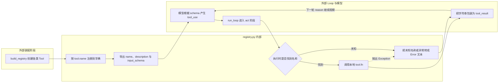

# `waku/tools/registry.py` 源码解析

## 源码文件

- [`waku/tools/registry.py`](../../../../waku/tools/registry.py#L1)

## 一句话总结

`registry.py` 是模型 tool 协议与本地 Python callable 之间的最小边界：`Tool` 同时保存模型可见描述和本地实现，`ToolRegistry` 负责按名称注册、导出 schema，并把未知名称或执行异常转换成可回填给模型的字符串结果。

它不是权限系统、参数校验框架或重试器；安全性的核心是让 Loop 不因单个 tool 异常崩溃，并让模型在下一轮观察到明确错误。

## 前提知识

- **tool schema**：模型请求中的 `tools=` 只包含名称、描述和 JSON Schema。Python callable 永远不能被序列化发给 provider。
- **tool_use**：模型返回的结构化调用意图，包含名称、参数和调用 id。真正副作用尚未发生。
- **tool_result**：`ToolRegistry.execute()` 返回字符串后，由 Loop 包装并与 tool_use id 配对的观察结果。
- **registry pattern**：生产装配阶段先收集可用 Tool；运行阶段只按名称查找，不在 Loop 中写大量 `if name == ...`。
- **错误文本化**：未知名称和 Python 异常都返回以 `Error` 开头的文本。Loop 可以继续下一轮，模型可据此解释或调整参数。

## 文件概览

文件只有两个类，静态描述与运行路由的边界非常明确。

| 主要部分 | 角色/职责 | 为什么值得先看 | 代码位置 |
| --- | --- | --- | --- |
| `Tool` dataclass | 绑定 name、description、input_schema 与本地 `fn` | 展示一个 tool 在模型侧和本地侧的完整最小定义 | [`L14-L19`](../../../../waku/tools/registry.py#L14) |
| `Tool.to_api()` | 去掉 callable，生成 Messages API schema | 是本地对象离开进程前的协议翻译边界 | [`L21-L33`](../../../../waku/tools/registry.py#L21) |
| `ToolRegistry.__init__()` / `register()` | 建立名称索引并支持同名覆盖 | 决定 tool 装配顺序与运行路由 | [`L36-L55`](../../../../waku/tools/registry.py#L36) |
| `ToolRegistry.schemas()` | 批量导出模型可见 schema | 每次 reason 调用都通过它告知模型可用能力 | [`L57-L65`](../../../../waku/tools/registry.py#L57) |
| `ToolRegistry.execute()` | 按名执行并把错误转成结果文本 | 是模型意图变成真实副作用的关键边界 | [`L67-L89`](../../../../waku/tools/registry.py#L67) |

## 文件拆解

### 1. `Tool` 同时连接两个世界

[`Tool`](../../../../waku/tools/registry.py#L14) 的四个字段可以分成两组：

- 模型可见：`name`、`description`、`input_schema`；
- 仅本地可见：`fn`。

模型根据前三项决定是否调用以及如何构造 JSON 参数；只有 `ToolRegistry.execute()` 能接触 `fn` 并触发实际副作用。`fn` 的约定返回 `str`，因为该文本会成为下一轮模型直接观察的内容。

### 2. `to_api()` 是单向协议投影

[`Tool.to_api()`](../../../../waku/tools/registry.py#L21) 创建一个新字典，不返回 dataclass 自身，也不包含 `fn`。这既避免 callable 序列化失败，也防止 provider 接触本地执行对象。

这里没有动态补充类型或默认值；每个 tool factory 必须在创建 `Tool` 时提供正确 schema。Registry 只传递契约，不负责修复不一致。

### 3. 注册表状态与覆盖语义

[`ToolRegistry.__init__()`](../../../../waku/tools/registry.py#L37) 使用普通字典 `_tools`。[`register()`](../../../../waku/tools/registry.py#L46) 以 `tool.name` 作为唯一 key，因此同名对象会覆盖旧实现。

覆盖发生在装配阶段，没有版本检查或警告。它给可选 adapter 留出替换实现的空间，也意味着 tool name 必须在整个进程中保持稳定且唯一。Python 字典保留插入顺序，所以 `schemas()` 通常按 `build_registry()` 的注册顺序输出；覆盖已有 key 不会创建第二项。

### 4. `schemas()` 与真实执行完全分离

[`schemas()`](../../../../waku/tools/registry.py#L57) 只遍历注册对象并调用 `to_api()`。它不验证 callable、不开启资源，也不执行任何 tool。

Loop 在每一次模型 reason 前调用它，因此运行时新增或替换的 tool 会从下一次模型请求起可见。当前项目通常在 Waku 构造阶段一次性注册完毕，没有并发修改 registry 的设计。

### 5. `execute()` 的三种返回语义

[`execute()`](../../../../waku/tools/registry.py#L67) 始终向 Loop 返回字符串，但字符串来源有三种：

1. **未知名称**：[`L77-L80`](../../../../waku/tools/registry.py#L77) 返回 `Error: unknown tool ...`，没有调用副作用。
2. **正常执行**：[`L82-L85`](../../../../waku/tools/registry.py#L82) 以 `tool.fn(**args)` 调用真实实现，并原样返回其字符串。
3. **执行异常**：[`L87-L89`](../../../../waku/tools/registry.py#L87) 捕获任意 `Exception`，返回 `Error running ...`，Loop 不崩溃。

这三条路径外层类型相同，语义却不同。Loop 不在此处把错误提升为异常，而是把文本包装为 tool_result，让模型下一轮决定如何向用户解释或是否用修正参数重试。

### 6. 边界内没有做什么

- Registry 不根据 JSON Schema 再验证 `args`。缺参、类型错误等通常会由 Python callable 抛出，然后进入异常文本路径。
- Registry 不做权限、确认或 sandbox。各 tool factory 与项目配置必须自行决定是否注册高风险能力。
- Registry 不重试，也不回滚已经发生的部分副作用。
- Registry 不记录 trace；Loop 在取得输出后创建 tool event，再统一交给 observer。

## 主调用链

### 调用链一：生产 tool 装配

1. [`build_registry()`](../../../../waku/tools/__init__.py#L13) 创建 `ToolRegistry`。调用场景：`Waku.__init__()` 完成 Memory 初始化后装配 tool。
2. [`build_registry()` 的内置注册段](../../../../waku/tools/__init__.py#L24) 依次注册 calendar、notes、messages、search 和可选 memory tools。
3. 配置开启时，后续分支继续注册 experimental、Apple 与 MCP Tool；MCP bridge 也挂到同一个 registry 供 Waku 关闭。
4. 每次 [`register()`](../../../../waku/tools/registry.py#L46) 都只更新 `_tools`，不会提前执行 callable。

### 调用链二：reason 阶段导出 schema

1. [`run_loop()` 的流式请求](../../../../waku/loop/agent.py#L80) 或 [`普通请求`](../../../../waku/loop/agent.py#L93) 在发模型请求前调用 [`schemas()`](../../../../waku/tools/registry.py#L57)。调用场景：每一次模型 reason。
2. `schemas()` 为每个 Tool 调用 [`to_api()`](../../../../waku/tools/registry.py#L21)，去掉 `fn` 后形成 API 列表。
3. provider 只看到 name、description 和 input_schema，据此返回零个或多个 tool_use block。

### 调用链三：act 阶段安全执行

1. [`run_loop()` 识别 tool_use](../../../../waku/loop/agent.py#L106) 后在 [`L113-L116`](../../../../waku/loop/agent.py#L113) 调用 [`execute()`](../../../../waku/tools/registry.py#L67)。调用场景：模型明确请求本地能力。
2. `execute()` 按名称路由到 `tool.fn(**args)`，或把未知名称/异常转换成 Error 文本。
3. [`run_loop()`](../../../../waku/loop/agent.py#L117) 将名称、参数和输出记录为统一 event，同时在 [`L120-L125`](../../../../waku/loop/agent.py#L120) 构造 tool_result 回填下一轮模型。

## 关键流程图

下图同时展示装配阶段、reason 阶段和 act 阶段。模型只接触 schema 与结果文本，本地 callable 始终留在 ToolRegistry 边界内。

## 关键状态对象

| 状态对象 | 含义 | 关键约束 |
| --- | --- | --- |
| `Tool.name` | 模型协议名称与本地路由 key | 进程内唯一；同名注册覆盖旧对象 |
| `Tool.description` | 模型选择能力时阅读的自然语言说明 | Registry 不修改，质量由 tool factory 负责 |
| `Tool.input_schema` | 模型构造参数的 JSON Schema | 只发送给模型，Registry 不做二次校验 |
| `Tool.fn` | 真正执行副作用的 Python callable | 不会进入 `to_api()` 结果；约定返回字符串 |
| `ToolRegistry._tools` | name 到 Tool 的进程内映射 | 构造后通常只读，没有并发注册保护 |
| `args` | 模型生成的参数字典 | [`execute()`](../../../../waku/tools/registry.py#L67) 直接展开为 kwargs |
| 返回字符串 | 正常结果或 Error 文本 | 外层类型统一，具体语义由下一轮模型和 UI 解释 |

## 阅读顺序

1. 先看 [`Tool` 字段](../../../../waku/tools/registry.py#L14)，把模型可见契约与本地 callable 分开。
2. 阅读 [`to_api()`](../../../../waku/tools/registry.py#L21) 和 [`schemas()`](../../../../waku/tools/registry.py#L57)，跟踪 schema 如何进入模型请求。
3. 再读 [`execute()`](../../../../waku/tools/registry.py#L67)，对比未知名称、正常输出和异常文本三条同类型不同语义的路径。
4. 跳到 [`build_registry()`](../../../../waku/tools/__init__.py#L13)，观察内置与可选 tool 的真实注册顺序。
5. 最后回到 [`run_loop()` act 阶段](../../../../waku/loop/agent.py#L113)，确认 registry 输出如何同时进入 trace event、LoopResult 和 tool_result。

这些方法都很短，关键行为也已被 Loop 的 deterministic eval 和教学 demo 真实执行。单独新增 learning test 会主要复制字典查找与异常捕获实现，因此本次不生成；调试时在 `execute()` 的名称查找后和 `tool.fn(**args)` 前观察 `name`、`args`、`tool` 即可。
